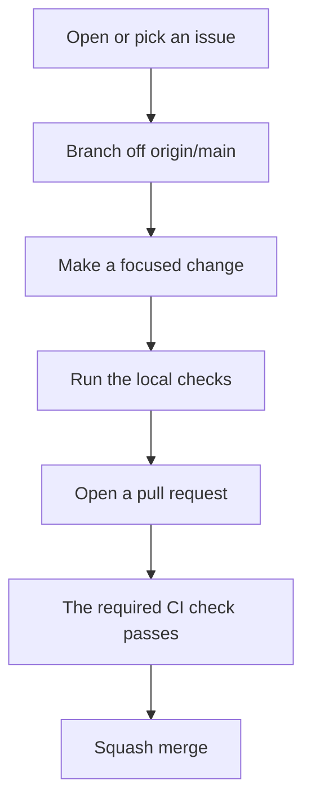

# Contributing to agentic-toolkit

Thank you for helping improve the toolkit. This guide covers how to propose a change, the checks to run, and the standards that commits, pull requests and documentation follow.

## Code of conduct

This project follows the Contributor Covenant [Code of Conduct](CODE_OF_CONDUCT.md). By taking part, you agree to follow it.

## Security issues

Do not open a public issue for a security vulnerability. See [SECURITY.md](SECURITY.md) for how to report it privately.

## How to contribute



- **Discuss larger changes in an issue first.** For a significant architecture decision, propose an ADR in `docs/adrs/`.
- **Keep changes to public files:** skills, hooks, rules, documentation, guides, references, templates, scripts and tests.
- **Do not add planning folders** such as `docs/0-brainstorms/`, `docs/1-discovery/`, `docs/2-design/`, `docs/3-plans/` or `docs/4-reviews/`. The issue and pull request hold the discussion.

## Branches

Branch off the latest `origin/main`:

```bash
git fetch origin
git checkout -b <branch-name> origin/main
```

Keep each pull request to one concern. Pull requests are squash-merged, so `main` keeps a linear history.

## Local checks

Run these before opening a pull request. CI runs the same checks.

```bash
bash tests/test-githooks.sh
bash tests/test-sync-toolkit.sh
bash git-hooks/drift-guard/test-housekeep.sh
sh skills/schedule-resume/tests/run-tests.sh
python3 -m unittest discover -s tests -p 'test_relative_links.py'
python3 scripts/check-relative-links.py
shellcheck -S error <changed shell scripts>
```

The tests run in temporary directories. Do not run `scripts/sync-toolkit.sh` against your own home directory to test a change, because it writes to your live harness configuration.

## Commit messages

Commits follow [Conventional Commits](https://www.conventionalcommits.org/):

```
<type>(<scope>): <description>
```

- **Types:** `feat`, `fix`, `docs`, `style`, `refactor`, `perf`, `test`, `chore`, `ci`.
- **Subject:** imperative mood, 72 characters or fewer.
- **Body:** explains why the change is needed, not what the diff already shows.
- **Issue numbers:** write `#N` only when you mean to link a real GitHub issue.

## Pull requests

- Open the pull request against `main` and fill in the template.
- The `required` status check must pass before merging.
- For a user-facing change, add a line to `docs/CHANGELOG.md` in the same pull request.

## Continuous integration

Workflows in `.github/workflows/` pin every action to a full commit SHA, with the version in a comment. Keep the SHA when updating an action, and do not replace it with a tag. The `required` job collects the results of the other jobs and is the only required status check.

## Documentation standard

Every public document in this repository follows these rules.

- **Start with the purpose.** The first paragraph says what the document or component is, who it is for and when to use it.
- **Structure for scanning.** Use sentence-case headings, tables for comparisons and options, and numbered steps for procedures.
- **Write plain, professional English.** Use short sentences, active voice and common words. Address the reader as "you". Avoid first person, filler, marketing language and unexplained jargon.
- **Add a diagram where it helps.** Use a Mermaid diagram for a process, a data flow, a directory layout or a decision. Do not add one for decoration.
- **Follow the Mermaid rules.** No `;` in labels, no leading `+` or `-` in sequence messages, quote labels that contain `()[]{}|`, and no hard-coded colors or themes. Check each diagram with the [Mermaid validator](hooks/validate-mermaid/).
- **Date volatile facts.** Model names, prices, quotas and product behavior change. State when a fact was checked and link its source.
- **Keep it general.** Write for any reader's setup. Do not include personal machine paths, account details or private project names.
- **Check commands against the code.** Every command and flag must match the current scripts.
- **Keep links working.** Use relative links between files in the repository. Do not rename a heading that other documents link to without updating those links.
- **One line per paragraph.** Do not hard-wrap lines, so diffs stay small and editors can wrap text themselves.
