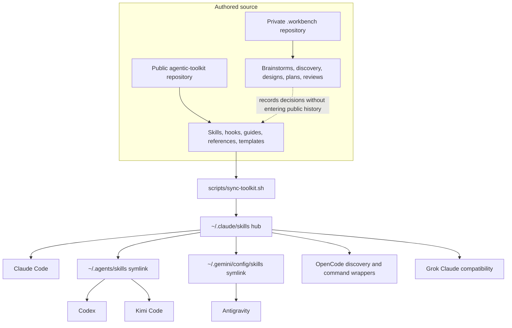
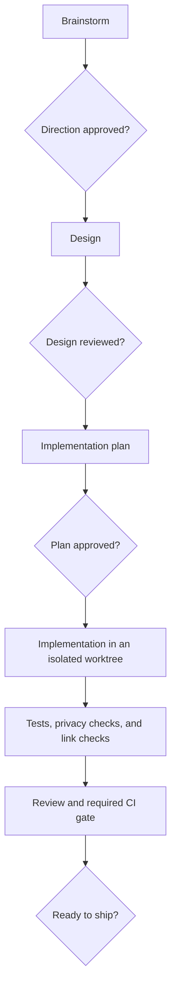

# agentic-toolkit

`agentic-toolkit` is a portable library of instructions, skills, hooks, templates, and engineering conventions for Claude Code, OpenAI Codex, Google Antigravity, Kimi Code, Grok Build TUI, and OpenCode. It is for engineers who want one tested working method across multiple AI coding harnesses without maintaining independent copies of the same configuration.

The toolkit addresses prompt and context cost, configuration drift, informal software delivery phases, tool-specific workflows, and accidental mixing of public code with private working memory. The repository is both installable tooling and a reference implementation of the operating model behind it.

## What the toolkit changes

| Problem | Mechanism in this repository |
|---|---|
| Repeated context and irrelevant instructions | Short global instructions, task-scoped skills, and model-effort routing guidance |
| Copies drifting across harnesses | One skill hub, symlinked spokes, and deterministic synchronization |
| Agents skipping design, tests, or delivery steps | Explicit brainstorm, design, plan, implementation, review, and verification gates |
| Private working notes entering public history | Separate public and private repositories, an ignored `.workbench/`, and a staged-content privacy guard |
| Tool-specific workflows | Shared `SKILL.md` packages plus documented harness-specific adapters where the products differ |

## Architecture

The repository is the authored source. `scripts/sync-toolkit.sh` copies those resources into a user-level hub and repairs the harness paths that read it.



The public repository contains code, user documentation, architectural decision records (ADRs), the roadmap, and the changelog. Maintainer working memory lives in a separate private repository nested at `.workbench/`. Contributors use issues, pull requests, and public ADRs without needing access to the private repository.

## Delivery workflow

The workflow has an explicit stop between each authoring phase. Implementation starts only after the design and plan have been reviewed.



## Quick start

Synchronization requires Git, Bash, and `rsync`. Python 3, `jq`, and ShellCheck are required for the contributor verification suite.

### Synchronize one clone across installed harnesses

Clone the repository, inspect the harness-only changes, then apply them:

```bash
git clone https://github.com/carlosboeing/agentic-toolkit.git
cd agentic-toolkit
./scripts/sync-toolkit.sh --dry-run --harness
./scripts/sync-toolkit.sh --harness
```

`--harness` writes beneath `$HOME` but does not modify neighboring repositories. The broader `--all` mode also installs Git hooks into discovered repositories, so run `./scripts/sync-toolkit.sh --dry-run --all` before using it.

### Install one skill manually

Copy the complete skill directory because some skills include scripts, schemas, tests, or references:

```bash
skill_name=schedule-resume
mkdir -p "$HOME/.claude/skills/$skill_name"
cp -R "skills/$skill_name/." "$HOME/.claude/skills/$skill_name/"
```

Claude Code reads `~/.claude/skills` directly. Codex and Kimi Code read the shared `~/.agents/skills` spoke. Antigravity reads `~/.gemini/config/skills`. See the [skills catalog](skills/README.md) before wiring those paths by hand.

### Link the shared instruction file

For a local authoring clone, link the canonical instruction file instead of copying it:

```bash
mkdir -p "$HOME/.claude"
ln -s "$PWD/instructions/CLAUDE.md" "$HOME/.claude/CLAUDE.md"
```

If the destination already exists, inspect and back it up before replacing it. The [new-machine setup guide](guides/guide-new-machine-setup.md) covers the remaining harness links and local configuration that does not belong in Git.

### Create a project from the template

After the repository is public, `degit` can copy only the template directory:

```bash
npx degit github:carlosboeing/agentic-toolkit/templates/default-project new-project
```

## Component directory

### Skills

| Skill | Purpose |
|---|---|
| [`briefing`](skills/briefing/) | Produces a manual, evidence-backed project orientation without activating on focused follow-up questions |
| [`learn`](skills/learn/) | Explains a commit, pull request, file, symbol, behavior, or topic at a chosen level and depth |
| [`schedule-resume`](skills/schedule-resume/) | Schedules and resumes unattended sessions across supported harnesses |
| [`repo-standards`](skills/repo-standards/) | Audits or applies the repository's public and private governance standards |
| [`penmark-comments`](skills/penmark-comments/) | Reviews local Markdown and can write validated Penmark inline comments with user consent |
| [`git-worktrees`](skills/git-worktrees/) | Defines the shared worktree layout and safe branch-isolation rules |
| [`housekeeping`](skills/housekeeping/) | Audits merged pull requests against local branches and worktrees, with a verified cleanup mode |
| [`start-planning`](skills/start-planning/) | Starts implementation planning from an approved design while preserving the phase boundary |
| [`capture-meeting`](skills/capture-meeting/) | Converts a meeting recording and notes into an audited project record |
| [`externalize-deliverable`](skills/externalize-deliverable/) | Produces a client-safe copy of an internal document under a human review gate |
| [`oss-standards`](skills/oss-standards/) | Compatibility alias for `repo-standards --oss` |

The [skills catalog](skills/README.md) documents invocation, dependencies, bundled files, and installation details. Locally installed third-party skills are not presented as repository-owned components.

### Hooks and gates

| Component | Runs at | Purpose |
|---|---|---|
| [Drift guard](git-hooks/drift-guard/) | `pre-push`, `post-merge`, and manual `housekeep` | Blocks stale lifecycle records before push and reports merged-branch residue |
| [Private workbench guard](git-hooks/private-workbench-guard/) | `pre-commit` | Rejects staged workbench gitlinks, private paths, and private-side vocabulary |
| [Mermaid validator](hooks/validate-mermaid/) | Claude Code `PostToolUse`, OpenCode plugin, or manual command | Parses every modified Mermaid block and returns actionable syntax errors |

### Guides and references

| Resource | Use it for |
|---|---|
| [Project structure and conventions](guides/guide-project-structure-and-conventions.md) | Lifecycle directories, document frontmatter, project maps, and change discipline |
| [AI model and effort routing](guides/guide-ai-model-and-effort-routing.md) | Choosing a model, effort level, and escalation path by task shape |
| [Harness plugin parity](guides/guide-harness-plugin-parity.md) | Mapping skills, plugins, Model Context Protocol (MCP) servers, hooks, and browser tools across harnesses |
| [Harness capability map](reference/reference-harness-capability-map.md) | Comparing delegation, routing, hook, browser, and headless capabilities |
| [OSS repository standard](reference/reference-oss-standards.md) | Community files, pinned workflows, Dependabot, and branch protection |

The complete indexes are in [`guides/`](guides/) and [`reference/`](reference/).

### Templates and other resources

| Directory | Contents |
|---|---|
| [`templates/`](templates/) | Private-base and public open-source project scaffolds plus lean Claude settings |
| [`instructions/`](instructions/) | The canonical cross-harness global brief and its regression criteria |
| [`plugins/`](plugins/) | Plugin installation and drift reporting, currently focused on Superpowers |
| [`rules/`](rules/) | Authoring sources for rules that may later justify always-on loading |
| [`docs/adrs/`](docs/adrs/) | Public architectural decisions |
| [`docs/ROADMAP.md`](docs/ROADMAP.md) | Current priorities and shipped work |
| [`docs/CHANGELOG.md`](docs/CHANGELOG.md) | Dated release history |

## Limitations

The synchronizer copies authored skills; it does not install every external tool or create instruction-file links. Spokes are created only when their harness parent directory exists. Review local sync configuration before applying it, and compare same-named skills before using `--adopt`, which replaces a real spoke directory. Product capabilities, model rosters, and prices in dated references need fresh verification. Mermaid hooks check syntax, not layout, and some skip paths return success without validating a diagram.

## Contributing and governance

Read [CONTRIBUTING.md](CONTRIBUTING.md) before opening a pull request. It lists the local checks, Conventional Commit format, and the `required` continuous integration gate.

The repository uses the [Contributor Covenant](CODE_OF_CONDUCT.md), accepts private vulnerability reports through [GitHub Security Advisories](https://github.com/carlosboeing/agentic-toolkit/security/advisories/new), and documents support boundaries in [SUPPORT.md](SUPPORT.md). [THIRD_PARTY_NOTICES.md](THIRD_PARTY_NOTICES.md) records bundled dependencies.

Repository-authored code and documentation use the [MIT License](LICENSE). Reused material has the notices and license exceptions listed in [THIRD_PARTY_NOTICES.md](THIRD_PARTY_NOTICES.md). Copies or substantial portions must retain the applicable notices.
