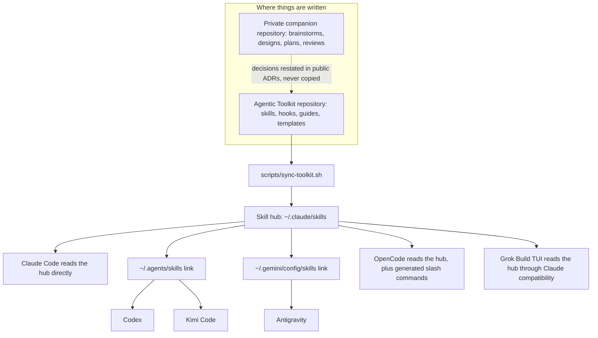
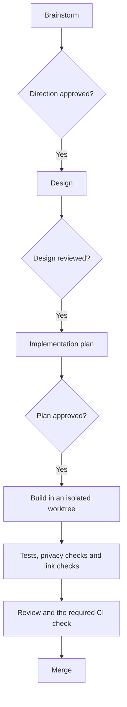

# Agentic Toolkit

A portable library of skills, hooks, instructions, templates and conventions for AI coding agents. It works with Claude Code, OpenAI Codex, Google Antigravity, Kimi Code, Grok Build TUI and OpenCode.

Use it if you work in more than one AI coding harness and want the same skills, rules and delivery process in each, without keeping separate copies in sync by hand. The repository is both installable tooling and a working example of the method behind it. It is opinionated toward one way of working, so take what fits and leave the rest.

## What it solves

| Problem | How the toolkit handles it |
|---|---|
| Every harness needs its own copy of the same skills, and the copies drift apart | One skill hub on disk. Each harness reads it through a link, and one script keeps it current. |
| Long instruction files use up context on every turn | A short global brief, plus skills that load only for the task that needs them |
| Agents skip design, testing or review | A delivery workflow with an explicit review stop between each phase |
| Private notes leak into public repositories | Public and private repositories kept apart, and a pre-commit guard that refuses private paths |
| Each harness has different install paths and hook support | Guides that map skills, plugins, MCP servers and hooks across harnesses |

## How it fits together

The repository is the source. `scripts/sync-toolkit.sh` copies its skills into a hub at `~/.claude/skills`, then links each harness's skill directory to that hub. Working notes such as brainstorms and plans live in a separate private repository, so they never enter public history.



Because every harness reads the same files, a skill updated in the repository reaches all of them after one sync. You do not need the private repository to use or contribute to the toolkit. Contributors use issues, pull requests and public architecture decision records (ADRs).

## Delivery workflow

The toolkit's skills and conventions follow one delivery process. Each authoring phase ends with a review, and implementation starts only after the plan is approved.



The [project structure and conventions guide](guides/guide-project-structure-and-conventions.md) explains where each phase's documents live and how they link together.

## Quick start

You need Git, Bash and `rsync`. The contributor test suite also needs Python 3, `jq` and ShellCheck.

### Sync everything to your harnesses

Clone the repository, preview the changes, then apply them:

```bash
git clone https://github.com/carlosboeing/agentic-toolkit.git
cd agentic-toolkit
./scripts/sync-toolkit.sh --dry-run --harness
./scripts/sync-toolkit.sh --harness
```

`--harness` writes only under your home directory. It copies the skills into the hub, links each installed harness to it, and copies the Mermaid validation hook. OpenCode loads that hook automatically. Claude Code needs it registered in `settings.json`, as described in the [validator's README](hooks/validate-mermaid/README.md). The script skips any harness whose configuration directory does not exist.

The `--all` mode also installs Git hooks into the repositories it finds in your projects directory. Run `./scripts/sync-toolkit.sh --dry-run --all` first to see which repositories it would change.

### Install a single skill

Copy the whole skill directory, because some skills include scripts, schemas or reference files:

```bash
skill_name=schedule-resume
mkdir -p "$HOME/.claude/skills/$skill_name"
cp -R "skills/$skill_name/." "$HOME/.claude/skills/$skill_name/"
```

For a skill that is a single `SKILL.md`, such as `learn`, you can download it without cloning:

```bash
skill_name=learn
mkdir -p "$HOME/.claude/skills/$skill_name"
curl -fsSL -o "$HOME/.claude/skills/$skill_name/SKILL.md" \
  "https://raw.githubusercontent.com/carlosboeing/agentic-toolkit/main/skills/$skill_name/SKILL.md"
```

Claude Code reads `~/.claude/skills`. Codex and Kimi Code read `~/.agents/skills`, and Antigravity reads `~/.gemini/config/skills`. The [skills catalog](skills/README.md) explains how to link those directories to the hub, and each skill's README says whether it needs more than `SKILL.md`.

### Use the shared instruction file

If you keep a local clone, link the global instruction file instead of copying it, so edits in the repository take effect everywhere:

```bash
mkdir -p "$HOME/.claude"
ln -s "$PWD/instructions/CLAUDE.md" "$HOME/.claude/CLAUDE.md"
```

Back up any existing `~/.claude/CLAUDE.md` first. The [new-machine setup guide](guides/guide-new-machine-setup.md) covers the links for the other harnesses, and is the place to start when setting up a new machine or handing the toolkit to a colleague.

### Start a new project from the template

```bash
npx degit github:carlosboeing/agentic-toolkit/templates/default-project new-project
```

## Repository layout

Each top-level directory has its own `README.md`, which lists its contents with install and usage details.

### Installs into a harness

These directories mirror the harness's own layout under `~/.claude/`, so each item has an obvious install location.

| Directory | Contents | Installs to |
|---|---|---|
| [`skills/`](skills/) | Agent skills, one directory each | `~/.claude/skills/<name>/` |
| [`hooks/`](hooks/) | Harness hooks: scripts and their settings fragments | `~/.claude/hooks/<name>.sh` |
| [`instructions/`](instructions/) | The global instruction file shared by every harness | `~/.claude/CLAUDE.md`, as a link |
| [`output-styles/`](output-styles/) | Output styles. Empty for now, because Plain English ships with CopyDesk. | `~/.claude/output-styles/<name>.md` |
| [`rules/`](rules/) | Rule files a harness can load on every session. Not installed by default. | `~/.claude/rules/` |
| [`plugins/`](plugins/) | An installer for the Superpowers plugin across harnesses | Each harness's own plugin system |

### Read, copy or install into a project

| Directory | Contents |
|---|---|
| [`guides/`](guides/) | Step-by-step guides for setting up and working with AI coding harnesses |
| [`reference/`](reference/) | Dated facts and repository standards |
| [`templates/`](templates/) | Project scaffolds for private and open-source repositories, and a lean Claude Code settings file |
| [`git-hooks/`](git-hooks/) | Git hooks that install into a target repository rather than a harness |
| [`scripts/`](scripts/) | The synchronizer and repository checks |
| [`docs/`](docs/) | The roadmap, the changelog and architecture decision records |

## Components

### Skills

| Skill | What it does |
|---|---|
| [`briefing`](skills/briefing/) | Summarizes a project's current state from Git, GitHub and its tracking files |
| [`learn`](skills/learn/) | Explains a commit, pull request, file, symbol or topic at the level you choose |
| [`schedule-resume`](skills/schedule-resume/) | Schedules an agent session to resume later, for example after a usage limit resets |
| [`repo-standards`](skills/repo-standards/) | Checks or applies a repository's governance files, workflows and branch protection |
| [`penmark-comments`](skills/penmark-comments/) | Reviews a local Markdown file and can write inline review comments into it |
| [`git-worktrees`](skills/git-worktrees/) | Sets where worktrees go and the checks to run before changing branches |
| [`housekeeping`](skills/housekeeping/) | Finds branches and worktrees left behind by merged pull requests, and removes them on request |
| [`start-planning`](skills/start-planning/) | Starts an implementation plan from an approved design |
| [`capture-meeting`](skills/capture-meeting/) | Turns a meeting recording and notes into a project record |
| [`externalize-deliverable`](skills/externalize-deliverable/) | Makes a client-safe copy of an internal document, with a required human review |
| [`oss-standards`](skills/oss-standards/) | Shortcut for `repo-standards` in open-source mode |

The [skills catalog](skills/README.md) lists each skill's commands, dependencies and install notes.

### Hooks

| Hook | Runs on | What it does |
|---|---|---|
| [Drift guard](git-hooks/drift-guard/) | `pre-push`, `post-merge`, and the `housekeep` command | Blocks a push when tracking records are out of date, and reports branches left behind by merges |
| [Private workbench guard](git-hooks/private-workbench-guard/) | `pre-commit` | Refuses commits that stage private paths, private vocabulary or a nested private repository |
| [Mermaid validator](hooks/validate-mermaid/) | Claude Code `PostToolUse`, an OpenCode plugin, or by hand | Parses each Mermaid diagram in an edited file and reports syntax errors to the agent |

### Guides and references

| Resource | Use it to |
|---|---|
| [Project structure and conventions](guides/guide-project-structure-and-conventions.md) | Organize a project's documents, frontmatter and tracking files |
| [AI model and effort routing](guides/guide-ai-model-and-effort-routing.md) | Choose a model and effort level for a task |
| [Harness plugin parity](guides/guide-harness-plugin-parity.md) | Match skills, plugins, MCP servers and hooks across harnesses |
| [Harness capability map](reference/reference-harness-capability-map.md) | Compare what each harness supports |
| [OSS repository standard](reference/reference-oss-standards.md) | Set up community files, pinned workflows and branch protection |

See [`guides/`](guides/) and [`reference/`](reference/) for the full lists.

## Sharing individual files

Most files are written to stand on their own:

- A single-file skill's `SKILL.md` is the whole skill. Copy it into a skills directory and it works.
- Guides and references are self-contained Markdown. Send them, paste them into another project, or link to them on GitHub.

Filenames carry their type, such as `guide-*.md` and `reference-*.md`, so a file still makes sense when it travels on its own. If a file only works inside this repository, please open an issue.

## Limitations

- The synchronizer installs this repository's own skills and hooks. It does not install third-party tools or create instruction-file links.
- A harness link is created only if that harness's configuration directory already exists.
- `--adopt` replaces a real skill directory in a harness with a link to the hub. Compare any same-named skills before using it.
- Guides that mention model names, quotas or prices record the date they were checked. Verify them against the vendor before relying on them.
- The Mermaid validator checks syntax, not layout.

## Contributing

Read [CONTRIBUTING.md](CONTRIBUTING.md) before opening a pull request. It covers the local checks, the commit message format, the required CI check, the documentation standard, and how to add a new kind of component.

Report security issues privately through [GitHub Security Advisories](https://github.com/carlosboeing/agentic-toolkit/security/advisories/new). The project follows the [Contributor Covenant](CODE_OF_CONDUCT.md), and [SUPPORT.md](SUPPORT.md) explains where to ask for help.

## License

The code and documentation are under the [MIT License](LICENSE). You are free to use, fork and adapt them. [THIRD_PARTY_NOTICES.md](THIRD_PARTY_NOTICES.md) lists material from other projects and its licenses, which copies must keep.
