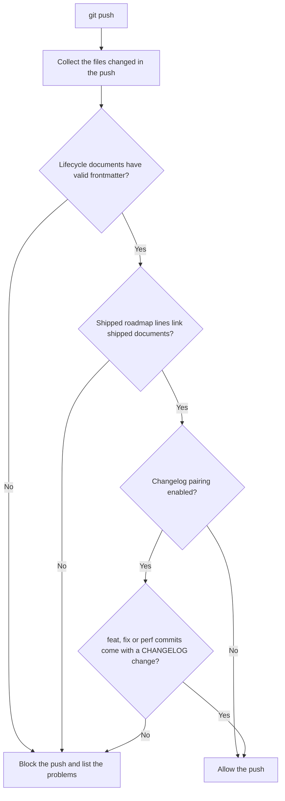

# drift-guard

Drift guard keeps a project's tracking records honest. It blocks a push when documents are missing required metadata or when the roadmap claims something shipped that its design does not. After a merge, it reports branches and worktrees that the merge left behind.

It has three parts:

| File | Runs | Role |
|---|---|---|
| `pre-push` | On `git push` | Runs `housekeep check --push` on the commits being pushed and blocks the push if it finds a problem |
| `post-merge` | After `git pull` or `git merge` | Runs `housekeep check` and reports what the merge left behind. Never blocks. |
| `housekeep` | Called by the hooks, or by hand | Does the checking and, in `fix` mode, the cleanup |

## What the push check enforces

| Check | Applies to | Rule |
|---|---|---|
| Lifecycle frontmatter | Markdown files in the push under `0-brainstorms/`, `1-discovery/`, `2-design/`, `3-plans/`, `4-reviews/` or `adrs/` | The file must start with a YAML frontmatter block containing `title`, `type` and `authors`. Lifecycle documents also need `date` and `status`. `status` must be one of `draft`, `approved`, `in-progress`, `shipped`, `resolved` or `superseded`. |
| Shipped roadmap lines | Lines added under `Recently shipped` in `ROADMAP.md` that link to lifecycle documents | Each linked document must have `status: shipped`. |
| Changelog pairing (opt-in) | Pushes containing `feat`, `fix` or `perf` commits | The push must also change `CHANGELOG.md`. Turn this on by creating `scripts/githooks/drift-guard.on`. |



## Modes

| Mode | What it looks at | Uses the network | Exit code | Called by |
|---|---|---|---|---|
| `check --push <base> <head>` | Frontmatter, roadmap pairing and changelog pairing for the pushed commits | Never | `1` if it finds a problem | `pre-push` |
| `check` | The last pull (`ORIG_HEAD..HEAD`) and stale branches | Yes | Always `0` | `post-merge` |
| `audit` | Every local branch and registered worktree | Yes | Always `0` | `/housekeeping audit` |
| `fix` | Removes what `audit` marked safe to remove | Yes | Always `0` | `/housekeeping fix` |

## Reading the audit output

`housekeep audit` prints a scope line, one line per branch and noteworthy worktree, and a summary.

### Scope line

```
  audit <owner/repo> at <toplevel>: <Nb> branches (<P> protected), <Mw> worktrees, <K> pull requests resolved, <J> unresolved
```

If `origin` is missing or is not a GitHub URL, pull request state cannot be looked up:

```
  audit <toplevel>: no GitHub identity (origin missing or unparseable); pull-request state unresolved for all <N> branches
```

### Branch lines

```
  branch <B>: pull request #<N> merged, safe to remove
    worktree <path> holds it, so remove that first
  branch <B>: pull request #<N> merged, local behind its head, safe to remove
  branch <B>: pull request #<N> open, kept
  branch <B>: pull request #<N> closed unmerged, kept
  branch <B>: commits past pull request #<N> (<state>), kept
  branch <B>: merged pull request #<N>, but <oid12> is not in <base> history, kept
  branch <B>: diverged from pull request #<N> head, kept
  branch <B>: no pull request found, kept
  branch <B>: pull request #<N> merged, worktree <path> <blocker>, kept
  branch <B>: checked out in the main worktree, kept
  branch <B>: unresolved (<reason>), kept
```

`<blocker>` is the worktree state that prevents removal: `has uncommitted changes`, `is locked` or `holds ignored files`.

### Worktree lines

```
  worktree <path> (<B>): uncommitted changes, kept
  worktree <path> (<B>): locked (<reason>), kept
  worktree <path> (<B>): ignored files (<n>: <p1>, <p2>, ...), kept
  worktree <path>: detached HEAD, not managed
  worktree <path>: directory missing, metadata prunable
```

The main worktree is counted in the scope line but never listed.

### Summary line

```
  <R> removable, <K> kept, <J> unresolved, across <Nb> branches and <Mw> worktrees
  housekeep fix
```

The `housekeep fix` hint appears only when something is removable.

## What it does not do, on purpose

- **No network calls during a push.** They would slow every push, fail offline, and tempt people to skip the hook with `--no-verify`.
- **No checks on Markdown outside lifecycle directories.** `notes/`, `assets/`, `imports/`, `guides/`, root files such as the README, ROADMAP and CHANGELOG, and published documentation are exempt.
- **No rule that every feature needs a roadmap line.** Measured against history, that rule was wrong 44% of the time, because many features never had a roadmap line.
- **No automatic cleanup.** `fix` removes branches and worktrees only when you run it.
- **No forced worktree removal.** It never passes `--force` to `git worktree remove`.
- **No remote branch deletion.** Turn on GitHub's "Automatically delete head branches" setting for that.

## Limitations

- **Branch names containing `"`** are not supported by the record parser. Such branches are reported as `unresolved` and kept.
- **Detached worktrees** have no branch, so `fix` never removes or changes them.
- **Ignored files** block removal. `git worktree remove` would delete them silently, so `housekeep` keeps the worktree until you clear them yourself.

## False-positive measurements

### Push frontmatter check (2026-09-04)

Run against the full history of four repositories:

| Repository | Files without frontmatter | Of those, in a lifecycle directory |
|---|---|---|
| Repository A | 22 | 0 |
| Repository B | 29 | 11 |
| Repository C | 16 | 0 |
| Repository D | 6 | 0 |

Limiting the check to lifecycle directories removed every false positive in three of the four repositories. The 11 findings in the fourth were real gaps, which were then fixed.

### Audit of branches and worktrees (2026-09-17)

Run across nine repositories, including nested private companion repositories:

| Repositories | Branches | Worktrees | Marked removable | Wrong on inspection |
|---|---|---|---|---|
| 9 | 17 | 12 | 0 | 0 |

Every open branch, branch without a pull request, and worktree with uncommitted or ignored files was kept.

## Install

```bash
hook_src=<path-to-toolkit>/git-hooks/drift-guard
target=<path-to-repo>

mkdir -p "$target/scripts/githooks"
cp "$hook_src/housekeep" "$hook_src/pre-push" "$hook_src/post-merge" "$target/scripts/githooks/"
chmod +x "$target/scripts/githooks/housekeep" "$target/scripts/githooks/pre-push" "$target/scripts/githooks/post-merge"
git -C "$target" config core.hooksPath scripts/githooks
```
