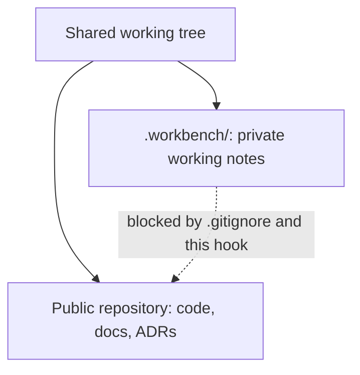

# private-workbench-guard

A Git `pre-commit` hook for a public repository that has a private companion repository nested inside it. It stops private content from reaching a public commit.

## The pattern

Two repositories share one working tree. The public repository holds code, user documentation, ADRs, the roadmap and the changelog. The private one, cloned into `.workbench/` and ignored by the public repository, holds the working process: brainstorms, research, designs, plans, reviews and notes, plus anything about business or commercial direction.

```
<public-repo>/            public repository
  .workbench/             private repository, listed in the public .gitignore
```

`git ...` at the root targets the public repository. `git -C .workbench ...` targets the private one. Nothing is ever committed to both.



## What already protects it

Three safeguards work before any hook runs:

1. **`.workbench/` is in `.gitignore`**, so `git add -A` at the root cannot pick up its files.
2. **Git does not stage files inside a nested repository.** Even `git add -f .workbench/some/file` stages nothing.
3. **Git refuses paths outside the current repository.** From inside `.workbench/`, `git add ../scripts/lint.sh` fails.

A private file cannot become a public file by accident. What remains is private content typed or pasted into a public file, and that is what this hook checks.

## What the hook checks

| Check | What it catches |
|---|---|
| Nested repository staged as a gitlink | `git add -f .workbench` records a submodule reference. Clones get none of the content, but the private repository's name and commit ID become public. |
| Private vocabulary in added lines | References to `.workbench` paths, and terms such as hosted service or tier, monetisation, pricing, per-seat figures and dollar amounts |

Both checks refuse the commit. `git commit --no-verify` overrides them deliberately.

The vocabulary check is the reason the hook exists. Private content retyped or summarized into a public file, in the right directory with a valid path, passes every structural safeguard above. Only the words give it away.

## Why the money pattern is not `\$[0-9]`

`\$[0-9]` matches every shell positional parameter, such as `"$1"`. Measured over the last 40 commits of one repository:

| Pattern | Commits blocked |
|---|---|
| `\$[0-9]` | 16 of 40 |
| `\.workbench` | 1 |
| `hosted (service\|tier)` | 1 |
| `monetiz\|monetis` | 1 |
| `pricing` | 1 |
| `per (seat\|month\|user)` | 0 |

The hook instead requires two digits or a separator: `\$[0-9]{2,}` or `\$[0-9]+[.,][0-9]`. That still catches `$50`, `$1.50` and `$4,500` but ignores `"$1"`. With this change and the allowlist below, none of the same 40 commits is blocked, and a test leak containing all three vocabulary types is still caught.

A hook that blocks 40% of legitimate commits gets bypassed out of habit, which is worse than having no hook.

## Allowlist

The hook skips `CLAUDE.md`, `AGENTS.md`, `.gitignore` and its own script. Stating a rule means naming the words it forbids, so those files could never pass their own check.

## What it does not do, on purpose

An earlier design blocked `git commit` and `gh` commands when the shell was inside the nested repository. It was dropped for two reasons:

- **Committing to the wrong repository from inside `.workbench/` cannot leak anything.** The content lands in the private repository, where it belongs. At worst the commit message is misleading, and `git reset` fixes it.
- **A directory rule guards the wrong direction.** Leaks happen when private words reach the public repository, from the right directory with the right repository named. Only a content check can see that.

## Install

Run from the toolkit root, once per repository. The script is committed into the target repository, so every clone carries it.

```bash
repo="<path-to-target-repository>"
mkdir -p "$repo/scripts/githooks"
cp git-hooks/private-workbench-guard/pre-commit "$repo/scripts/githooks/pre-commit"
chmod +x "$repo/scripts/githooks/pre-commit"
git -C "$repo" config core.hooksPath scripts/githooks
```

`core.hooksPath` is a per-clone setting, so repeat the last line on every machine. Git never enables hooks automatically on clone, because that would let a repository run code on your machine.

Check the setting:

```bash
git -C "$repo" config --get core.hooksPath      # expect: scripts/githooks
```

To test the gitlink refusal, use a throwaway repository with a throwaway nested repository and nothing else staged, because the final `git reset` unstages everything:

```bash
git -C "$repo" add -f .workbench && git -C "$repo" commit -m probe
# expect: refusing — the private workbench is staged
git -C "$repo" reset
```

## Using a different directory name

The hook assumes the nested repository is at `.workbench`. For another name, change that string in both the gitlink check and the vocabulary pattern.
