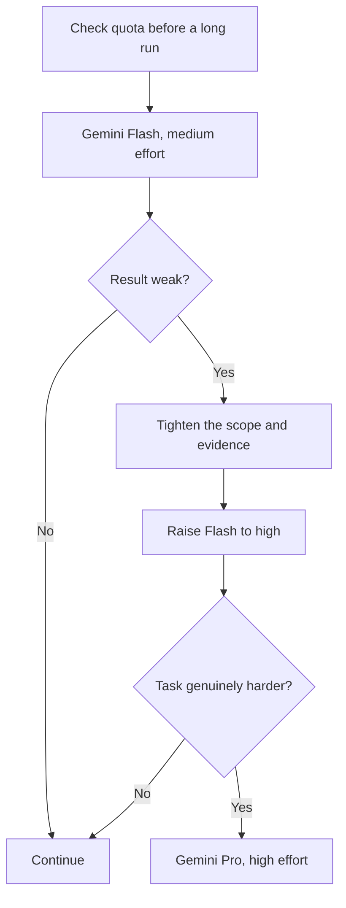

# Antigravity model and quota selection

How to choose a model and effort level inside Google Antigravity (`agy`), and how to manage its quota. For choosing between harnesses, start with the [AI model and effort routing guide](guide-ai-model-and-effort-routing.md). This guide covers only what is specific to Antigravity.

The model list below was recorded on 2026-08-02. On 2026-09-22, [Google's model list](https://antigravity.google/docs/models) also included Gemini 3.8 Flash and 3.7 Flash, so treat the table as an example and check the picker in your own account.

## Models recorded in the picker

| Model | Effort levels | Good for |
|---|---|---|
| Gemini 3.6 Flash | low, medium, high | Fast research, documentation, browser work, visual iteration and light coding |
| Gemini 3.5 Flash | low, medium, high | A fallback when 3.6 Flash is unavailable |
| Gemini 3.1 Pro | low, high | Harder reasoning, long-context synthesis and visual judgments that matter |
| Claude Sonnet 4.6 Thinking | Thinking | Implementation and review, when that model pool has capacity |
| Claude Opus 4.6 Thinking | Thinking | Difficult architecture or repair work inside Antigravity |
| GPT-OSS 120B | medium | Bounded open-weight work and comparing model behavior |

Antigravity's effort levels do not map directly to those in Claude Code, Codex or Kimi Code. Choose the lowest level that fits: low for extraction, medium for routine work, and high or Thinking for ambiguous, multi-step reasoning.

## Choosing a model

1. Check your quota before a long or unattended run.
2. Use Gemini Flash at medium effort for gathering information and ordinary browser work.
3. Raise Flash to high for visual checks or moderately complex reasoning.
4. Move to Gemini Pro at high effort when Flash misses relationships, when a visual judgment matters, or when the task is long-context synthesis.
5. Use the Claude Sonnet Thinking model for implementation when its separate capacity inside Antigravity is more useful than running Claude Code itself.
6. Keep the Claude Opus Thinking model for hard repair or architecture work that needs Antigravity's tools. Claude Code offers newer Claude models, so prefer it when model generation matters more than Antigravity's browser, autonomy or quota.
7. Start a new session when you change the kind of task, when old investigation fills the context, or when a finished phase no longer helps the next one.

## Quota

A Google AI Pro subscription gets a higher Antigravity quota, refreshed every five hours until the weekly limit is reached. Google does not publish a fixed number of turns. Use depends on the model, the workload, available capacity and your account. Where your account supports it, AI credits can cover usage beyond the quota. See [Antigravity plans](https://antigravity.google/docs/plans).

Storage or consumer Gemini benefits on the same plan do not mean unlimited agent use.

Check your capacity with:

| Where | Command |
|---|---|
| Command-line tool | `/usage` for the current session, and `/quota` where available. See [Antigravity usage commands](https://antigravity.google/docs/cli/commands/usage). |
| IDE | The Models and Quota view |

## When capacity runs short

| Situation | What to do |
|---|---|
| The five-hour Gemini quota is nearly used | Move bounded information gathering to another harness's fast model, or to an open-weight model |
| The weekly quota is nearly used | Keep Antigravity for work that needs its browser, visual or autonomous tools. Do ordinary terminal coding in another harness. |
| Flash gives a weak result | Improve the scope and evidence first, then raise the effort. Move to Pro only if the task really is harder. |
| Antigravity's Claude model is older than the task needs | Use Claude Code directly with a current Claude model |
| A long session gets noisy | Save a short summary of the state and evidence, and start a new session rather than raising effort |
| The task needs a browser that is logged in to your accounts | Use a browser tool that drives your own browser, and supervise any destructive action or purchase |

## What Antigravity cannot decide for you

Antigravity does not know which of your other subscriptions has spare capacity. It cannot judge business impact or privacy requirements, or whether a task really needs a 1M-token context. Apply the [routing guide](guide-ai-model-and-effort-routing.md) before choosing from this picker.

Cross-provider comparisons belong in the routing guide. Update this guide only when Antigravity's picker, quota or session behavior changes.
