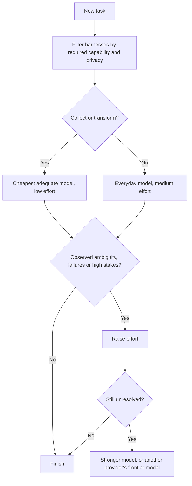
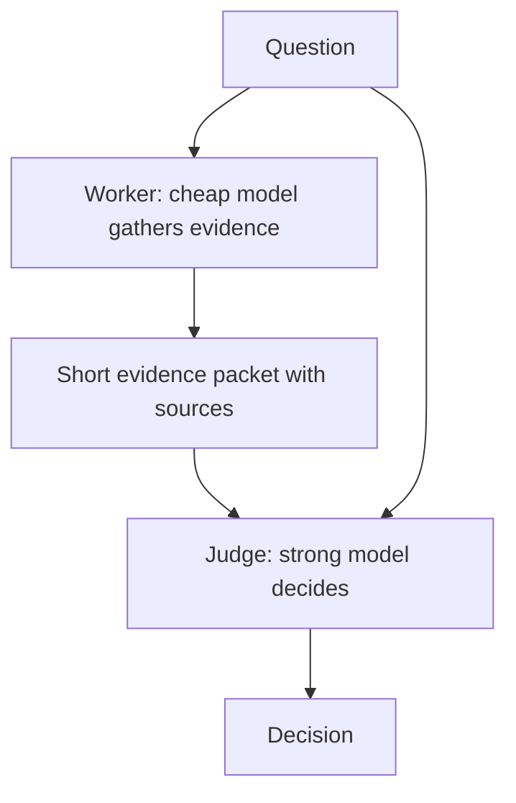

# AI model and effort routing

How to choose a harness, model and effort level for a task in under a minute, when you have subscriptions to several AI coding tools. The aim is steady, high-quality output across the week, not using the strongest model on every task.

The method in the first half of this guide is meant to stay valid as products change. The [example routing table](#example-routing-table-august-2026) at the end names specific models from an August 2026 comparison, and newer models have appeared since. On 2026-09-22, for example, Codex offered [GPT-6 Astra](https://learn.chatgpt.com/docs/pricing) and Antigravity offered [Gemini 3.8 and 3.7 Flash](https://antigravity.google/docs/models). Check current models, plans and prices before you rely on a named model.

## The core rule

> Start with the cheapest separate capacity pool that can finish the task reliably. Escalate when you observe complexity, not when a task merely sounds important.

Each subscription is its own pool with its own limits. Spreading work across pools keeps the strongest models free for the tasks that need them.

## Choosing, step by step

Decide in this order:

1. **Required capability.** Does the task need a terminal, a browser, vision, a logged-in session, a document tool, a particular skill or hook, long context or background running?
2. **Privacy.** Must it stay local, can it go to an approved cloud provider, or can any provider see it?
3. **Task type.** Is it collecting, transforming, implementing, debugging, deciding or reviewing?
4. **Difficulty.** How large is the scope, how ambiguous is it, how much damage could a mistake do, and have evidence-backed attempts already failed?
5. **Context size.** A few targeted files, under 256,000 tokens, or genuinely more?
6. **Quota.** Protect the five-hour limit first, the weekly limit second, and keep a separate fallback third.
7. **Escalation.** Raise effort first, then the model tier, then move to a different frontier provider.



If you automate routing later, give the router these fields rather than one "intelligence" score, which would route browser, privacy, quota and context-heavy tasks badly:

```yaml
task_class: collect | transform | implement | debug | decide | review
required_capabilities: [terminal, browser, vision, artifact_tools, long_context]
privacy: local | approved_cloud | any
context_class: targeted | under_256k | over_256k
difficulty: bounded | ordinary | hard | exceptional
quota_state: healthy | preserve_weekly | five_hour_exhausted
fallback_order: []
escalation_triggers: []
```

## Choose effort before a stronger model

Effort levels differ by provider. "High" on Kimi, Claude, Gemini and Codex does not mean the same amount of compute.

| Effort | Use it for |
|---|---|
| Low | Gathering information, extraction, classification, mechanical changes, and work on one named file or symbol |
| Medium | Ordinary implementation, writing tests, structured drafting and well-scoped analysis |
| High | Ambiguity, reasoning across several layers, debugging, architecture, critique and final synthesis |
| Extra high or max | Only when a mistake would be costly, a high-effort attempt left specific open questions, or a long task has shown it needs more |

Do not raise effort to make up for a vague prompt. Narrow the goal, supply the relevant evidence and define what success looks like first.

## Split gathering from judgment

For large tasks, let a cheap model gather the evidence and a strong model make the decision.



Give the worker a narrow brief:

- The scope and when to stop.
- The files, symbols or kinds of official source to use.
- The exact format for its findings.
- A source link or file location for every claim.
- Any uncertainties and contradictions it found.
- No architecture, recommendations or approvals.
- A limit of about 1,500 tokens for the handoff, unless the task clearly needs more.

The judge gets the original question and the packet. It checks samples of the important evidence and makes the decision. It does not repeat the gathering.

In bounded trials, the split saved capacity. A pricing research task used about 25,100 tokens with a cheap worker against 34,900 for a single pass by a strong model, and a code-tracing task used about 48,000 against 66,100. In the code-tracing trial, the strong model's review added architectural risks the worker had missed. A skill that loaded a lot of context inflated both runs, so limit what the worker can load.

Use the split when gathering is large but mechanical and the handoff is small. Use one strong model when the task is small, when gathering and judgment are mixed together, or when a worker mistake would mean starting over.

## Managing quota

Five-hour limits shape today's work. Weekly limits decide whether a hard task later in the week still has a frontier model.

### At the start of a work block

1. Check the relevant limits before a long task: `/usage` in Claude Code, `/status` in Codex, `/usage` in Kimi Code, and `/usage` or `/quota` in Antigravity.
2. Decide whether the day's work is mostly gathering, implementation or consequential judgment.
3. Keep one frontier pool free for unexpected debugging or review.
4. Use a separate pool for bounded background work.

### Protect weekly capacity

- Do not use the most expensive models or maximum effort for mechanical work.
- Use a smaller context window when the evidence fits in it.
- Do not switch models or effort partway through a Kimi session, because it invalidates the cache. Start a new session for a different task.
- Start a new session when the conversation holds old investigation, repeated failed attempts or a large finished phase. Compaction helps continuity but does not make irrelevant context free.
- Keep raw research out of the judge's session. Give it a sourced packet.

### When quota runs low

1. Lower the effort, if the task is still bounded.
2. Move gathering to a cheaper model or an open-weight worker you have tested.
3. Move the whole task to another provider's pool at the same capability level.
4. Split gathering from judgment, if the handoff will be small.
5. Wait for the reset for non-urgent decisions, rather than accepting a low-confidence one.

Do not start the same investigation in three harnesses to get around a five-hour limit. It duplicates context and leaves three half-informed sessions.

## Open-weight models

Treat open-weight models as an extra pool of workers.

| Option | Use it for |
|---|---|
| Ollama Cloud | A one-month trial with measurements, for research packets, repository maps, extraction, first drafts and test-log triage. On 2026-09-21 it cost US$20 a month with US$60 of included usage credit. Check [current pricing](https://ollama.com/pricing). |
| Groq | Very fast, metered workers, such as GPT-OSS 20B or 120B, when latency matters |
| OpenRouter | Many models behind one API, with provider fallbacks, price and latency routing, budget caps and zero-data-retention filtering |
| RunPod | Renting a 24 GB or 48 GB GPU to test a model before buying hardware |

Buy local GPU capacity for privacy, offline work, predictable high-volume workers or measured cloud savings, not to replace a frontier model. Before buying, rent an equivalent GPU and measure prompt processing speed, generation speed, usable context and success rate on your own tasks. Check power and cooling as well as memory.

Accept a local model's result without frontier review only when all of these are true:

- The output can be checked mechanically.
- Errors are cheap to find and undo.
- The task has no consequential ambiguity.
- A sample has already shown the model is accurate enough.
- Privacy or volume justifies running it locally.

Everything else gets a frontier judge, or stays on a frontier model throughout.

## Common mistakes

- **Choosing by benchmark rank alone.** Harness tools, run time, quota and task fit can matter more than a one-point score difference.
- **Using maximum effort by default.** It multiplies time and quota use.
- **Treating a subscription like an API balance.** A five-hour message range does not tell you its value in tokens.
- **Using a 1M-token context because it exists.** Targeted search plus a short evidence packet is usually cheaper and more accurate.
- **Switching Kimi models often.** Each switch invalidates the cache.
- **Assuming a model that fits in GPU memory is useful.** Leave room for the runtime and context cache, then test the real context and tool loop.
- **Letting the worker decide.** Cheap gathering saves money. Cheap, unreviewed judgment causes rework.
- **Repeating the gathering in the judge's session.** Sample the packet. If you have to redo everything, the split failed.

## Example routing table (August 2026)

This table records one routing policy from an August 2026 comparison. It assumed one subscription tier each for Claude Code, Codex, Kimi Code and Antigravity. Model names and limits have changed since, so use it as an example of the method, not a current recommendation. Grok Build TUI is not included, because no roster or quota snapshot was recorded for it.

### Effort by provider

| Provider | Cheap | Everyday | Hard | Exceptional |
|---|---|---|---|---|
| Claude Code | Haiku 4.5, or Sonnet 5 low | Sonnet 5 medium or high | Opus 5 high | Opus 5 extra high, or Fable 5 max |
| Codex | Luna low | Terra medium | Sol high | Sol extra high or max |
| Kimi Code | K2.7 Code, or K3-256k low | K3-256k high | K3 high | K3 max, only when high has clearly failed |
| Antigravity | Gemini 3.6 Flash low | Gemini 3.6 Flash medium or high | Gemini 3.1 Pro high, or Sonnet 4.6 Thinking | Opus 4.6 Thinking. Antigravity's Claude models trail Claude Code's. |

### By task

| Task | Start here | Escalate when you see | Fallback in another pool |
|---|---|---|---|
| Search current documentation and collect sources | Antigravity, Gemini 3.6 Flash medium | Conflicting sources, a consequential conclusion, or synthesis across domains | Codex Luna low as worker, Kimi K3-256k high as judge |
| Read, extract, classify or summarize material | Codex Luna low | Missing facts, subtle meaning, or more than one interpretation | Gemini 3.6 Flash low or medium |
| Mechanical code edits, formatting, renames | Codex Luna low | Changes that cross APIs or behavior, or unexpected test failures | Kimi K2.7 Code, or Gemini 3.6 Flash medium |
| Everyday feature or test work | Codex Terra medium | More than two layers, unclear invariants, or two failed fixes | Claude Sonnet 5 medium or high, or Kimi K3-256k high |
| Debugging a cross-layer or intermittent problem | Codex Sol high | Competing root causes at high effort, or risky choices | Claude Opus 5 high, or Kimi K3 high |
| Architecture or system design | Claude Opus 5 high | An irreversible or costly decision, a security boundary, or an open trade-off | Codex Sol high, or Kimi K3 high |
| Brainstorming and challenging an idea | Claude Opus 5 high | Many systems involved, or a need for long-range coherence | Kimi K3 high, or Gemini 3.1 Pro high for visual products |
| Turning an approved design into a plan | Codex Sol high, or Claude `opusplan` | Unknown APIs, or architecture still unsettled | Kimi K3 high |
| Business writing and proposals | Kimi K3-256k high to draft, Claude Opus 5 high to review | Claims, positioning or negotiation that affect the outcome | Claude Sonnet 5 high, or Codex Terra medium |
| UI design and visual critique | Antigravity, Gemini 3.1 Pro high with browser screenshots | Design-system architecture or conflicting product constraints | Claude Opus 5 high with screenshots |
| Browser testing and visual regressions | Antigravity, Gemini 3.6 Flash high | A root cause in the app's architecture, accessibility or security | Gemini 3.1 Pro high, then Codex for the code fix |
| Code review | Codex Sol high | Security, data loss, concurrency or an architectural contract | Claude Opus 5 high as a second reviewer |
| Document, design or plan review | Claude Opus 5 high | Material too large for comfortable context, or claims needing fresh research | Kimi K3 high, or a Gemini Flash worker with an Opus judge |
| Large repository or long document analysis | Kimi K3-256k high | Evidence that really exceeds 256,000 tokens after targeted search | Kimi K3 high at 1M, or Claude at 1M |
| Long unattended implementation | Claude Sonnet 5 high, or Kimi K3-256k high | Repeated repair loops, unclear architecture, or systemic review findings | Antigravity's Sonnet 4.6 Thinking, or Codex Terra or Sol |

## Keeping this guide current

When plans or models change:

1. Check the official model lists, pricing pages, quota documentation and current independent benchmarks.
2. Replace the example table with the current models, and remove retired names.
3. Before a new model takes over a role, test it on one bounded task.
4. Change the method sections only when the evidence changes a starting choice, an escalation trigger, a fallback or a deployment decision.

Model names age quickly. What lasts is keeping capability, harness fit, quota and task difficulty separate, and using the strongest model only where it changes the outcome.
