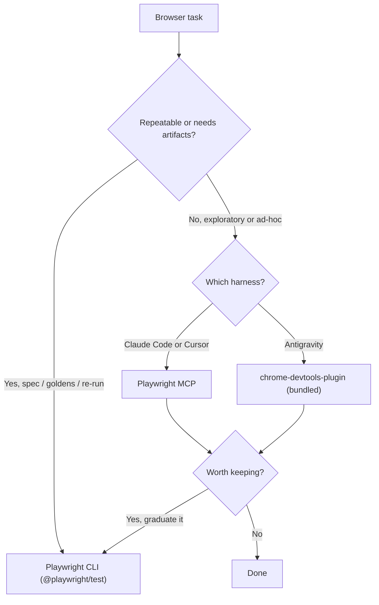

# Browser automation for agents — Playwright MCP vs CLI

For **agentic** browser work — not CI/CD — there is no single winner. Keep both Playwright MCP and the Playwright CLI and **choose per job**. They are different interaction paradigms, not two implementations of the same thing.

> **One-line rule:** exploratory/ad-hoc/aesthetic work → **MCP** (or chrome-devtools-plugin in Antigravity); repeatable flows, goldens, or anything you'll re-run or commit → **CLI**.

This guide covers the non-CI use cases: browsing the web, manual visual/smoke checks, judging the aesthetics of a live or in-progress site, and one-off browser operations.

## The three tools

| | Playwright MCP (`@playwright/mcp`) | Playwright CLI (`@playwright/test`) | chrome-devtools-plugin (Antigravity bundled) |
|---|---|---|---|
| **What it is** | Browser actions exposed to the agent as structured tool calls | The agent authors and runs Playwright code/commands via the shell | Antigravity's bundled live-debug browser plugin (replaces superpowers-chrome) |
| **Perception** | Accessibility-tree snapshot per step (deterministic, element refs); screenshots on demand (`--vision` for pixel mode) | Whatever the agent writes code to capture, read back from disk | Accessibility-tree snapshots, on demand |
| **Round trips** | One action per step, fresh snapshot each time — a REPL loop | Many actions per run — a program | Interactive, step-by-step |
| **Power ceiling** | Curated action set, plus a `run_code` escape hatch | Full Playwright API: network interception, contexts, fixtures, tracing, video, `expect`, `toHaveScreenshot` | Live DOM/perf/a11y debugging surface |
| **Artifacts** | Ephemeral unless the agent saves them | Reusable spec + traces/videos/goldens | Ephemeral |

## Mental model

**MCP is a REPL for the browser. The CLI is writing and running a program.**

A REPL wins when you don't yet know what you'll do next — unknown pages, exploration, "click around and tell me X." A program wins when the procedure is known, you'll run it more than once, and you want artifacts left behind. Nearly every trade-off below falls out of that one distinction.

## Decision rule — use case to tool

| Task | Use | Why |
|---|---|---|
| Browsing the internet / research | **MCP** | Unknown pages, adapt each step. |
| Ad-hoc "open this and tell me X" | **MCP** | Lowest friction, no code. |
| Quick "does this site look right?" | **MCP** (screenshot + vision) | One call, immediate visual read. |
| Manual smoke-test of a *known* flow | **CLI** | Script once, run unattended, get a trace on failure. |
| Visual-regression / pixel goldens | **CLI** | `toHaveScreenshot` + diff ratio. MCP can't baseline. |
| A site you're building (live preview) | **Both** | Explore with MCP, then graduate to a spec — see below. |

## Per-harness defaults

| Harness | Exploratory / ad-hoc / aesthetics | Repeatable / goldens |
|---|---|---|
| **Claude Code** | Playwright MCP (idle cost is ~tool names — see token note) | Playwright CLI |
| **Cursor** | Playwright MCP | Playwright CLI |
| **Antigravity** | **chrome-devtools-plugin** (already bundled, no install) | Playwright CLI |

In Claude Code/Cursor there is also **superpowers-chrome** (CDP) for the narrow case of attaching to an existing, *authenticated* browser session — neither a fresh MCP nor a CLI run shares your logged-in cookies. In Antigravity, only add `@playwright/mcp` if you specifically want the MCP REPL loop and accept the schema cost; otherwise the bundled chrome-devtools-plugin already covers live work.

## Token cost — the honest version

The token story is **harness-dependent**, not a fixed ratio:

- **Idle cost (server installed, not used):** depends on whether the harness loads MCP tool schemas eagerly or defers them. **Claude Code can defer** — only tool *names* are in context until the first call (you fetch the schema on demand), so an unused server costs ~names. A harness that **eager-loads** every schema pays per session whether you browse or not. That, not Playwright MCP itself, is the real argument for skipping it in a given harness — check your harness's behaviour before deciding.
- **In-use cost:** MCP returns a snapshot per step, so context grows with each action. The **accessibility-tree snapshot is the cheap perception mode**; vision/screenshot mode is heavier. The CLI keeps artifacts on disk and the agent reads back only what it needs — more frugal for long multi-step flows, heavier if it dumps full HTML.

There is no universal "Nx cheaper" multiplier; it depends entirely on how each is used.

## Aesthetics need pixels — either way

Judging whether something *looks* right — contrast, spacing, overlap, alignment, font rendering — requires **screenshots + a vision model**, regardless of MCP or CLI. The accessibility tree describes structure, roles, and names; it says nothing about whether the page looks good. MCP gets you there in one inline screenshot call (smoothest for a quick "does this look ok?"); the CLI gets you there by scripting the screenshot and reading it back. For *repeatable* pixel checks, only the CLI baselines (`toHaveScreenshot`).

## Graduate exploration into a spec

The strongest pattern is not pick-one — it's a pipeline:

1. **Explore** the live target with MCP to find selectors and confirm the flow.
2. Once validated, **write it up as a committed Playwright spec** (CLI) so it becomes a permanent smoke/regression test.

The throwaway exploration becomes durable coverage in the same suite. This is the right shape whenever a project already keeps `*.spec.ts` browser tests and visual goldens.

## Myths to not re-derive

These have appeared in older notes and in at least one harness's advice — they are wrong:

- **"`@playwright/cli`"** — no such package. The CLI ships with **`@playwright/test`**; the `playwright` binary provides `test`, `codegen`, `screenshot`, `open`, `pdf`, `install`.
- **"Playwright CLI is 4–10x cheaper than MCP"** — a fabricated, precise-sounding number. The direction (artifacts on disk vs per-step snapshots) is real; the multiplier is not measured.
- **"MCP always adds schema overhead every session"** — only when the harness eager-loads schemas. Deferred-loading harnesses (Claude Code in its default deferred mode) carry ~names until first use.
- **"Just skip the MCP, the goldens/test runner cover it"** — conflates two jobs. Goldens are regression (CLI's job); they do nothing for exploratory browsing, ad-hoc ops, or live aesthetic review (MCP's job). Keep both.

## Decision flow



## Quick reference

```bash
# Playwright CLI (ships with @playwright/test — NOT @playwright/cli)
npx playwright test                 # run specs
npx playwright test --headed        # watch locally (also --debug, --ui)
npx playwright test --update-snapshots   # refresh pixel goldens
npx playwright codegen <url>        # record a flow into a spec
npx playwright screenshot <url> out.png  # one-shot screenshot
npx playwright install              # install browsers

# Playwright MCP (Claude Code / Cursor) — add to MCP config
#   package: @playwright/mcp   (default: accessibility-tree snapshots; --vision for screenshots)
```

`--slow-mo` is **not** a Playwright Test CLI flag — use `launchOptions.slowMo` in `playwright.config.ts`, or `--debug` to step through.

## See also

- [Harness plugin and skill parity](guide-harness-plugin-parity.md)
- [Cross-harness project instructions](guide-cross-harness-project-instructions.md)
