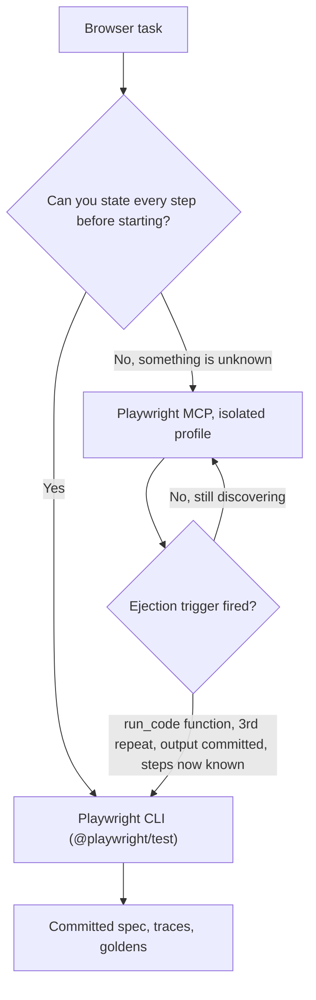

# Browser automation for agents — Playwright MCP vs CLI

For **agentic** browser work — not CI/CD — there is no single winner. Keep both Playwright MCP and the Playwright CLI and **choose per job**. They are different interaction paradigms, not two implementations of the same thing.

> **One-line rule:** if you already know every step, write a **CLI** script. If you don't, start in **MCP** — and eject to the CLI the moment one of the [ejection triggers](#ejection-triggers--the-rule-that-actually-fires) fires.

This guide covers the non-CI use cases: browsing the web, manual visual/smoke checks, judging the aesthetics of a live or in-progress site, and one-off browser operations.

## The three tools

| | Playwright MCP (`@playwright/mcp`) | Playwright CLI (`@playwright/test`) | chrome-devtools-plugin (Antigravity bundled) |
|---|---|---|---|
| **What it is** | Browser actions exposed to the agent as structured tool calls | The agent authors and runs Playwright code/commands via the shell | Antigravity's bundled live-debug browser plugin (replaces superpowers-chrome) |
| **Perception** | Accessibility-tree snapshot per step (deterministic, element refs); screenshots on demand (`--caps=vision` for pixel mode; bare `--vision` is legacy) | Whatever the agent writes code to capture, read back from disk | Accessibility-tree snapshots, on demand |
| **Round trips** | One action per step, fresh snapshot each time — a REPL loop | Many actions per run — a program | Interactive, step-by-step |
| **Power ceiling** | Curated action set, plus a `run_code` escape hatch | Full Playwright API: network interception, contexts, fixtures, tracing, video, `expect`, `toHaveScreenshot` | Live DOM/perf/a11y debugging surface |
| **Artifacts** | Ephemeral unless the agent saves them | Reusable spec + traces/videos/goldens | Ephemeral |

## Mental model

**MCP is a REPL for the browser. The CLI is writing and running a program.**

A REPL wins when you don't yet know what you'll do next — unknown pages, exploration, "click around and tell me X." A program wins when the procedure is known, you'll run it more than once, and you want artifacts left behind. Nearly every trade-off below falls out of that one distinction.

## Decision rule — use case to tool

| Task | Use | Why |
|---|---|---|
| Browsing the internet / research | **MCP** | Unknown pages, adapt each step. |
| Ad-hoc "open this and tell me X" | **MCP** | Lowest friction, no code. |
| Quick "does this site look right?" | **MCP** (screenshot + vision) | One call, immediate visual read. |
| Manual smoke-test of a *known* flow | **CLI** | Script once, run unattended, get a trace on failure. |
| Visual-regression / pixel goldens | **CLI** | `toHaveScreenshot` + diff ratio. MCP can't baseline. |
| Parameter sweep (N variants, one fixed procedure) | **CLI** | It's a loop with a changing argument. See ejection triggers. |
| A site you're building (live preview) | **Both** | Explore with MCP, eject when a trigger fires. |

Treat this table as a starting hint, not the real rule. It asks you to classify a task *before* doing it, and most browser work doesn't reveal which column it belongs in until you're several steps in. The triggers below are what actually decide.

## Ejection triggers — the rule that actually fires

The honest problem with "exploratory vs repeatable" is that it's a **prediction**. You have to guess the task's nature up front, and you'll guess wrong often, because plenty of work starts as a genuine question and turns into a procedure two steps later.

So don't route on category. Route on **observable signals during the work**. Any one of these means stop and write a CLI script instead:

| Trigger | What it means |
|---|---|
| You're passing a multi-statement function to `browser_run_code` | You're already writing a Playwright program, just in a worse editor and without a file to keep. |
| You're about to repeat an action sequence a **third** time with only a parameter changing | That's a loop. Loops belong in code. |
| The output is going to be **committed** | Committed artifacts must be regenerable; a chat transcript isn't a build step. |
| You can state every remaining step before running any of them | The exploration is over. You're now transcribing a known procedure by hand. |

The inverse is just as important: **don't pre-emptively write a script** for something you can't yet describe. A CLI script for an unknown page is guesswork you then have to debug. MCP is the cheapest way to find selectors, confirm a flow, and see what the page actually does — that's real work, not a detour.

**Worked example.** Screenshot one fixed section of a local page across six font variants, at one fixed viewport, verifying each webfont applied. Starting in MCP is defensible for the first variant — you don't yet know the selector or whether the font-loading check works. By variant two you've hit trigger 2 (same sequence, one parameter changing), and reaching for `run_code` with a whole async function hits trigger 1. The screenshots being committed hits trigger 3. Eject at variant two; the first variant's MCP exploration wasn't wasted, it was how you learned the selector.

Net effect: more work ends up on the CLI than a strict category rule would send there — but by observation, not prediction.

## Per-harness defaults

All five daily harnesses run Playwright MCP with `--isolated` — see [why](#run-every-harness-with---isolated). Cursor stays the parked exception. Any harness left on the default persistent profile will contend with the others.

| Harness | Exploratory / ad-hoc / aesthetics | Repeatable / goldens |
|---|---|---|
| **Claude Code** | Playwright MCP via the `playwright@claude-plugins-official` plugin; flags set as env in `~/.claude/settings.json` (idle cost is ~tool names — see token note) | Playwright CLI |
| **Codex** | Playwright MCP (`~/.codex/config.toml`) | Playwright CLI |
| **Antigravity** | Playwright MCP for parity (`~/.gemini/config/mcp_config.json`); chrome-devtools-plugin (already bundled, no install) is an additional live-debug tool | Playwright CLI |
| **Kimi Code** | Playwright MCP (`~/.kimi-code/mcp.json`) | Playwright CLI |
| **Grok Build TUI** | Playwright MCP (`~/.grok/config.toml` → `[mcp_servers.playwright]`) | Playwright CLI |

**Cursor** is not covered: it has no Playwright MCP registered and is no longer in active use. Gemini CLI likewise has none — it's being retired in favour of Antigravity CLI, and the two read different files (`~/.gemini/settings.json` vs `~/.gemini/config/mcp_config.json`). Don't confuse them.

In Claude Code there is also **superpowers-chrome** (CDP) for the narrow case of attaching to an existing, *authenticated* browser session — neither a fresh MCP nor a CLI run shares your logged-in cookies. In Antigravity, the bundled chrome-devtools-plugin remains the live-debug tool, but Playwright MCP is also required for the cross-harness parity baseline below.

## Kimi WebBridge — the authenticated niche

[WebBridge](https://www.kimi.com/features/webbridge) is a third tool beside the MCP/CLI pair, not a replacement for either: a local daemon (`http://127.0.0.1:10086`) plus a Chrome/Edge extension that lets an agent drive your **real** browser — your login sessions, cookies, and MFA'd panels — over CDP, fully local. Its "With Local Agent" install covers Kimi Code, Claude Code, Cursor, Codex, Hermes, and OpenClaw.

**Use it for:** exploratory work that needs your real login state — admin consoles, authenticated research, form filling, manually verifying a logged-in flow. This is the slot Playwright MCP can't fill without exporting session state into a sandbox.

**Don't use it for:** anything repeatable or committable. There is no spec format, no goldens, no headless CI mode — smoke tests and visual regression stay on the Playwright CLI, and unauthenticated throwaway exploration stays on Playwright MCP.

**The risk is the point.** WebBridge acts inside your real, authenticated profile: an agent can submit, purchase, or delete, not just read. Prefer it over a sandboxed tool only when the login state is exactly what you need, and supervise destructive-looking steps.

**Tool surface** (curl-JSON against the daemon, documented in the installed `kimi-webbridge` skill): navigate, accessibility-tree snapshot, click, fill (incl. contenteditable), `evaluate` (arbitrary JS), raw CDP passthrough, screenshot-to-file, network capture, file upload, save-as-PDF, tab/session management.

**Installed state (2026-07-28):** daemon v1.11.3 running with the extension connected; the vendor installer wrote byte-identical skill copies into the Kimi, Claude Code, and Codex skill dirs (plus OpenClaw); Antigravity is covered by a symlink at `~/.gemini/config/skills/kimi-webbridge`. Verified: extension connect, navigate → snapshot → close loop. Not yet verified: a real authenticated flow and screenshot fidelity for vision review — treat those as open smoke items before relying on it for either.

## Cross-harness Playwright baseline

The baseline makes Codex, Claude Code, and Antigravity comparable for portable browser-assisted skills. It keeps MCP for exploratory, stateful browser work and the Playwright CLI for repeatable browser evidence. The authoritative setup reference is [Microsoft Playwright MCP](https://github.com/microsoft/playwright-mcp).

| Harness | Exploratory browser interface | Repeatable proof | Project skill root |
|---|---|---|---|
| Claude Code | Playwright MCP | Playwright CLI and installed browsers | `.claude/skills` |
| Codex | Playwright MCP | Playwright CLI and installed browsers | `.agents/skills` |
| Antigravity | Playwright MCP for parity, with chrome-devtools available for live debugging | Playwright CLI and installed browsers | `.agents/skills` |

### Run every harness with `--isolated`

**This is not optional when you run more than one harness.** By default Playwright MCP keeps a *persistent* Chrome profile and takes an exclusive lock on it. Upstream is explicit:

> A persistent profile can only be used by one browser instance at a time, so concurrent MCP clients sharing the same workspace will conflict. To run several clients in parallel, start each additional client with `--isolated` or point it at a distinct `--user-data-dir`.

The failure looks like `Browser is already in use for <dir>, use --isolated to run multiple instances of the same browser` — harnesses may paraphrase it (Kimi Code reports "The Playwright MCP browser profile is locked by another process").

**Why `--isolated` and not per-harness `--user-data-dir`.** The default profile path is `~/Library/Caches/ms-playwright/mcp-{channel}-{workspace-hash}` on macOS, and the `{workspace-hash}` is derived from **the MCP client's workspace root** — so different *projects* already get different profiles automatically. Pinning a fixed per-harness directory throws that away and swaps one collision axis for another: two sessions of the *same* harness in *different* projects would then contend, where today they don't. If you work across several repos at once, per-harness directories are a downgrade. `--isolated` removes the profile entirely, so no axis collides. The two flags are mutually exclusive anyway — setting both throws `Browser userDataDir is not supported in isolated mode`.

**The cost** is persistent login state, which Playwright MCP shouldn't be carrying: [WebBridge](#kimi-webbridge--the-authenticated-niche) owns the authenticated-browser niche. If a specific job needs seeded state, `--isolated` pairs with `--storage-state <path>`.

**`file:` URLs are blocked by default.** Navigating to a local HTML file throws `Access to "file:" protocol is blocked`. This trips up design mockups, generated reports, and static prototypes. It is *not* a reason to stand up `python3 -m http.server` — `--allow-unrestricted-file-access` removes the block. Note what else that flag does: it also lifts the workspace-root restriction on where MCP writes its output files. On a single-user dev machine where the agent already has filesystem read/write, the marginal risk is small; on a shared or untrusted setup, weigh it or leave local-HTML work to the CLI, which has no such restriction.

### Configure only after inspection

Inspect before writing; never overwrite unrelated user-level configuration. Rollback removes only the `playwright` entry.

| Harness | Config | Inspect with |
|---|---|---|
| Claude Code | Plugin `playwright@claude-plugins-official` — see env note below | `claude mcp list` |
| Codex | `~/.codex/config.toml` → `[mcp_servers.playwright]` | `codex mcp list` |
| Kimi Code | `~/.kimi-code/mcp.json` → `mcpServers.playwright` | read the file |
| Antigravity | `~/.gemini/config/mcp_config.json` → `mcpServers.playwright` | read the file |
| Grok Build TUI | `~/.grok/config.toml` → `[mcp_servers.playwright]` | `grok mcp list` / `grok mcp doctor` |

The standard object, for any harness taking JSON:

```json
{
  "mcpServers": {
    "playwright": {
      "command": "npx",
      "args": ["@playwright/mcp@latest", "--isolated", "--allow-unrestricted-file-access"]
    }
  }
}
```

Codex takes the same args in TOML:

```toml
[mcp_servers.playwright]
command = "npx"
args = ["@playwright/mcp@latest", "--isolated", "--allow-unrestricted-file-access"]
```

**Claude Code is the exception — use env vars, not args.** Its Playwright MCP comes from a plugin whose `.mcp.json` lives under `~/.claude/plugins/cache/…`, which plugin updates overwrite. Every flag has an environment-variable equivalent, and `env` in `~/.claude/settings.json` applies to subprocesses Claude Code spawns, including MCP servers. That survives plugin updates:

```json
{
  "env": {
    "PLAYWRIGHT_MCP_ISOLATED": "true",
    "PLAYWRIGHT_MCP_ALLOW_UNRESTRICTED_FILE_ACCESS": "true"
  }
}
```

Env vars accept `true`/`1` and `false`/`0` only; anything else is ignored. Restart the harness — a running MCP server won't pick up changed env.

### Stale locks are a myth — don't build a cleaner

It's tempting to blame leftover `SingletonLock` files from crashed sessions. **Tested and false.** Chromium's ProcessSingleton reads the lock (on macOS a symlink to `<hostname>-<pid>`), and when the hostname matches and the PID is dead, it breaks the lock and proceeds. A persistent context launched against a profile whose lock pointed at a long-dead PID started normally.

So a stale lock does not block anything, and a cleanup script or SessionStart hook to remove them is machinery for a problem that doesn't exist. What abandoned profiles *do* cost is disk — ten of them measured 401 MB. With `--isolated` no new ones are created, so a one-time sweep is enough:

```bash
# Delete abandoned Playwright MCP profiles under both cache roots.
# Only touches mcp-chrome-* dirs; browser binaries (chromium-*, ffmpeg-*) are untouched.
find ~/Library/Caches/ms-playwright ~/Library/Caches/ms-playwright-mcp \
  -maxdepth 1 -type d -name "mcp-chrome-*" -exec rm -rf {} +
```

Two profile roots exist because different MCP versions used different paths — handle both. Check nothing is live first: for each `mcp-chrome-*/SingletonLock`, `readlink` it, take the PID after the last `-`, and skip the directory if `kill -0 <pid>` succeeds.

The one case where a lock genuinely blocks: the **hostname changed** since the lock was written. Chromium can't verify a PID on what it reads as a different machine, so it refuses rather than breaking the lock. Rare, and the sweep above fixes it.

### Shared smoke procedure

1. MCP: open `https://example.com`, obtain the page title or heading, and capture a screenshot to a disposable local path.
2. CLI: run `npx playwright screenshot https://example.com <disposable-path>/example.png`; verify the PNG is non-empty.
3. Record harness, command/interface, date, browser result, and any failure. Delete disposable artifacts after recording the result.
4. A config listing alone is not a pass. A public-page pass does not authorize bypassing a gated quote.

## Token cost — the honest version

The token story is **harness-dependent**, not a fixed ratio:

- **Idle cost (server installed, not used):** depends on whether the harness loads MCP tool schemas eagerly or defers them. **Claude Code can defer** — only tool *names* are in context until the first call (you fetch the schema on demand), so an unused server costs ~names. A harness that **eager-loads** every schema pays per session whether you browse or not. That, not Playwright MCP itself, is the real argument for skipping it in a given harness — check your harness's behaviour before deciding.
- **In-use cost:** MCP returns a snapshot per step, so context grows with each action. The **accessibility-tree snapshot is the cheap perception mode**; vision/screenshot mode is heavier. The CLI keeps artifacts on disk and the agent reads back only what it needs — more frugal for long multi-step flows, heavier if it dumps full HTML.

There is no universal "Nx cheaper" multiplier; it depends entirely on how each is used.

## Aesthetics need pixels — either way

Judging whether something *looks* right — contrast, spacing, overlap, alignment, font rendering — requires **screenshots + a vision model**, regardless of MCP or CLI. The accessibility tree describes structure, roles, and names; it says nothing about whether the page looks good. MCP gets you there in one inline screenshot call (smoothest for a quick "does this look ok?"); the CLI gets you there by scripting the screenshot and reading it back. For *repeatable* pixel checks, only the CLI baselines (`toHaveScreenshot`).

## Graduate exploration into a spec

The strongest pattern is not pick-one — it's a pipeline:

1. **Explore** the live target with MCP to find selectors and confirm the flow.
2. When an [ejection trigger](#ejection-triggers--the-rule-that-actually-fires) fires, **write it up as a committed Playwright spec** (CLI) so it becomes a permanent smoke/regression test.

The throwaway exploration becomes durable coverage in the same suite. This is the right shape whenever a project already keeps `*.spec.ts` browser tests and visual goldens.

Graduating is also the escape hatch for MCP's own limits. `browser_run_code` exists precisely because the curated tool set runs out — but reaching for it is trigger 1, not a solution. Same for the `file:` block: the CLI's `page.goto('file://…')` never had that restriction.

## Myths to not re-derive

These have appeared in older notes and in at least one harness's advice — they are wrong:

- **"`@playwright/cli` does not exist"** is obsolete. Microsoft publishes [Playwright CLI](https://github.com/microsoft/playwright-cli) for agent-driven browser sessions. This guide uses the **Playwright Test CLI** (`@playwright/test`, `npx playwright test`) for repeatable test specifications and screenshot baselines. They are distinct interfaces, checked 2026-09-22.
- **"Playwright CLI is 4–10x cheaper than MCP"** — a fabricated, precise-sounding number. The direction (artifacts on disk vs per-step snapshots) is real; the multiplier is not measured.
- **"MCP always adds schema overhead every session"** — only when the harness eager-loads schemas. Deferred-loading harnesses (Claude Code in its default deferred mode) carry ~names until first use.
- **"Just skip the MCP, the goldens/test runner cover it"** — conflates two jobs. Goldens are regression (CLI's job); they do nothing for exploratory browsing, ad-hoc ops, or live aesthetic review (MCP's job). Keep both.
- **"Stale `SingletonLock` files block later sessions"** — tested false. Chromium breaks a same-host dead-PID lock automatically. Abandoned profiles waste disk, not availability. Don't write a cleanup hook for it.
- **"MCP can't open local HTML, so local-file work must go through a web server"** — the `file:` block is a default, not a design limit. `--allow-unrestricted-file-access` lifts it. Standing up `python3 -m http.server` to screenshot a local file is unnecessary.
- **"The lock contention proves MCP is the wrong tool for concurrent work"** — it proves the default config is wrong for concurrent work. After `--isolated`, MCP is as concurrency-safe as the CLI, and the argument stops carrying weight in any MCP-vs-CLI decision.

## Decision flow



## Quick reference

```bash
# Playwright Test CLI (the test runner, distinct from @playwright/cli)
npx playwright test                 # run specs
npx playwright test --headed        # watch locally (also --debug, --ui)
npx playwright test --update-snapshots   # refresh pixel goldens
npx playwright codegen <url>        # record a flow into a spec
npx playwright screenshot <url> out.png  # one-shot screenshot
npx playwright install              # install browsers

# Playwright MCP (Claude Code / Codex / Kimi Code / Antigravity / Grok Build TUI) — add to MCP config
#   package: @playwright/mcp   (default: accessibility-tree snapshots; --caps=vision for screenshots)
#   --isolated                        in-memory profile: no lock, no cross-harness contention
#   --allow-unrestricted-file-access  permit file:// navigation (blocked by default)
#   --storage-state <path>            seed logins into an isolated session
#   env equivalents: PLAYWRIGHT_MCP_ISOLATED, PLAYWRIGHT_MCP_ALLOW_UNRESTRICTED_FILE_ACCESS
```

`--slow-mo` is **not** a Playwright Test CLI flag — use `launchOptions.slowMo` in `playwright.config.ts`, or `--debug` to step through.

## See also

- [Harness plugin and skill parity](guide-harness-plugin-parity.md)
- [Cross-harness project instructions](guide-cross-harness-project-instructions.md)
