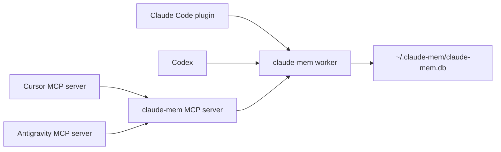

# Sharing claude-mem across harnesses

[claude-mem](https://github.com/thedotmack/claude-mem) gives an AI coding agent memory across sessions. It records observations from your work in a local database and lets the agent search them later. This guide shows how to install it and share one memory store between several harnesses.

## How it works

One background worker process manages a single SQLite database. Each harness talks to the same store, either through a native plugin or through claude-mem's MCP server, so memory recorded in one harness can be searched from another.



Searching memory through MCP works in any harness that supports MCP. Recording new observations automatically depends on hooks, which not every harness supports, so check the upstream documentation for what each harness gets.

## Install

Upstream supports Claude Code, Cursor, Windsurf, OpenCode, Codex CLI, the Antigravity CLI and others, as listed in the [installation guide](https://docs.claude-mem.ai/installation) on 2026-09-22.

Run the interactive installer and pick your harnesses:

```bash
npx claude-mem install
```

Or, in Claude Code, install it from the plugin marketplace:

```
/plugin marketplace add thedotmack/claude-mem
/plugin install claude-mem
```

Data lives in `~/.claude-mem/` by default: the database `claude-mem.db`, the worker's process ID and port files, logs and `settings.json`. Set `CLAUDE_MEM_DATA_DIR` to use another location.

## Connect a harness by hand

If the installer does not cover a harness that supports MCP, register claude-mem's MCP server yourself. First find the server script in your installation. For a Claude Code plugin install it is under `~/.claude/plugins/`, at a path like `marketplaces/thedotmack/plugin/scripts/mcp-server.cjs`. Confirm the file exists, because the exact path changes between versions.

Then add an entry to the harness's MCP configuration. Replace `<mcp-server-path>` with the full path you found:

```json
"claude-mem": {
  "command": "node",
  "args": ["<mcp-server-path>"]
}
```

| Harness | MCP configuration file |
|---|---|
| Antigravity | `~/.gemini/config/mcp_config.json` |
| Cursor | `~/.cursor/mcp.json` |

## Check that it works

Check that the worker is running:

```bash
cat ~/.claude-mem/worker.pid
cat ~/.claude-mem/supervisor.json
```

Then check each harness:

| Harness | How to check |
|---|---|
| Claude Code | `/plugin list` shows claude-mem |
| Antigravity | Tools named `mcp__claude-mem__*` are available in a session |
| Cursor | Cursor Settings, Features, MCP shows the `claude-mem` server as connected |

## See also

- [claude-mem repository](https://github.com/thedotmack/claude-mem)
- [Harness plugin parity guide](guide-harness-plugin-parity.md)
