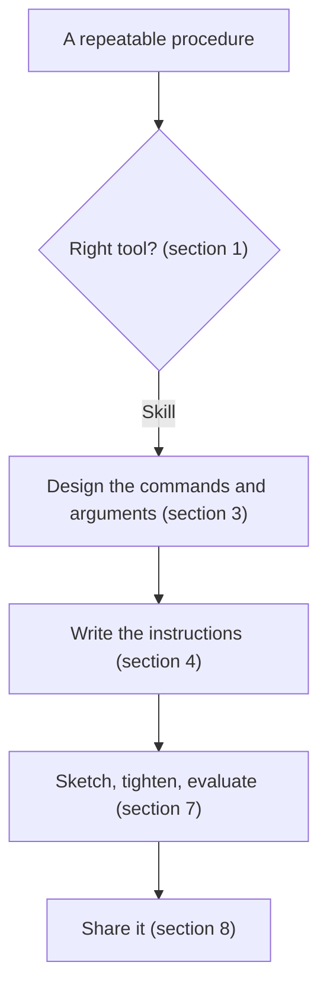

# Creating Claude Code skills

A practical guide to designing a skill: when a skill is the right tool, how to shape its commands and arguments, how to write its instructions, and how to test and share it. It builds on the official [Claude Code skills documentation](https://code.claude.com/docs/en/skills), so read that first if you have never written a skill. The examples come from `/learn`, a working skill in this repository at `skills/learn/SKILL.md`.

It assumes you have used Claude Code and can read YAML frontmatter.



## 1. When to write a skill (vs the alternatives)

Claude Code has several extension points. Picking the wrong one means rewriting later. Use this triage:

| If you want to… | Use a… |
|---|---|
| Bundle a multi-step procedure under a slash command (`/deploy`, `/learn`, `/commit-push-pr`) | **Skill** |
| Add stable project knowledge ("this codebase uses snake_case for filenames") that should always be in context | **CLAUDE.md** |
| Run a deterministic script automatically on a tool-call event (PreToolUse, PostToolUse, UserPromptSubmit) | **[Hook](https://code.claude.com/docs/en/hooks)** |
| Ship a coordinated bundle of skills + hooks + commands + MCP servers as a single installable unit | **[Plugin](https://code.claude.com/docs/en/plugins)** |
| Expose external tools (a database, an API, a service) to Claude as callable functions | **[MCP server](https://code.claude.com/docs/en/mcp)** |

Important: **automated behaviours ("from now on, when X happens, do Y") are hooks, not skills**. Skills only run when invoked — by you with `/skill-name`, or by Claude when relevant to the conversation. They do not auto-fire on tool events. If you find yourself writing "after every commit, do…" into a skill, stop and write a hook instead.

Also: **`.claude/commands/foo.md` files are now merged into skills.** A skill at `.claude/skills/foo/SKILL.md` produces the same `/foo` slash command. Skills are the recommended path because they support supporting files, frontmatter features, and Claude-led auto-invocation. Existing `commands/` files keep working — no need to migrate immediately, but write new ones as skills.

## 2. Anatomy of a skill

Minimum viable skill:

```
~/.claude/skills/my-skill/
└── SKILL.md
```

`SKILL.md` is a markdown file with YAML frontmatter on top:

```markdown
---
description: One-sentence what-it-does and when-to-use-it.
---

The body of the skill — instructions Claude follows when the skill is invoked.
```

That's it. Drop the directory in `~/.claude/skills/` (personal, all your projects), or `<repo>/.claude/skills/` (project, travels with the repo), or inside a plugin's `skills/` directory. Restart Claude Code only the *first* time you create the parent skills directory — after that, edits to existing skills hot-reload within the session.

A more substantial skill bundles supporting material:

```
my-skill/
├── SKILL.md           # required — the entry point
├── reference.md       # detailed reference, loaded when SKILL.md says to
├── examples/
│   └── sample.md      # example outputs / templates
└── scripts/
    └── helper.py      # scripts the skill can run (not loaded into context)
```

The harness reads `SKILL.md` only. Anything else loads when `SKILL.md` references it explicitly, or runs as a script. This is the **progressive disclosure** pattern — keep `SKILL.md` lean, push detail into supporting files, point at them by name.

## 3. Designing the command surface

The frontmatter is your skill's discovery and triggering interface. Get this right.

### 3.1 Required and recommended fields

```yaml
---
name: learn                         # Optional. Defaults to directory name. Lowercase, hyphens, ≤64 chars.
description: |                      # Recommended. Combined with when_to_use, capped at 1,536 chars.
  Explain a target as a software-engineering lesson, in plain English…
argument-hint: |                    # Optional. Shown in the / autocomplete menu.
  [target] [expert|simple|eli5] [quick|overview|deep-dive] [save] [help]
---
```

The combined `description` + `when_to_use` text is **truncated at 1,536 characters** in the skill listing that Claude sees. Front-load the most important trigger phrases. If your skill is one Claude should auto-invoke (without a slash), the description must contain the natural-language phrases users actually say — "explain what just changed", "walk me through this folder", "how does login work" — not just an abstract description.

### 3.2 Three invocation modes

The frontmatter controls who can invoke a skill:

| Frontmatter | You can invoke | Claude can invoke | Use for |
|---|---|---|---|
| (default) | yes | yes | Most skills. Description always in context, full body loads on invocation. |
| `disable-model-invocation: true` | yes | no | Side-effect actions you want to control timing on (`/commit`, `/deploy`, `/send-message`). Description **not** in context — saves tokens. |
| `user-invocable: false` | no | yes | Background knowledge that isn't a meaningful command (`legacy-system-context`, `coding-conventions`). Description in context, body loads when relevant. |

The default is fine for most skills. `disable-model-invocation` matters most for irreversible actions — you don't want Claude inferring "the code looks ready, I'll deploy."

### 3.3 Argument design — three patterns

Skills expose arguments via string substitution. Pick the pattern that fits the shape of the input.

**Pattern A — `$ARGUMENTS` (raw)**: the user types `/skill foo bar baz` and your skill body sees `foo bar baz` substituted in for `$ARGUMENTS`. Best when arguments are free-form text (a topic name, a question, a single ID).

```yaml
---
description: Fix a GitHub issue by number
---

Fix GitHub issue $ARGUMENTS following our coding standards.
```

**Pattern B — positional (`$0`, `$1`, …)**: indexed arguments are split shell-style. Multi-word values must be quoted. Use this when the slot order is meaningful and unambiguous.

```yaml
---
description: Migrate a component from one framework to another
---

Migrate the $0 component from $1 to $2.
```

`/migrate-component SearchBar React Vue` → `Migrate the SearchBar component from React to Vue.`

**Pattern C — closed keyword sets (this repo's house pattern, used by `/learn` and `/briefing`)**: when you want order-independent flags (level, depth, mode toggles), don't use positional arguments — instead, parse `$ARGUMENTS` inside the skill body using *closed keyword sets*. The skill body says "look at the args, bucket each token into one of these closed sets, default the rest." This is what makes `/learn pr 42 simple deep-dive save` and `/learn save deep-dive simple pr 42` equivalent.

```markdown
1. **Parse the args.** Walk the tokens once and bucket each one:
   - Level keywords (closed set): `expert`, `deep`, `technical`, …
   - Depth keywords (closed set): `quick`, `overview`, `deep-dive`, …
   - Save keywords (closed set): `save`, `--save`, `export`. Default off.
   - Help keywords (closed set): `help`, `?`, `usage`. Short-circuit if any appear.
   - Everything else is the target spec.
```

This repo's two skills (`/learn` and `/briefing`) both use this pattern with shared dial vocabulary: depth is `quick` / `standard` / `deep` in both (with `peek` / `overview` / `deep-dive` as legacy synonyms in `/learn` for backwards compatibility); `save` / `--save` / `export` for save toggles in both; `help` / `?` / `usage` / `--help` / `-h` for help short-circuits in both. Defaults differ — `/learn` defaults depth to `standard`, `/briefing` defaults to an adaptive no-dial mode that lets content drive length. Reuse the canonical names in new skills wherever the dial concept fits; the muscle-memory consistency compounds across the catalog.

Closed sets give you discoverability (`argument-hint` lists the keywords), order-independence (great UX), and synonyms ("eli5" or "grandma" both work). The cost is a few sentences in the skill body explaining the parser — worth it for skills with more than two dials.

### 3.4 Help mode — always include one

For any skill with non-trivial arguments, include a `help` keyword that short-circuits to render the skill's synopsis without executing. Reasons:

- Discoverability — users learn what arguments exist without cruft from a real run.
- Self-documentation — the synopsis is in the skill, so it doesn't drift from reality.
- Cheap to implement — one `if` at the top of the parser.

`/learn` accepts `help`, `?`, `usage`, `--help`, `-h`. Any of them, anywhere in the args, renders the synopsis and stops.

### 3.5 Auto-detecting target dispatchers

When a skill has multiple shapes of input it can handle (a SHA, a path, a topic name, a question), don't make the user pick the mode. Auto-detect.

`/learn` does this with six target shapes — `diff`, `static`, `symbol`, `trace`, `topic`, `help` — and a syntactic dispatcher: a SHA looks like a SHA, an existing path resolves on disk, a quoted phrase is a question, the literal `topic` keyword forces topic mode. The skill picks one, *states the inference in the first line of the response*, and the user can override on the next invocation if it guessed wrong.

This is the difference between a skill that's clunky (`/learn-pr 42`, `/learn-symbol Foo`, `/learn-topic auth` — three skills) and one that's a single command surface for everything related (`/learn`). The dispatcher pattern travels well: any skill that operates on "a thing" benefits.

The cost: about 20 lines of dispatcher logic and an ambiguity-resolution rule. The benefit: one skill instead of three, and one invocation pattern for the user to remember.

## 4. Designing the body

The body of `SKILL.md` is the skill itself — the prompt that runs when invoked. Good skill bodies share a few traits.

### 4.1 Write standing instructions, not one-time steps

The skill content enters the conversation as a single message and stays for the rest of the session. It is **not re-read on later turns**. Auto-compaction re-attaches invoked skills with the first 5,000 tokens of each, but no skill is fully re-injected after compaction.

Implication: write guidance that should apply throughout a task as *standing instructions* ("when explaining a concept, link the term inline on first mention"), not as one-time steps ("first, explain the term"). One-time steps fail silently when the user invokes the skill on a new target later in the session.

### 4.2 The "what, then how" pattern

Tight skill bodies usually open with two synopsis-style sections, then drop into reference detail:

1. **What this skill does.** One paragraph. Audience definition.
2. **When this skill runs.** Trigger phrases, target shapes, defaults.

After that, the bulk of the body is the *contract* — what the output looks like, what tone, what citations, what to skip. Treat it like a style guide for a future-you who's invoked the skill mid-conversation and needs to remember the rules.

### 4.3 Earn every dial

A "dial" is a configurable knob on a skill — an argument that changes behaviour. `/learn` has three: level (`expert`/`simple`/`eli5`), depth (`quick`/`overview`/`deep-dive`), and save toggle.

Each dial should have a clear, narrow contract on what it changes and what it doesn't:

- **Level changes writing density only.** A correct `eli5` lesson still names the right principles; it just leads with a metaphor and keeps jargon density low. Level does *not* change which concepts get surfaced or how long the lesson is.
- **Depth changes coverage in topic and folder modes.** It does nothing in diff/symbol/trace mode — and the skill explicitly says so, so users don't pass it expecting it to matter and get confused when nothing changes.
- **Save changes one thing — whether the lesson gets written to disk.** It does not change rendering, length, or tone.

Dials that quietly do many things at once (e.g. "expert mode = longer + denser + more diagrams + skip examples") are confusing to use and confusing to extend. Resist.

### 4.4 The anti-fabrication discipline

If your skill produces references — citations, file paths, search hits, command flags — write the discipline into the skill body. Three load-bearing rules from `/learn`:

- **Don't invent URLs.** If a citation isn't certain, verify with WebFetch before linking, or write a search hint instead (`search Wikipedia for "Strangler fig pattern"`). A confidently-wrong link is worse than no link.
- **Don't manufacture findings.** If `/learn topic caching` finds no caching layer in the codebase, that's a finding, not a failure. Say so. Don't invent caching examples to fill out the section.
- **Don't manufacture diagrams.** Same rule applied to Mermaid. A diagram on a typo fix is noise. Diagrams earn their place by showing what prose can't show in two lines.

These rules generalise to any skill that produces references the user can act on. The principle: the skill should be more honest than its silent failure modes.

The hybrid pattern is also worth knowing — `/learn` ships a 19-row built-in topic vocabulary, but if the user asks for a topic outside the list, it admits it's improvising and runs anyway with derived search terms. Curated when possible, hybrid when needed, transparent always.

### 4.5 Tone rules belong in the body

If your skill produces text the user reads (most skills do), write the tone rules into the body, not into your CLAUDE.md. CLAUDE.md applies globally; the skill body applies *only when invoked*. Keeping skill-specific tone in the skill prevents drift between projects.

Examples:

- "Don't use emojis or breathless tone. Educational, not enthusiastic."
- "Prefer 'we' or 'the code' over 'you'."
- "Quote sparingly — pull short snippets when the snippet itself is the lesson."

## 5. Single-file vs multi-file

The harness recommends `SKILL.md` stay under 500 lines. When you're approaching that, you have a choice.

### 5.1 Stay single-file when

- The skill is **share-by-paste**: someone can drop one file into `~/.claude/skills/foo/` and have it work. `/learn` is in this category — 500 lines, one file, lives at `skills/learn/SKILL.md` and ships in a gist.
- The reference material **changes with the skill itself**. `/learn`'s 19-topic vocabulary table is part of the skill's logic — splitting it into a separate `topics.md` would mean two files going stale together, with one extra hop for the model to reason about.
- The skill is **standalone**, not part of a plugin bundle.

### 5.2 Split into supporting files when

- A reference doc is large and **only sometimes loaded** (an API spec, a domain glossary, a list of 500 known-bad patterns). Keep it in `reference.md` and have `SKILL.md` say "for the full list, see reference.md". The harness loads it only when needed.
- The skill needs **executable scripts**. Put them in `scripts/` — the skill body invokes them via shell injection or `Bash`, but the script files don't load into context.
- You have **multiple variants** the skill picks between (e.g. one reference per cloud provider, one per language). `references/aws.md`, `references/gcp.md`, etc. — load only the relevant one.

The split is rarely about "this is too long" — it's about *progressive disclosure*. If a section of `SKILL.md` is rarely needed, hoisting it out is a real win. If every invocation needs it, splitting is overhead with no payoff.

### 5.3 When to use `context: fork`

For skills that should run in **isolation** — without your conversation history, without your in-flight context — set `context: fork` in the frontmatter and pick a subagent type via `agent: Explore` (or `Plan`, or `general-purpose`, or any custom subagent).

```yaml
---
name: deep-research
description: Research a topic thoroughly
context: fork
agent: Explore
---

Research $ARGUMENTS thoroughly:
1. Find relevant files using Glob and Grep
2. Read and analyze the code
3. Summarize findings with specific file references
```

The skill body becomes the subagent's prompt. Results come back as a summary, keeping main context lean. Use this for any skill that does heavy exploration (research, deep audits, anything reading 30+ files) — main-context invocation would burn tokens you don't need to spend.

`context: fork` only makes sense for skills with explicit, actionable instructions. A skill of standing rules ("use these API conventions") doesn't fit — the subagent receives the rules but no task to do with them.

## 6. Description tuning

The skill's `description` is the trigger surface. Two failure modes to avoid:

### 6.1 Too generic — won't trigger

```yaml
description: Helps with code.
```

Will Claude auto-invoke this on the right prompts? Almost never — there's no signal in the description that matches a user phrase. Good descriptions front-load the trigger phrases users actually say:

```yaml
description: |
  Explain a target as a software-engineering lesson, in plain English, for someone who is still learning.
  The target can be a git ref (last commit by default), a path or symbol in the codebase, a natural-language
  question about behaviour, or a topic name like "auth" or "dependency-injection" — the skill auto-detects
  which. Use whenever the user types /learn, /learn pr <N>, /learn HEAD~N, /learn <sha>, /learn <path>,
  /learn <symbol>, /learn "<question>", /learn topic <name>, or asks "explain what just changed",
  "walk me through this folder", "how does login work", "teach me about caching in this codebase".
```

That description is verbose on purpose. The 1,536-char cap is generous; *use it* on auto-invoke skills.

### 6.2 Too greedy — triggers on everything

```yaml
description: |
  Use whenever the user mentions code, files, programming, or anything technical.
```

This will trigger on prompts where it shouldn't, polluting your responses with unwanted skill content. Symptom: you keep finding the skill loaded when you didn't ask for it.

The fix is *specificity* — name the exact phrases and contexts. The `find-skills` skill description is a model of greed and works because skill discovery genuinely is its job. Don't copy that pattern unless your skill is similarly meta.

### 6.3 Use `when_to_use` for trigger-rich skills

If your `description` is getting long because you're enumerating trigger phrases, split the static description from the trigger list using the `when_to_use` field. They get concatenated for Claude's view of the skill, but reading them separately is easier:

```yaml
description: Explain a code change or topic as a software-engineering lesson.
when_to_use: |
  Triggers on /learn, /learn pr <N>, /learn topic <name>, or natural phrases like
  "explain what just changed", "teach me about <topic>", "walk me through this folder".
```

Same combined budget (1,536 chars), better readability for the human maintaining the skill.

## 7. Iterating on a skill

Skills hot-reload — edit `SKILL.md`, re-invoke, the new version runs. No restart needed unless you're creating a new skills directory that didn't exist when the session started.

Three rough phases of iteration:

1. **Sketch.** Write a minimum-viable `SKILL.md` (frontmatter + 30 lines of body), invoke it, see what it does. Most of the discovery happens here — you find out what the model wants to do *without* your guidance, which tells you what guidance to add.
2. **Tighten.** Add the contract — output structure, tone rules, anti-fabrication discipline, dial semantics. This is where the skill body grows the most.
3. **Eval.** Run the skill on a handful of representative prompts (write them down — `evals/evals.json` is the convention the [`skill-creator`](https://code.claude.com/docs/en/skills) skill uses). Compare with-skill vs without-skill outputs. If the skill isn't moving outputs measurably, it's not pulling its weight — simplify or kill.

The skill-creator skill (built into Claude Code) automates phases 2 and 3 with a structured eval workflow. Worth using once you've outgrown vibe-iteration.

A pragmatic rule: **if you find yourself adding a new constraint to the skill body, ask whether you can phrase it as "why" rather than "must"**. The model is smart enough that "explain the principle in concrete terms because abstract rules don't stick" outperforms "ALWAYS USE CONCRETE EXAMPLES." Heavy-handed MUSTs and NEVERs are a yellow flag — usually they mean the rationale is missing.

## 8. Sharing

Three scopes:

- **Personal**: `~/.claude/skills/<name>/SKILL.md`. All your projects, only your machine. The default during development.
- **Project**: `<repo>/.claude/skills/<name>/SKILL.md`. Travels with the repo, available to teammates who clone it. For duplicate names, Claude Code gives enterprise skills precedence over personal skills, then project skills. See the official skills documentation, checked 2026-09-22.
- **Plugin**: bundle skills with hooks, commands, MCP servers as a single installable unit. Distributed via marketplaces. The right path when your skill has dependencies the user shouldn't have to install separately.

For a one-off skill you want to share with a friend, the simplest path is a public gist of the `SKILL.md` plus a one-line install snippet:

```bash
mkdir -p ~/.claude/skills/<name>
curl -fsSL -o ~/.claude/skills/<name>/SKILL.md <gist-raw-url>
```

That's how `/learn` shipped first. Once you have more than one skill worth sharing, a repo with a `skills/<name>/` directory per skill (and a top-level catalog README) scales better — see this repo's `skills/README.md` as a template.

## 9. Pitfalls

A non-exhaustive list of mistakes worth dodging.

- **Markdown-link-wrapping repo paths.** Claude Code's CLI auto-detects bare `path:line` tokens and makes them cmd+clickable. Wrapping in `[text](url)` breaks both the hyperlink (relative URL with no resolver) and the path-detector (the `:line` falls outside the link). Always write `path/to/file.ts:42`, not `[path/to/file.ts](path/to/file.ts):42`. The `[term](url)` form is for *external* URLs only.
- **Letting the description rot.** When you change skill behaviour, update the description in the same edit. Claude relies on the description to decide when to load the skill — a stale description means the skill triggers on wrong prompts and misses right ones.
- **One-time vs standing instructions.** Skill bodies don't re-load on every turn. If you write "first, do X", that runs once on invocation; subsequent turns won't re-do X unless the rule is phrased as a standing instruction.
- **Over-engineering dials.** A two-dial skill (`level`, `depth`) is great. A six-dial skill is a config menu the user has to memorise. If you find yourself adding a fourth dial, see if any pair can collapse into one.
- **Skipping the help keyword.** Users will forget your dial keywords. Help mode is cheap and earns its keep on every skill with non-trivial arguments.
- **Inventing URLs to fill out a "Further reading" section.** Same anti-fabrication rule as the body. If you don't have a link you can verify, write a search hint instead.
- **Bundling scripts that don't run cross-platform.** If your skill ships a shell script in `scripts/`, test it on macOS and Linux — and document the bash-vs-powershell distinction with the `shell:` frontmatter field if it matters.
- **Forgetting that `disable-model-invocation` removes the description from context.** If you set this and the skill description disappears from Claude's view of available skills, that's the field doing its job — it's a feature, not a bug.
- **Putting standing project rules in a skill instead of CLAUDE.md.** Skills load on invocation; CLAUDE.md is always in context. If a rule applies all the time, it belongs in CLAUDE.md. Skills are for *invokable* procedures.
- **Writing a skill where a hook would do.** Skills don't auto-fire on tool events. If you want "after every commit, run X", that's a hook, not a skill. The user will get frustrated when the skill needs explicit invocation each time.

## 10. A worked sketch

What does the *minimum* useful skill look like? Here is a deliberately small example:

```markdown
---
name: scope
description: |
  Print a one-paragraph summary of the current branch's scope —
  what files have changed since main, what the commit messages say
  about intent, and one open question worth surfacing before review.
  Use whenever the user asks "what am I working on", "what's the
  scope of this branch", or before starting a /commit or /pr.
argument-hint: "[main-branch-name]"
allowed-tools: Bash(git diff *) Bash(git log *) Bash(git status *)
---

# /scope — branch scope summary

Run `git diff $ARGUMENTS...HEAD --stat` and `git log $ARGUMENTS..HEAD --oneline`
to gather what's on the current branch. If `$ARGUMENTS` is empty, default to
`main`.

Summarise in three parts:

1. **Scope** — one sentence: what theme runs through these changes?
2. **Files** — list the top 3–5 files by lines changed.
3. **One open question** — pick the *single* thing about this work that isn't
   obvious from the diff and would slow down review. If nothing is unclear,
   say so honestly.

Don't pad. Don't grade the code. Don't list every file. The reader has the
diff if they want it.
```

That's a workable skill in well under 100 lines. Most useful skills are this size. The 500-line ones are the exception, justified only when the contract is genuinely complex (`/learn` is — six target shapes, three dials, anti-fabrication discipline, six lesson sections).

## 11. Further reading

- **Official spec** — `https://code.claude.com/docs/en/skills`. The reference for every frontmatter field. Read it once cover-to-cover.
- **Agent Skills standard** — `https://agentskills.io`. Skills follow this open standard, so the patterns travel to other AI tools.
- **The `skill-creator` bundled skill** — invoke `/skill-creator` in Claude Code for a structured create-test-iterate workflow with eval scaffolding.
- **`/learn`** — the working example this guide drew from. See `skills/learn/SKILL.md` and `skills/learn/README.md` in this repo for the full skill and its design notes.
- **`superpowers:writing-skills`** — if you have the superpowers plugin installed, this skill captures additional discipline around skill design. Shares some DNA with this guide; emphasises eval-driven iteration more.

Across all of these, one habit matters most: write the reason for each rule into the skill as you go. When you return to the skill months later, the reasons tell you which rules still apply.
