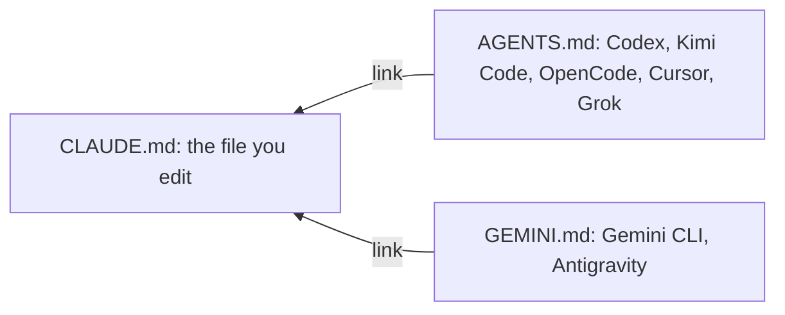

# Cross-harness project instructions

How to keep one project brief that every AI coding harness reads. Each harness looks for a different file name, so the brief lives in `CLAUDE.md` and the other names are links to it.

## The pattern



Create the links from the repository root:

```bash
ln -sf CLAUDE.md AGENTS.md
ln -sf CLAUDE.md GEMINI.md
git add CLAUDE.md AGENTS.md GEMINI.md
```

Git stores `AGENTS.md` and `GEMINI.md` as symbolic links. If they were regular files before, `git status` shows them as `typechange`.

## What to put in `CLAUDE.md`

Write the brief so it applies to every harness:

- What the project is, where things live, its conventions, commit style and working rules.
- Optionally, `## Learned User Preferences` and `## Learned Workspace Facts` sections. Cursor's continual-learning plugin appends to these through the `AGENTS.md` link.

Do not make a command that exists in only one harness, such as a Claude Code slash command, a requirement unless you mark it as specific to that harness.

## Personal defaults belong elsewhere

Put preferences that apply to all your projects in your user-level instruction file, not in a project brief. For example, a global rule can tell every harness to use the `penmark-comments` skill when you ask for a review of a local Markdown file. Project instructions can still change where the findings go.

Keep such global rules short and neutral across harnesses. Put the detailed workflow, dependencies and validation in the skill itself. See [Penmark agent integration](guide-penmark-agent-integration.md). Do not copy a personal preference into a shared project template unless the project adopts it.

## Which file each harness reads

| Harness | File | Notes |
|---|---|---|
| Claude Code | `CLAUDE.md` | Loaded at the start of every session |
| Cursor | `AGENTS.md`, and often `CLAUDE.md` too | Loaded as workspace rules. With both files present, the content may load twice. |
| Antigravity | `GEMINI.md` | Named through Superpowers' `contextFileName` setting. Antigravity's migration documentation also mentions `AGENTS.md`. |
| Codex | `AGENTS.md`. An `AGENTS.override.md` in the same directory takes precedence. | User instructions come from `~/.codex/AGENTS.md`, and project files are found along the path to the working directory. See [Codex instruction discovery](https://developers.openai.com/codex/guides/agents-md/). |
| Kimi Code | `AGENTS.md` | Reads the project `AGENTS.md` and the shared `~/.agents/AGENTS.md` natively. An optional Kimi-only layer can go in `~/.kimi-code/AGENTS.md`. |
| Grok Build TUI | `AGENTS.md` in the project, plus `~/.claude/CLAUDE.md` through its Claude compatibility setting | Do not add `~/.grok/AGENTS.md`. It would duplicate a file Grok already loads. |

## Cursor's continual learning

Cursor's continual-learning plugin writes learned facts into `AGENTS.md`. Through the link, they land in `CLAUDE.md`, so there is still one source. Antigravity has no equivalent, so use claude-mem or update the brief by hand.

## Converting an existing project

1. Merge anything unique from an existing `AGENTS.md` into `CLAUDE.md`.
2. Give the brief a neutral title, such as "Project instructions for AI agents".
3. Create the links, and mention them in the README.
4. Check the links: `readlink AGENTS.md` should print `CLAUDE.md`.
5. Commit the links and the merged content together.

## When not to use links

- **The harnesses need different content.** This is rare. Use separate files and accept that they can drift apart.
- **Contributors use Windows without symbolic link support.** Commit copies and add a CI check that they match, or document Windows Developer Mode and `core.symlinks=true`.

## See also

- [Harness plugin parity](guide-harness-plugin-parity.md)
- [Default project template](../templates/default-project/CLAUDE.md)
