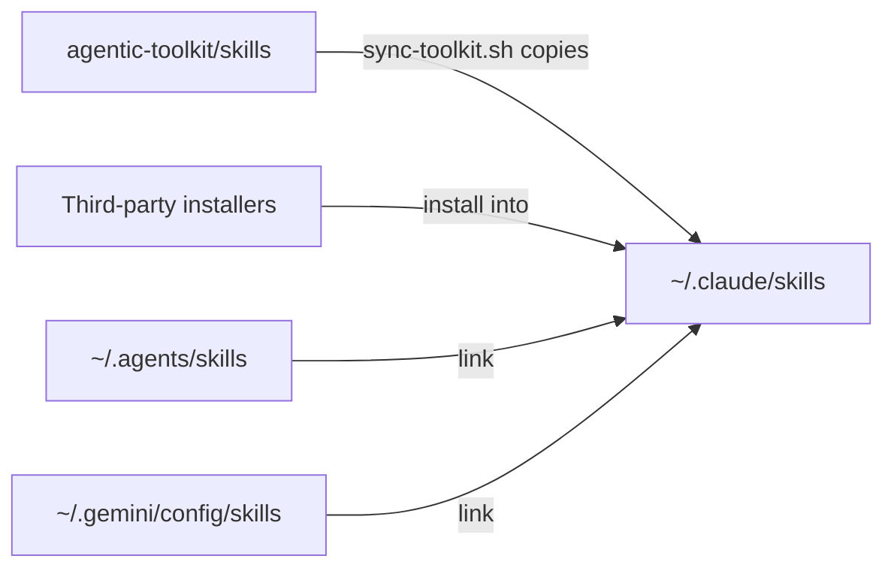

# Harness plugin and skill parity

How to get the same working method and tools when you move between Claude Code, Codex, Antigravity (`agy`), Kimi Code, Grok Build TUI and OpenCode. Use each product's official install method where one exists, and share only portable skills through the skill hub.

For a side-by-side view of what each harness supports, see the [harness capability map](../reference/reference-harness-capability-map.md).

## Skill hub and spokes

Every skill lives in one place on disk, the hub at `~/.claude/skills`. The hub holds real directories, so Claude Code never has to follow a link to find a skill. Other harnesses reach the same files through a link to the whole directory.



| Directory | Role | Used by |
|---|---|---|
| `~/.claude/skills` | The hub, holding real skill directories | Claude Code, OpenCode, Grok Build TUI |
| `~/.agents/skills` | A link to the hub | Codex, Kimi Code, OpenCode |
| `~/.gemini/config/skills` | A link to the hub | Antigravity |
| `~/.codex/skills` | Codex's own bundled skills in `.system/`. Not linked to the hub. | Codex. Leave it alone. |

Skills reach the hub in two ways:

- **Skills from this repository** are copied in by `scripts/sync-toolkit.sh --harness`. Editing the repository does not change the hub until you sync again.
- **Third-party skills** are installed straight into the hub. An installer that writes to `~/.agents/skills` writes through the link and lands in the hub. If an installer replaces the link with a real directory, `scripts/sync-toolkit.sh --adopt` moves its contents into the hub and restores the link.

The hub is not tracked in Git. Reinstall third-party skills from their upstream sources.

### Linking rules

- **Do link** instruction files, and whole harness skill directories that point at the hub.
- **Do not link** plugin directories from a harness's cache, because their paths contain hashes that change. Do not link MCP configuration files, Superpowers twice, or anything from the hub out to another location. Links out of the hub bring back the drift the hub exists to prevent.
- **Installers that copy a skill into every harness** only need the hub copy now, since every harness reads the hub.
- **Antigravity's slash menu.** If skills do not appear under `/skills` in the Antigravity command-line tool, also link `~/.gemini/antigravity-cli/skills/`.

## Install locations by harness

### Antigravity

| Item | Command or path |
|---|---|
| Native plugin | `agy plugin install <url>` |
| Import Gemini extensions | `gemini extensions install ...`, then `agy plugin import gemini` |
| Import Claude plugins | `agy plugin import claude`, when local Claude extensions exist |
| Skills | `.agents/skills/` per project, `~/.gemini/config/skills/` for the IDE, and `~/.gemini/antigravity-cli/skills/` for the command-line tool. The synchronizer links only the IDE path. See [Google's skill locations](https://antigravity.google/docs/skills), checked 2026-09-22. |
| MCP servers | `~/.gemini/config/mcp_config.json` |
| Bundled Google plugins | `~/.gemini/config/plugins/`, for example chrome-devtools and modern-web-guidance |

Check with `agy plugin list`, `/skills` in a session, and `ls ~/.agents/skills/`.

### Kimi Code

| Item | Command or path |
|---|---|
| Native plugin | The `/plugins` marketplace, or `/plugins install <github-url>` |
| Skills | `~/.agents/skills/`, read natively, plus `.agents/skills/` and `.kimi-code/skills/` per project. Add `~/.kimi-code/skills/` only for a skill that is specific to Kimi. |
| Instructions | `~/.agents/AGENTS.md` and the project `AGENTS.md`, read natively. An optional Kimi-only layer goes in `~/.kimi-code/AGENTS.md`. |
| MCP servers | `~/.kimi-code/mcp.json`, and `.kimi-code/mcp.json` per project. Manage them with `/mcp-config`. |
| Hooks | `[[hooks]]` in `~/.kimi-code/config.toml`. Only `PreToolUse`, `Stop` and `UserPromptSubmit` can block, and no hook can change a tool's input. |
| Headless runs | `kimi --session session_<id> -p`, which approves actions automatically. `-p` rejects `--yolo` and `--auto`. |

Kimi reads the shared `~/.agents/` directory natively, so the hub and the shared instruction file cover it without extra setup. Check with `ls ~/.agents/skills/`, `/plugins info <name>` and `kimi doctor`.

### Grok Build TUI

| Item | Command or path |
|---|---|
| Skills | `~/.claude/skills`, through `[compat.claude] skills = true`. Do not create `~/.grok/skills`. |
| Instructions | `~/.claude/CLAUDE.md`, through `[compat.claude] agents = true`, and the project `AGENTS.md` natively. Do not create `~/.grok/AGENTS.md`. |
| MCP servers | Inherits servers configured for Claude Code. Declare others, such as Playwright with `--isolated` or Context7 with `Authorization = Bearer ${CONTEXT7_API_KEY}`, in `~/.grok/config.toml`. |
| Hooks | Grok does not load Claude hooks. Register your own `PreToolUse` and `Stop` hooks under `~/.grok/hooks/`. See [Grok Build TUI hooks](../hooks/README.md#grok-build-tui). |
| Plugins | Grok discovers Claude plugins. List the ones to turn off under `[plugins].disabled`, matching Claude Code. |
| Superpowers | Uses Claude Code's plugin copy. Do not install a second one with `grok plugin install`. |

### OpenCode

| Item | Command or path |
|---|---|
| Skills | `~/.claude/skills` and `~/.agents/skills`, loaded automatically |
| Instructions | `AGENTS.md`, read natively at user and project level; the global file is `~/.config/opencode/AGENTS.md`. OpenCode 2.x recognizes `AGENTS.md` only: the `CLAUDE.md` fallback is gone, and the `instructions` config array is accepted but not loaded |
| Configuration | `~/.config/opencode/opencode.json`. `~/.opencode/` holds only the program. |
| MCP servers | The `mcp` block in `opencode.json`. `enabled: false` turns off a server inherited from a parent configuration. |
| Hooks | JavaScript plugin modules in `~/.config/opencode/plugins/`. On 2.x a plugin default-exports a definition with `id` and `setup`, registers hooks with `ctx.tool.hook("execute.before", ...)`, and refuses a call by throwing. On 1.x the module returns a hooks map and `tool.execute.before` refuses by throwing. `tool.execute.after` cannot block on either. One module can serve both APIs with a dual entrypoint: `id` plus `setup` for 2.x, `server()` for 1.x from 1.18.29 |
| Mermaid validation | `scripts/sync-toolkit.sh --harness` copies `hooks/validate-mermaid/opencode-validate-mermaid.ts` to `plugins/validate-mermaid.ts`. Dual-API: OpenCode 2.x and 1.x from 1.18.29 |
| Plugins | The `plugins` array (named `plugin` on 1.x) accepts npm and Git sources. Files placed in `plugins/` load without a configuration entry. |
| Superpowers | `"plugin": ["superpowers@git+https://github.com/obra/superpowers.git"]`. Do not use links, which upstream no longer supports. |
| RTK | `rtk init -g --opencode` writes `~/.config/opencode/plugins/rtk.ts`. Checked 2026-09-23: that file is V1-format and does not load on OpenCode 2.x, which reports `Plugin must export a default definition`; porting it is an RTK-side change |
| Providers | `disabled_providers` turns off a provider that an environment variable enabled by accident |
| Agents and commands | `~/.config/opencode/agent/<name>.md` and `command/<name>.md`, as Markdown with frontmatter. On 2.x the canonical command directory is `commands/`, and `command/` is still discovered |

## A useful minimum for unattended runs

For long unattended coding runs, process skills and automated checks matter most.

| Priority | Capability | Antigravity setup |
|---|---|---|
| 1 | Superpowers | Bundled at `~/.gemini/config/plugins/superpowers`. For a fresh install: `agy plugin install https://github.com/obra/superpowers` |
| 2 | UI design skills (ui-ux-pro-max) | `npm i -g uipro-cli`, then `uipro init --ai antigravity` in the repository |
| 3 | Context7 documentation lookup | MCP server in `mcp_config.json`, or `npx ctx7 setup --mcp --antigravity` |
| 3 | claude-mem | MCP server in `mcp_config.json`, or `npx claude-mem install` |
| 4 | Playwright MCP and CLI | Set up after checking the existing configuration. See the [shared Playwright baseline](guide-browser-automation-mcp-vs-cli.md#cross-harness-playwright-baseline). |
| 4 | Live browser debugging | chrome-devtools-plugin, bundled with Antigravity |

## Claude Code plugins in Antigravity

| Claude Code plugin | In Antigravity |
|---|---|
| superpowers | Official plugin, bundled. Fresh install: `agy plugin install https://github.com/obra/superpowers` |
| ui-ux-pro-max | Official, through `uipro` |
| context7 | Official MCP server: `npx ctx7 setup --mcp --antigravity` |
| claude-mem | Official MCP server: `npx claude-mem install` |
| playwright | Playwright MCP (`@playwright/mcp`) and the Playwright CLI (`@playwright/test`). Run the [shared smoke procedure](guide-browser-automation-mcp-vs-cli.md#shared-smoke-procedure). |
| superpowers-chrome | Use chrome-devtools-plugin instead |
| frontend-design | Import it with `agy plugin import claude`, or use the bundled copy in `~/.gemini/config/plugins/frontend-design` |
| code-review, pr-review-toolkit, feature-dev | Use Superpowers' review, brainstorming and subagent skills instead |
| Skills from this repository | Already available through the hub link |
| elements-of-style | Not available. It comes from a Claude Code plugin, not the hub. |
| continual-learning (Cursor) | Not available. It depends on Cursor's hooks. |
| Plugins that exist only for Claude Code, such as playground or agent-sdk-dev | Not available |

## Browser automation

Keep both Playwright MCP and the Playwright CLI, and choose for each job. The [browser automation guide](guide-browser-automation-mcp-vs-cli.md) explains how to choose.

| Tool | Use it for | Harnesses |
|---|---|---|
| Playwright MCP (`@playwright/mcp`) | Exploring pages, one-off tasks, browsing and visual review, one step at a time | Claude Code, Codex, Antigravity, Kimi Code, Grok Build TUI |
| Playwright CLI (`@playwright/test`) | Repeatable flows, visual regression baselines and anything you commit or run again | All of the above |
| chrome-devtools-plugin | Extra live debugging in Antigravity. It does not replace Playwright MCP. | Antigravity |

A server appearing in a configuration list does not prove it works. Run the [shared smoke procedure](guide-browser-automation-mcp-vs-cli.md#shared-smoke-procedure).

## Routing add-ons

These tools sit alongside a harness rather than inside it:

- **llm-router** classifies each prompt and routes it using hooks. Its documentation covers Gemini CLI, so check Antigravity support first.
- **BrokeLLM** routes by quota across model lanes.
- **lite-harness** offers one API across Claude Code and Codex.

Use one when you want each prompt routed to a different model, rather than a fixed model per task.

## Useful commands

```bash
agy plugin list                     # installed Antigravity plugins
ls ~/.agents/skills/                # skills visible to Codex and Kimi Code
ls .agents/                         # project-level agent configuration
agy --dangerously-skip-permissions  # run Antigravity without approval prompts
cat ~/.gemini/config/mcp_config.json   # MCP servers (remove keys before sharing)
```

Keep project-specific run prompts, such as "work autonomously until milestone X", in each project's repository, and link to this guide for harness setup.

## See also

- [Cross-harness project instructions](guide-cross-harness-project-instructions.md)
- [Antigravity model and quota selection](guide-agy-model-and-quota-selection.md)
- [Harness capability map](../reference/reference-harness-capability-map.md)
