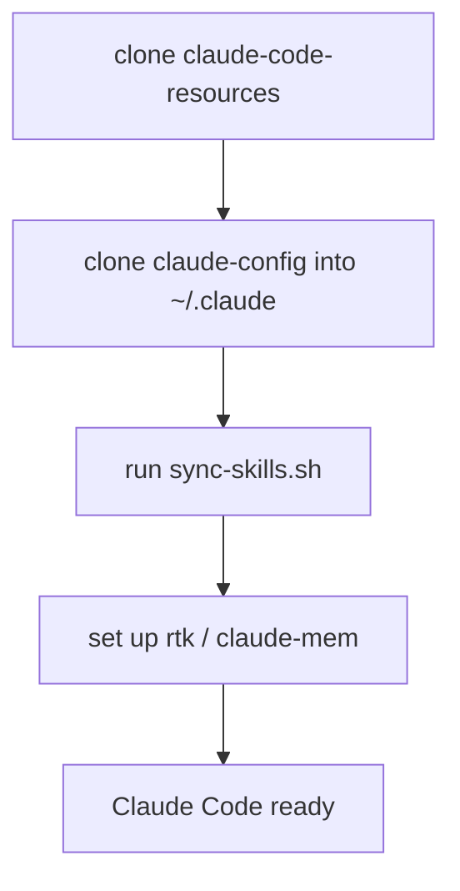

# Guide: restore your Claude setup on a new machine

Stand up your Claude Code environment on a fresh machine (or hand the recipe to a colleague) by cloning two repos and running one link script. OpenCode steps sit at the end of the same recipe. Assumes macOS/Linux with `git` and SSH access to your GitHub repos.

## The pieces

| Piece | Lives in | Restored by |
|---|---|---|
| Global config (`CLAUDE.md`, `docs/`) | `claude-config` repo → `~/.claude` | clone in place (step 3) |
| Local config (`settings.json` — secrets + model/effort) | **not** in git (machine-local) | recreate by hand (step 3) |
| Standalone skills (`briefing`, `learn`, …) | `claude-code-resources` repo → all harness skill dirs | `sync-skills.sh` (step 4) |
| Tool integrations (rtk, claude-mem) | external installs | the setup guides (step 5) |
| Separately-managed wiring | see step 6 | not covered here |
| OpenCode config | `~/.config/opencode/` — not a git repository | step 7 |



## Steps

### 1. GitHub access

Ensure your SSH key is on the new machine and authorized (`ssh -T git@github.com` succeeds).

### 2. Clone claude-code-resources

```bash
git clone git@github.com:carlosboeing/claude-code-resources.git ~/Projects/carlos/claude-code-resources
```

The link script is portable — it works from wherever you clone this, not a fixed path.

### 3. Restore ~/.claude from claude-config

`~/.claude` already exists (Claude Code creates it with local state — `sessions/`, `plugins/`, etc.). The `claude-config` repo tracks only a whitelist (`CLAUDE.md`, `skills/`, `docs/`) — **not** `settings.json`, which is machine-local (see below). Initialize the repo **in place** rather than cloning over the directory:

```bash
# Back up the CLAUDE.md Claude Code pre-created (the repo tracks it):
[ -f ~/.claude/CLAUDE.md ] && mv ~/.claude/CLAUDE.md ~/.claude/CLAUDE.md.bak
# (settings.json is gitignored, so the checkout below won't touch it — no backup needed)

cd ~/.claude
git init -b main
git remote add origin git@github.com:carlosboeing/claude-config.git
git fetch origin
git checkout -f main            # brings in tracked files; ignored local state is untouched
```

`checkout -f` overwrites tracked files only — the gitignore whitelist keeps `sessions/`, `plugins/`, and other local state out of git's way. Verify on first run, then delete the `.bak` files once you're happy.

**`settings.json` is not restored by this clone** — it's intentionally untracked, because it holds a hooks secret (a Telegram bot token) plus volatile `model`/`effortLevel` that Claude Code rewrites every session. Recreate it on the new machine by copying it from your old machine or a secure backup (never commit it), then adjust the model/effort with `/model` and `/effort`. Keep secrets in an untracked file (e.g. `telegram-hooks.env`) referenced from the hook, not inline.

### 4. Sync skills into your harnesses

```bash
~/Projects/carlos/claude-code-resources/skills/sync-skills.sh
```

Symlinks every authored `skills/<name>/` from your clone straight into each installed harness's skill directory — `~/.claude/skills/`, `~/.agents/skills/` (Codex), `~/.gemini/config/skills/` (Antigravity). Idempotent, skips uninstalled harnesses, and never overwrites a real skill directory. Re-run it any time you add a skill. Independent of `find-skills` (step 6) — it only creates symlinks.

### 5. Tool integrations

Follow the per-tool guides in this directory:

- [`guide-rtk-setup.md`](guide-rtk-setup.md) — RTK (shell-output token filter)
- [`guide-claude-mem-setup.md`](guide-claude-mem-setup.md) — claude-mem (session memory)

Headroom is **not** installed on new machines. It was removed on 2026-08-04 — see [ADR 0001](../docs/adrs/0001-remove-headroom-compression-proxy.md). Its [setup guide](guide-headroom-setup.md) is retained, marked retired, as a record of what the teardown reverted.

### 6. Separately-managed wiring (not covered here)

These have their own mechanisms — the link script does not touch them:

- **`~/.agents/skills/` skills** (the `vercel-*`, `impeccable`, `deploy-to-vercel` family): installed and version-locked by a separate skill installer (`~/.agents/.skill-lock.json`). Restore via that tool.
- **Plugins** (`enabledPlugins` in `settings.json`): installed from their marketplaces by Claude Code.
- **Codex / Antigravity** plugin wiring: see [`../plugins/superpowers-relink.sh`](../plugins/superpowers-relink.sh).
- **Kimi Code CLI**: install with the official script (`curl -fsSL https://code.kimi.com/kimi-code/install.sh | bash`), then `kimi` and `/login`. It reads `~/.agents/AGENTS.md` and `~/.agents/skills/` natively, so steps 3–4 already cover instructions and authored skills. `~/.kimi-code/` (config.toml, mcp.json, sessions) is machine-local and not in git — recreate MCP entries per [`guide-harness-plugin-parity.md`](guide-harness-plugin-parity.md). Superpowers installs via its native plugin manager (`/plugins`), not the relink script.
- **Grok Build TUI**: already reads `~/.claude/CLAUDE.md` and `~/.claude/skills` through Claude compat. Do not create `~/.grok/AGENTS.md` or `~/.grok/skills`. Recreate `~/.grok/config.toml` compat cells, `[plugins].disabled`, and the three MCP entries from [`guide-harness-plugin-parity.md`](guide-harness-plugin-parity.md). Superpowers stays on the Claude plugin path.

### 7. OpenCode

Config lives in `~/.config/opencode/`. Do not turn that directory into a git repository. Do not copy `auth.json` or `service.json`. `auth.json` is created by `opencode auth login` under `~/.local/share/opencode/`. `service.json` in the config directory holds a password.

1. Symlink the canonical instructions after step 3 has restored `~/.claude/CLAUDE.md`:

```bash
ln -sfn ~/.claude/CLAUDE.md ~/.config/opencode/AGENTS.md
```

2. Put `"lsp": true` in `opencode.json`. If that key is omitted, OpenCode disables every language server. Do not add `model` or `small_model` unless you want a pinned default.

3. Add Superpowers as a plugin declaration, not a symlink:

```json
"plugin": ["superpowers@git+https://github.com/obra/superpowers.git"]
```

`plugins/install-superpowers.sh` checks this line. It does not write the file.

4. Install language servers (most of the active projects are TypeScript):

```bash
npm install -g typescript-language-server typescript bash-language-server yaml-language-server
```

5. Install the RTK plugin. Do not copy `plugins/rtk.ts` from another machine:

```bash
rtk init -g --opencode
```

6. Run `sync-skills.sh` (step 4). That run also copies command wrappers into `command/` and `hooks/validate-mermaid/opencode-validate-mermaid.ts` into `plugins/validate-mermaid.ts`. Local provider blocks such as an Ollama `baseURL` stay on this machine. Leave `opencode.json` untracked.

## Verify

```bash
# skills resolve
ls -l ~/.claude/skills | grep '\->'
# config is tracked and clean
git -C ~/.claude status --short
# tools respond
rtk --version
```

Start a new Claude Code session; type `/` and confirm your skills appear.

```bash
# OpenCode instructions spoke
readlink ~/.config/opencode/AGENTS.md
# OpenCode mermaid plugin present after sync
test -f ~/.config/opencode/plugins/validate-mermaid.ts && echo mermaid-plugin-ok
```
