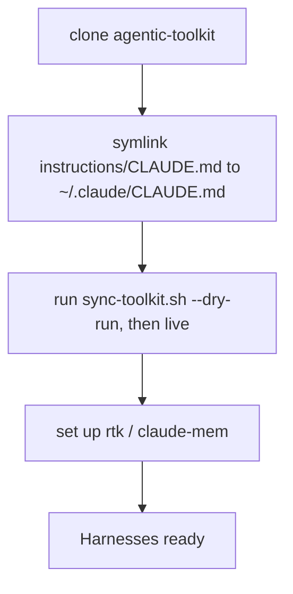

# Guide: restore your agentic coding setup on a new machine

Stand up your agentic coding environment on a fresh machine (or hand the recipe to a colleague) by cloning the toolkit and running the synchronization tool. Assumes macOS/Linux with `git` and SSH access to your GitHub repos.

## The pieces

| Piece | Lives in | Restored by |
|---|---|---|
| Global brief (`instructions/CLAUDE.md`) | `agentic-toolkit` repo → `~/.claude/CLAUDE.md` | symlink (step 3) |
| Local config (`settings.json` — secrets + model/effort) | **not** in git (machine-local) | recreate by hand (step 3) |
| Standalone skills & hooks | `agentic-toolkit` repo → all harness dirs | `./scripts/sync-toolkit.sh` (step 4) |
| Tool integrations (rtk, claude-mem) | external installs | the setup guides (step 5) |
| Plugins (Superpowers) | plugin marketplaces / installers | `plugins/install-superpowers.sh` (step 6) |
| OpenCode config | `~/.config/opencode/` — not a git repository | step 7 |



## Steps

### 1. GitHub access

Ensure your SSH key is on the new machine and authorized (`ssh -T git@github.com` succeeds).

### 2. Clone agentic-toolkit

```bash
git clone git@github.com:carlosboeing/agentic-toolkit.git ~/Projects/carlos/agentic-toolkit
cd ~/Projects/carlos/agentic-toolkit
```

The scripts and paths are portable — they work from wherever you clone this repository.

### 3. Wire global instructions

The global instruction brief lives at `instructions/CLAUDE.md`. Link it to your user-level Claude directory (creating `~/.claude` if needed):

```bash
mkdir -p ~/.claude
# Back up any pre-existing CLAUDE.md if present:
[ -f ~/.claude/CLAUDE.md ] && mv ~/.claude/CLAUDE.md ~/.claude/CLAUDE.md.bak
ln -sfn ~/Projects/carlos/agentic-toolkit/instructions/CLAUDE.md ~/.claude/CLAUDE.md
```

Note: `carlosboeing/claude-config` was retired on 2026-09-08; global instructions now live directly in `agentic-toolkit/instructions/CLAUDE.md`.

**`settings.json` is machine-local** — it is not tracked in git because it holds local preferences, model/effort levels, and any local hook environment variables. Recreate it on the new machine by copying it from your secure backup (never commit it), then adjust model and effort with `/model` and `/effort`.

### 4. Sync skills, hooks, and plugins across harnesses

The toolkit provides [`scripts/sync-toolkit.sh`](../scripts/sync-toolkit.sh) to link authored skills and hooks into all detected harness directories (`~/.claude/skills/`, `~/.agents/skills/`, `~/.gemini/config/skills/`, OpenCode command wrappers).

> [!WARNING]
> In non-interactive mode, `./scripts/sync-toolkit.sh` writes into your `$HOME` harness configuration directories and configures git hooks (drift-guard, housekeep) in sibling project repositories found beside this clone.

Always run with `--dry-run` first to preview the planned changes:

```bash
./scripts/sync-toolkit.sh --dry-run
```

Once the planned actions are verified, run the live synchronization:

```bash
./scripts/sync-toolkit.sh
```

### 5. Tool integrations

Follow the per-tool guides in this directory:

- [`guide-rtk-setup.md`](guide-rtk-setup.md) — RTK (shell-output token filter)
- [`guide-claude-mem-setup.md`](guide-claude-mem-setup.md) — claude-mem (session memory)

Headroom is **not** installed on new machines. It was removed on 2026-08-04 — see [ADR 0001](../docs/adrs/0001-remove-headroom-compression-proxy.md). Its [setup guide](guide-headroom-setup.md) is retained, marked retired, as a record of what the teardown reverted.

### 6. Plugins and external tools

- **Superpowers**: Run [`plugins/install-superpowers.sh`](../plugins/install-superpowers.sh) to verify and configure the Superpowers plugin across supported harnesses.
- **Kimi Code CLI**: Install with the official script (`curl -fsSL https://code.kimi.com/kimi-code/install.sh | bash`), then `kimi` and `/login`. It reads `~/.agents/AGENTS.md` and `~/.agents/skills/` natively, so steps 3–4 already cover instructions and authored skills.
- **Grok Build TUI**: Reads `~/.claude/CLAUDE.md` and `~/.claude/skills` through Claude compat. Recreate `~/.grok/config.toml` compat cells, `[plugins].disabled`, and the MCP entries per [`guide-harness-plugin-parity.md`](guide-harness-plugin-parity.md).

### 7. OpenCode

Config lives in `~/.config/opencode/`. Do not turn that directory into a git repository. Do not copy `auth.json` or `service.json`. `auth.json` is created by `opencode auth login` under `~/.local/share/opencode/`.

1. Symlink the canonical instructions after step 3 has restored `~/.claude/CLAUDE.md`:

```bash
ln -sfn ~/.claude/CLAUDE.md ~/.config/opencode/AGENTS.md
```

2. Put `"lsp": true` in `opencode.json`. If that key is omitted, OpenCode disables every language server.

3. Add Superpowers as a plugin declaration:

```json
"plugin": ["superpowers@git+https://github.com/obra/superpowers.git"]
```

4. Install language servers (for TypeScript, Bash, YAML):

```bash
npm install -g typescript-language-server typescript bash-language-server yaml-language-server
```

5. Install the RTK plugin:

```bash
rtk init -g --opencode
```

6. Run `./scripts/sync-toolkit.sh` (step 4). That run writes command wrappers into `command/` and copies `hooks/validate-mermaid/opencode-validate-mermaid.ts` into `plugins/validate-mermaid.ts`.

## Verify

```bash
# verify skills resolve in hub
ls -l ~/.claude/skills
# verify global instructions symlink
readlink ~/.claude/CLAUDE.md
# tools respond
rtk --version
```

Start a new session in your preferred harness; type `/` and confirm your skills appear.
