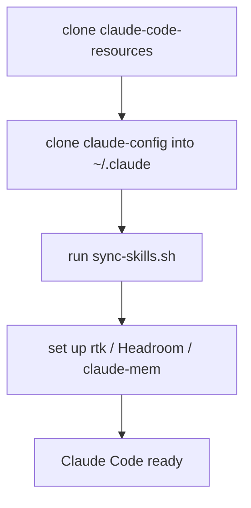

# Guide: restore your Claude setup on a new machine

Stand up your Claude Code environment on a fresh machine (or hand the recipe to a colleague) by cloning two repos and running one link script. Assumes macOS/Linux with `git` and SSH access to your GitHub repos.

## The pieces

| Piece | Lives in | Restored by |
|---|---|---|
| Global config (`CLAUDE.md`, `settings.json`, `docs/`) | `claude-config` repo → `~/.claude` | clone in place (step 3) |
| Standalone skills (`briefing`, `learn`, …) | `claude-code-resources` repo → all harness skill dirs | `sync-skills.sh` (step 4) |
| Tool integrations (rtk, Headroom, claude-mem) | external installs | the setup guides (step 5) |
| Separately-managed wiring | see step 6 | not covered here |



## Steps

### 1. GitHub access

Ensure your SSH key is on the new machine and authorized (`ssh -T git@github.com` succeeds).

### 2. Clone claude-code-resources

```bash
git clone git@github.com:carlosboeing/claude-code-resources.git ~/Projects/carlos/claude-code-resources
```

The link script is portable — it works from wherever you clone this, not a fixed path.

### 3. Restore ~/.claude from claude-config

`~/.claude` already exists (Claude Code creates it with local state — `sessions/`, `plugins/`, etc.). The `claude-config` repo tracks only a whitelist (`CLAUDE.md`, `settings.json`, `skills/`, `docs/`), so initialize it **in place** rather than cloning over the directory:

```bash
# Back up anything Claude Code pre-created that the repo also tracks:
[ -f ~/.claude/CLAUDE.md ] && mv ~/.claude/CLAUDE.md ~/.claude/CLAUDE.md.bak
[ -f ~/.claude/settings.json ] && mv ~/.claude/settings.json ~/.claude/settings.json.bak

cd ~/.claude
git init -b main
git remote add origin git@github.com:carlosboeing/claude-config.git
git fetch origin
git checkout -f main            # brings in tracked files; ignored local state is untouched
```

`checkout -f` overwrites tracked files only — the gitignore whitelist keeps `sessions/`, `plugins/`, and other local state out of git's way. Verify on first run, then delete the `.bak` files once you're happy.

### 4. Sync skills into your harnesses

```bash
~/Projects/carlos/claude-code-resources/skills/sync-skills.sh
```

Symlinks every authored `skills/<name>/` from your clone straight into each installed harness's skill directory — `~/.claude/skills/`, `~/.agents/skills/` (Codex), `~/.gemini/config/skills/` (Antigravity). Idempotent, skips uninstalled harnesses, and never overwrites a real skill directory. Re-run it any time you add a skill. Independent of `find-skills` (step 6) — it only creates symlinks.

### 5. Tool integrations

Follow the per-tool guides in this directory:

- [`guide-rtk-setup.md`](guide-rtk-setup.md) — RTK (shell-output token filter)
- [`guide-headroom-setup.md`](guide-headroom-setup.md) — Headroom (API-layer compression proxy)
- [`guide-claude-mem-setup.md`](guide-claude-mem-setup.md) — claude-mem (session memory)

### 6. Separately-managed wiring (not covered here)

These have their own mechanisms — the link script does not touch them:

- **`~/.agents/skills/` skills** (the `vercel-*`, `impeccable`, `deploy-to-vercel` family): installed and version-locked by a separate skill installer (`~/.agents/.skill-lock.json`). Restore via that tool.
- **Plugins** (`enabledPlugins` in `settings.json`): installed from their marketplaces by Claude Code.
- **Codex / Antigravity** plugin wiring: see [`../plugins/superpowers-relink.sh`](../plugins/superpowers-relink.sh).

## Verify

```bash
# skills resolve
ls -l ~/.claude/skills | grep '\->'
# config is tracked and clean
git -C ~/.claude status --short
# tools respond
rtk --version && which headroom 2>/dev/null || true
```

Start a new Claude Code session; type `/` and confirm your skills appear.
