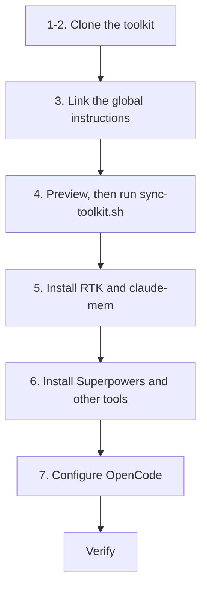

# New machine setup

How to set up the toolkit on a new macOS or Linux machine: the shared instructions, the skill hub, hooks, plugins and the OpenCode configuration. You need `git`, and SSH access to GitHub if you clone over SSH.

## What gets set up

| Piece | Source | Set up in |
|---|---|---|
| Global instructions | `instructions/CLAUDE.md` in this repository, linked to `~/.claude/CLAUDE.md` | Step 3 |
| Local settings, such as `settings.json` | Not in Git, because they are specific to the machine | Step 3 |
| Skills and hooks | This repository, copied into each harness by `scripts/sync-toolkit.sh` | Step 4 |
| RTK and claude-mem | Installed separately | Step 5 |
| Superpowers | Plugin marketplaces, driven by `plugins/install-superpowers.sh` | Step 6 |
| OpenCode configuration | `~/.config/opencode/` | Step 7 |



## 1. GitHub access

If you clone over SSH, check that your key works:

```bash
ssh -T git@github.com
```

## 2. Clone the toolkit

```bash
git clone https://github.com/carlosboeing/agentic-toolkit.git ~/Projects/agentic-toolkit
cd ~/Projects/agentic-toolkit
```

Any location works. The scripts find their files relative to the clone.

## 3. Link the global instructions

Link the shared instruction file to Claude Code's user directory, backing up any existing file first:

```bash
mkdir -p ~/.claude
[ -f ~/.claude/CLAUDE.md ] && mv ~/.claude/CLAUDE.md ~/.claude/CLAUDE.md.bak
ln -sfn "$PWD/instructions/CLAUDE.md" ~/.claude/CLAUDE.md
```

Then link it for the other harnesses you use. Check for existing files first. `ln -s` will not overwrite them.

```bash
mkdir -p ~/.agents ~/.codex ~/.gemini ~/.config/opencode
ln -s ~/.claude/CLAUDE.md ~/.agents/AGENTS.md
ln -s ~/.claude/CLAUDE.md ~/.codex/AGENTS.md
ln -s ~/.claude/CLAUDE.md ~/.gemini/GEMINI.md
ln -s ~/.claude/CLAUDE.md ~/.config/opencode/AGENTS.md
```

Creating these directories also lets the synchronizer link each harness's skill directory in step 4. The synchronizer does not create the instruction links itself.

`~/.claude/settings.json` is not in Git, because it holds machine-specific preferences, model and effort choices, and hook environment variables. Restore it from your own backup, and never commit it. Then set the model and effort with `/model` and `/effort`.

## 4. Sync skills and hooks

[`scripts/sync-toolkit.sh`](../scripts/sync-toolkit.sh) copies the skills into `~/.claude/skills`, links `~/.agents/skills` and `~/.gemini/config/skills` to it, writes OpenCode command wrappers, and copies the Mermaid validation hook.

Preview first:

```bash
./scripts/sync-toolkit.sh --dry-run --harness
```

Then apply:

```bash
./scripts/sync-toolkit.sh --harness
```

`--harness` only writes under your home directory. Without it, in non-interactive mode, the script also installs Git hooks into repositories it finds in your projects directory. Preview that with `--dry-run --all` before running it.

## 5. Tool integrations

- [RTK setup](guide-rtk-setup.md) shortens shell output before the agent reads it.
- [claude-mem setup](guide-claude-mem-setup.md) adds memory across sessions.

The Headroom compression proxy is no longer used. See [ADR 0001](../docs/adrs/0001-remove-headroom-compression-proxy.md).

## 6. Plugins and other harnesses

- **Superpowers.** Run [`plugins/install-superpowers.sh`](../plugins/install-superpowers.sh) to see the installed version in each harness, and `plugins/install-superpowers.sh install` to install or upgrade it.
- **Kimi Code.** Install it with the official script, then run `kimi` and `/login`:

  ```bash
  curl -fsSL https://code.kimi.com/kimi-code/install.sh | bash
  ```

  Kimi reads `~/.agents/AGENTS.md` and `~/.agents/skills` natively, so steps 3 and 4 already cover its instructions and skills.
- **Grok Build TUI.** Grok reads `~/.claude/CLAUDE.md` and `~/.claude/skills` through its Claude compatibility setting. Set up `~/.grok/config.toml` (the compatibility settings, `[plugins].disabled` and MCP servers) as described in the [plugin parity guide](guide-harness-plugin-parity.md).

## 7. OpenCode

OpenCode's configuration lives in `~/.config/opencode/`. Do not make that directory a Git repository, and do not copy `auth.json` or `service.json` between machines. `opencode auth login` creates `auth.json` under `~/.local/share/opencode/`.

1. Check the instruction link from step 3:

   ```bash
   readlink ~/.config/opencode/AGENTS.md
   ```

2. Set `"lsp": true` in `opencode.json`. Without it, OpenCode turns off every language server. See the [OpenCode LSP documentation](https://opencode.ai/docs/lsp/), checked 2026-09-22.
3. Add Superpowers as a plugin:

   ```json
   "plugin": ["superpowers@git+https://github.com/obra/superpowers.git"]
   ```

4. Install language servers for TypeScript, Bash and YAML:

   ```bash
   npm install -g typescript-language-server typescript bash-language-server yaml-language-server
   ```

5. Install RTK's OpenCode plugin:

   ```bash
   rtk init -g --opencode
   ```

6. Run `./scripts/sync-toolkit.sh --harness` again if you skipped OpenCode in step 4. It writes the command wrappers into `command/` and copies the Mermaid plugin to `plugins/validate-mermaid.ts`.

## Verify

```bash
ls -l ~/.claude/skills          # the skills are in the hub
readlink ~/.claude/CLAUDE.md    # the instructions link points at this repository
rtk --version                   # RTK is installed
```

Start a new session in each harness and check that the skills appear in its skill list. OpenCode's terminal interface shows individual skills in the `/` menu only through the generated command wrappers.
