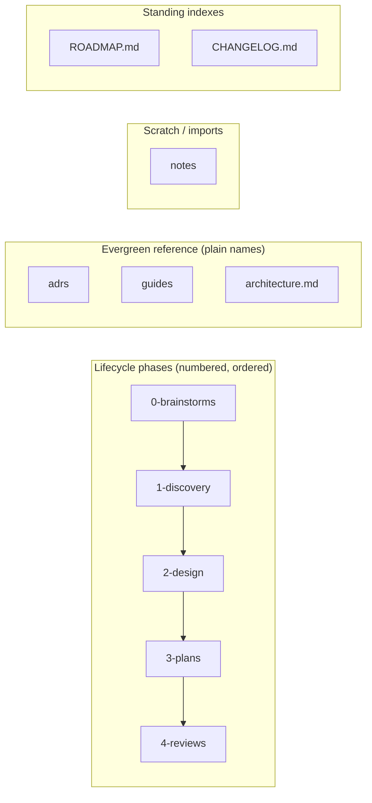
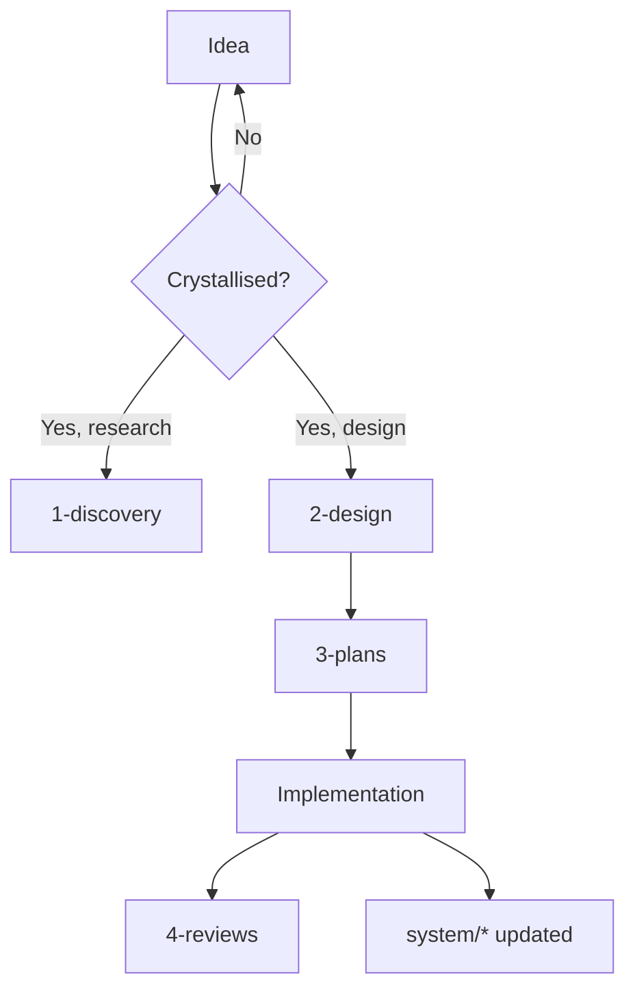
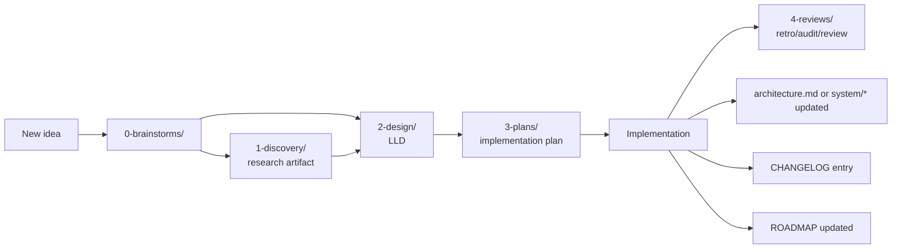

# Project Structure and Conventions — Portable Guide

A self-contained guide to a project documentation structure that supports long-running work — multiple initiatives shipping over months or years, with always-current state docs, per-initiative designs and plans, retrospectives, decision records, and clear conventions for how everything fits together.

This guide is **portable**: copy this file into a fresh project, follow the steps in §6, and you have the same structure operating in a new repo. Examples throughout are drawn from a real infrastructure project so the abstract conventions have a concrete shape.

---

## Table of contents

1. [Philosophy](#1-philosophy)
2. [Core principles](#2-core-principles)
3. [Repository structure](#3-repository-structure)
4. [What each folder is for](#4-what-each-folder-is-for)
5. [Conventions](#5-conventions)
6. [Workflow](#6-workflow)
7. [Recommended tools and plugins](#7-recommended-tools-and-plugins)
8. [Adopting this in a new project](#8-adopting-this-in-a-new-project)
9. [Concrete examples](#9-concrete-examples)
10. [Retrofitting an existing project](#10-retrofitting-an-existing-project)
11. [Notes for adoption](#11-notes-for-adoption)
12. [Credits](#12-credits)

---

## 1. Philosophy

Most project docs fall into one of two failure modes:

- **Chaos** — a sprawling `docs/` with whatever happens to land there, no convention for what goes where, no way to answer "what's the current state?" or "what should I do next?".
- **Bureaucracy** — heavyweight templates, mandatory ceremonies, a system that's nice in theory but in practice no one uses because it's too much overhead.

This structure aims for the middle: **enough convention that orientation is instant; little enough overhead that solo work doesn't feel ceremonial.** It works equally well for human collaborators and AI agents (Claude Code, Cursor, etc.) — both benefit from deterministic answers to "where does X go?" and "what's the current state of Y?".

The structure is opinionated about *placement* (where things live) and *naming* (filenames carry semantic information), but lightweight about *content* (no rigid templates — write what's useful).

---

## 2. Core principles

### 2.1 Single source of truth

There's exactly one place to look for any given question:

- "What's the current state of the system?" → `README.md`'s `## Architecture`, or `docs/architecture.md` (or `docs/architecture/`) once it overflows
- "What's queued / in flight / shipped?" → `docs/ROADMAP.md`
- "What did we decide and why?" → `docs/adrs/NNNN-*.md`
- "What was the design for X?" → `docs/2-design/YYYY-MM-DD-X-design.md`
- "How do I do Y?" → `docs/guides/Y-guide.md`

**No `TODO.md`** — its overlap with ROADMAP creates drift. The ROADMAP itself has a "Next actions" section.

### 2.2 Self-describing filenames

A filename should tell you what kind of doc it is, when it was written, and what it's about — without any folder context. This matters when files travel: tab titles, search results, attachments, chat shares.

```
2026-05-12-install-plex-design.md
└─date────┘ └─topic──────┘ └─type─┘
```

The folder reinforces the type; the filename suffix is the durable marker.

### 2.3 Always-current vs frozen-in-time

Two distinct doc shapes:

- **Always-current** docs (`docs/architecture.md`, `docs/guides/`, `docs/adrs/`, single-file evergreen content at `docs/` root) describe how things ARE right now. They get updated, not appended. No `status:` field — they're always "current" by definition (ADRs use `superseded` only when replaced).
- **Lifecycle** docs (`docs/0-brainstorms/` through `docs/4-reviews/`) describe a moment in time. They get a `status:` field (`draft`, `approved`, `shipped`, `superseded`, `abandoned`) and rarely get edited after they ship. New work generates new lifecycle docs.

Confusing the two leads to "the design says X but the system does Y" drift.

### 2.4 Mandatory frontmatter for machine-readability

Every doc inside `docs/` carries YAML frontmatter with at least `type`, `status` (lifecycle docs only), and `scope`. This lets AI agents and shell scripts query the corpus cheaply: "show me approved designs touching networking" becomes `grep -l "scope:.*network" docs/2-design/ | xargs grep -l "status: approved"`.

### 2.5 Stage-first lifecycle, numbered for clarity

Folders fall into three groups by *what kind of content lives there*, and only the lifecycle group gets numbered:

- **Lifecycle phases (numbered, ordered by workflow):** `0-brainstorms/` through `4-reviews/`. Numbers reflect workflow position; `ls docs/` shows the lifecycle in order.
- **Evergreen reference (plain names, alphabetical):** `adrs/`, `guides/`. No workflow position to encode — names describe what they hold.
- **Scratch / informal (plain name):** `notes/`. Not a phase; not evergreen reference; just a home for chat dumps and external research.
- **Standing indexes / single-file evergreen (UPPERCASE or lowercase at root):** `ROADMAP.md`, `CHANGELOG.md`, optional `architecture.md`.

Project-specific evergreen folders (`prompts/`, `art/`, etc.) are plain-named, NOT numbered. Numbered extensions (`5-prompts/`, `6-art/`) are discouraged — they were a sort-order workaround in older conventions and they imply a workflow position that doesn't exist.



New work flows along the lifecycle chain; not every initiative touches every stage.

### 2.6 ADRs as first-class single-decision records

Architecture decisions live as individual files (`NNNN-short-title.md`, where `NNNN` is a 4-digit zero-padded sequence number), not as a section inside a larger document. Each captures considered options, the choice, and reasoning. They're append-only in spirit — superseded ones stay around with `status: superseded` and `superseded_by:` linking to the replacement.

### 2.7 Brainstorm-then-graduate

Exploratory thinking isn't scratch — it's a first-class artifact in `docs/0-brainstorms/`. As ideas crystallise, they graduate up the chain (brainstorm → discovery → design). Parked decisions stay as brainstorms with `status: parked` so they're not lost.

---

## 3. Repository structure

```
<project-root>/
├── README.md                       # short project overview + entry points
├── CLAUDE.md                       # auto-loaded brief for Claude Code sessions
├── .gitignore
├── .claude/
│   └── settings.local.json         # Claude Code workspace settings (gitignored)
│
├── docs/                          # project's working memory
│   ├── ROADMAP.md                 # forward view: in flight / next / shipped
│   ├── CHANGELOG.md               # backward view: what shipped, when
│   ├── architecture.md            # OPTIONAL single-file HLD (when README's ## Architecture overflows)
│   │
│   ├── notes/                     # scratch, chat dumps, external research, snippets
│   │
│   ├── 0-brainstorms/             # pre-design ideas (worth-elaborating; one-liners → ROADMAP)
│   ├── 1-discovery/               # research, spikes, comparative analyses
│   ├── 2-design/                  # specs + designs (one per initiative)
│   ├── 3-plans/                   # phased implementation plans
│   ├── 4-reviews/                 # retros, audits, reviews, analyses
│   │
│   ├── adrs/                      # single-decision records (NNNN-title.md)
│   └── guides/                    # internal procedural how-tos
│
│ # Optional, per-project (created on demand):
│ # ├── architecture/              # promoted from architecture.md when one file isn't enough
│ # ├── system/                    # for ops/infrastructure projects with operational state
│ # ├── prompts/                   # stable reusable prompts (3+)
│ # └── <custom-evergreen>/        # project-specific (e.g., art/, gdd/)
│
├── archive/                        # frozen imported material; date-prefixed
│   └── YYYY-MM-DD-<source>/        # e.g., chat exports, retired docs
│
├── configs/                        # versioned configuration files
├── scripts/                        # tested ops scripts
└── skills/                         # Claude Code skills (or similar agent definitions)
```

Adapt the inner structure of `configs/`, `scripts/`, `skills/` to your project. The `docs/` structure stays consistent.

---

## 4. What each folder is for

### 4.1 Root-level files

#### `README.md`

Short (~30 lines). Orients a new reader: what is this project, where does the current-state HLD live, where do queued/shipped views live. It does NOT duplicate content — it points at the canonical sources.

```markdown
# Project Name

One-line description.

**Current state:** see the `## Architecture` section below — or [docs/architecture.md](docs/architecture.md) once it has been promoted out of the README.
**What's in flight:** see [docs/ROADMAP.md](docs/ROADMAP.md).
**What's shipped:** see [docs/CHANGELOG.md](docs/CHANGELOG.md).

For Claude Code sessions: [CLAUDE.md](CLAUDE.md) is the auto-loaded brief.

## Repo layout
[brief table]

## Conventions
[brief summary, link to full guide]
```

#### `CLAUDE.md`

Auto-loaded by Claude Code at the start of every session. Contains: project at-a-glance (what, current state pointer), operator preferences (how to work with you), verification policy (when to search vs answer), repo structure summary, working conventions (filenames, status flow, change discipline, ROADMAP discipline, brainstorm graduation, commit format, diagram default), and "what NOT to do" guardrails.

Should be ~150–250 lines. Token cost is per-session, so brevity matters. Keep it scannable, not exhaustive — link to detailed docs (the doc-structure spec, etc.) for the full version.

If you're not using Claude Code, this file is still a useful "agents and contributors brief." Other AI tools and human collaborators benefit from the same content.

#### `docs/ROADMAP.md`

The single source of truth for "what's next." Six sections, each with a clear semantic — see §6.3 for full detail.

#### `docs/CHANGELOG.md`

Date-grouped record of what shipped, when. Most recent first. Each entry references the LLD/plan/retro that drove the change. Mirrors what's in ROADMAP's "Recently shipped" section but with more depth per entry.

```markdown
# Changelog

## 2026-04-28

### foundation — Phase 0 complete

- BIOS updated F11 → F39
- DOCP enabled, RAM at 3200 MT/s, memtest 3 passes clean
- SVM enabled
- IPv6 audit: TCP/UDP firewalled (D-23)
- See [docs/4-reviews/2026-04-28-foundation-retro.md], [docs/3-plans/2026-04-25-foundation-plan.md].
```

### 4.2 `docs/architecture.md` (or `docs/architecture/`) — always-current architecture

Optional, created when README's `## Architecture` section overflows. Two shapes:

- **Single-file:** `docs/architecture.md`. Use until one file isn't enough.
- **Directory:** `docs/architecture/overview.md` + per-aspect files (`network.md`, `services.md`, `data-model.md`, etc.). Promote when single-file outgrows itself.

This is the *only* convention-blessed promotion-to-folder path. Other single-file evergreen content stays flat at `docs/` root (e.g., `vision.md` if you treat it as internal content, `gdd.md` for a game-design doc, `best-practices.md`).

For ops / infrastructure projects with *operational state* (running containers, hardware inventory, network topology) that's broader than architecture alone: optionally add `docs/system/` (or `docs/state/`, `docs/ops/` — operator's call). Keep architectural and operational state separate when they have different update cadences. Examples of `system/*` files for an infrastructure: `hardware.md`, `storage.md`, `containers.md`, `backups.md`.

**No frontmatter `status:` field** — these are evergreen. Optionally include `last_reviewed: YYYY-MM-DD` as a *deliberate* claim that you've personally verified the doc is up-to-date as of that date (NOT auto-bumped on every commit).

### 4.3 `docs/0-brainstorms/` — pre-design exploration

Holds **worth-elaborating ideas that haven't yet materialized into designs** — future thoughts, structured brainstorming sessions, proposals you want to capture before deciding whether to pursue.

The line worth drawing:
- **One-line ideas** ("we should look at X someday") → ROADMAP "Future considerations" section.
- **Worth-elaborating ideas** (~5+ lines, multiple aspects, options to weigh) → `0-brainstorms/<topic>.md` as a structured brainstorm.

Lower quality bar than the other lifecycle folders, but content here is *deliberate* — if it's just a passing thought, it belongs in ROADMAP or a comment, not its own file.

Frontmatter `status:`
- `open` — actively being explored
- `parked` — deferred for later (with notes on what would unpark it)
- `superseded` — graduated to discovery/design (link in `superseded_by:`)
- `abandoned` — explicitly not pursuing

When a brainstorm crystallises, it graduates up the chain — typically to `2-design/` directly, or via `1-discovery/` if substantial research came out of it first.

### 4.4 `docs/1-discovery/` — authoritative research artifacts

Where research reports, comparative analyses, and option-space writeups live. Content with a thesis (not just exploratory thoughts).

Examples: "Comparison of self-hosted photo platforms" (informs the photo-platform design), "Analysis of restic vs borg vs duplicacy" (informs the backup-strategy design), "Survey of vector databases" (informs the memory-rag design).

Frontmatter `status:` follows the standard lifecycle (`draft → approved → superseded`).

### 4.5 `docs/notes/` — scratch, imports, external research

Editable working content that doesn't (yet) belong in a structured phase folder:

- AI chat dumps from external sessions (claude.ai, ChatGPT, etc.)
- External research articles, snippets, links you've collected
- Personal scratch ("saw this technique, might be useful")
- Reference dumps from research sessions

Distinct from `archive/` (top-level, optional): `archive/` is for genuinely frozen historical content you specifically *don't* want loaded as session context. `notes/` is for content you *do* want loaded — chat dumps inform the next initiative, research dumps inform discovery work.

File naming: `YYYY-MM-DD-<topic>.md`. Subdirs optional (e.g., `notes/imports/`).

**Graduation path:** when content in `notes/` crystallises into a structured exploration, it graduates to `0-brainstorms/<topic>.md` with `status: open`, and the original notes can be linked from there.

No frontmatter required — `notes/` is informal by design. If you want to track origin, add a comment at the top of the file pointing at the source.

### 4.6 `docs/2-design/` — Low-level designs (LLDs)

One design doc per initiative. The "why" behind a piece of work — architecture, decisions, tradeoffs.

Each design typically has: summary, goals, non-goals, architecture (with Mermaid diagrams where helpful), decisions (linked to relevant ADRs), open questions, future considerations.

Frontmatter `status:`: `draft → approved → shipped → superseded`.

### 4.7 `docs/3-plans/` — Implementation plans

One plan per initiative, matching a design by topic stem. The "how" — phased implementation steps with verification and rollback per phase.

Frontmatter `status:` matches the design's lifecycle.

### 4.8 `docs/4-reviews/` — Retros, audits, reviews, analyses

Post-execution or evaluative writeups. Anything that looks back at what happened or audits current state. The folder name is an umbrella; the file suffix names the specific kind:

| Suffix | Meaning |
|---|---|
| `-retro.md` | Retrospective on a shipped piece of work |
| `-audit.md` | Systematic check (security, dependency, code health) |
| `-review.md` | General review (quarterly, system, dependency) |
| `-analysis.md` | Analytical writeup (competitive, framework, etc.) |

A retro typically has: summary, outcomes, what worked, what surprised, what to do differently, follow-ups. Audits and analyses follow domain-specific shapes; the common thread is "looking back / measuring against a target."

Frontmatter `status:` is typically `shipped` (these are written after the fact).

### 4.9 `docs/guides/` — Internal procedural how-tos

(Renamed from `5-guides/` — the number was forcing alphabetical sort, not signaling a workflow position.)

Operational reference docs that survive any single initiative. How to upgrade firmware, how to restore from backup, how to deploy a new service, performance primers, this guide itself.

Evergreen — no `status:` field. Optional `last_reviewed:`.

### 4.10 `docs/adrs/` — Architecture Decision Records

(Renamed from `6-adrs/` — see §4.9 note. ADRs are not lifecycle phase artifacts; they're persistent decision records.)

Single-decision files. One file per architecture decision, named `<NNNN>-<short-title>.md` (where `NNNN` is a 4-digit zero-padded sequence number). Example: `adrs/0001-database-choice.md`, `adrs/0023-rate-limit-strategy.md`.

Each ADR captures: considered options, picked option, reasoning, and cross-references to related ADRs and design docs.

```markdown
# <NNNN>: <Full Title>

## Considered
- Option A: ...
- Option B: ...

## Picked
<the choice>

## Why
<reasoning>

## Related
- [0017](0017-other-decision.md) — relationship
```

ADRs are decisions, not deliverables — they don't "ship." Their lifecycle is `draft → approved → superseded`.

### 4.11 `archive/`

Frozen imported material — chat exports, retired handover docs, third-party reports you want preserved alongside the project. Date-prefixed sub-folders for provenance:

```
archive/
├── 2026-04-25-design-chat/
│   ├── conversation-dump.md
│   └── original-handover.md
└── 2026-04-30-implementation-chat/
    └── conversation-transcript.md
```

Distinct from `docs/` — archive content is read-only historical, never updated. Distinct from `docs/notes/` — `notes/` holds editable scratch and imports you DO want loaded as session context; `archive/` holds frozen content you specifically DON'T want loaded.

### 4.12 `configs/`, `scripts/`, `skills/`, `.claude/`

Project-specific. Adapt to your needs:

- `configs/` — versioned config files (Docker Compose, Kubernetes manifests, IaC templates, app configs).
- `scripts/` — tested ops scripts. Half-finished work doesn't go here; use a `wip/` subfolder or keep it locally.
- `skills/` — Claude Code skills (or similar agent definitions). May or may not apply to your project.
- `.claude/` — Claude Code workspace settings (typically `settings.local.json` is gitignored).

---

## 5. Conventions

### 5.1 Filename conventions

| Folder | Pattern | Example |
|---|---|---|
| `notes/` | `YYYY-MM-DD-<topic>.md` (or freeform) | `2026-05-12-claude-design-chat.md` |
| `0-brainstorms/` | `YYYY-MM-DD-<topic>.md` | `2026-05-01-quarterly-ipv6-rescan-routine.md` |
| `1-discovery/` | `YYYY-MM-DD-<topic>-research.md` (or `-analysis.md`, `-spike.md`) | `2026-05-10-photo-platform-research.md` |
| `2-design/` | `YYYY-MM-DD-<topic>-design.md` | `2026-04-25-storage-architecture-design.md` |
| `3-plans/` | `YYYY-MM-DD-<topic>-plan.md` | `2026-04-25-storage-architecture-plan.md` |
| `4-reviews/` | `YYYY-MM-DD-<topic>-{retro,audit,review,analysis}.md` | `2026-04-28-foundation-retro.md` |
| `guides/` | `<topic>-guide.md` (no date) | `bios-update-guide.md` |
| `adrs/` | `<NNNN>-<short-title>.md` | `0023-ipv6-enabled-eero-firewall.md` |
| `architecture.md` / `architecture/` | `<aspect>.md` (no date) | `architecture.md`, `architecture/network.md` |

**Why date prefixes on lifecycle docs:** sorts chronologically (`ls 2-design/` shows the design history in order); answers "when was this written?" without opening the file; future versions of the same topic don't collide on filenames.

**Why no date prefix on evergreen:** these get UPDATED, not appended. The git log shows when content changed; the filename should reflect what the doc IS, not when it was created.

**Why suffixes (`-design`, `-plan`, etc.):** filenames travel out of folder context (tab titles, attachments, search results). The folder tells you the stage when the doc is in the repo; the suffix tells you the stage when the file is anywhere else.

### 5.2 File-name casing (project-meta vs content)

| Class | Case | Examples |
|---|---|---|
| Front-page meta file (open-source convention level) | `UPPERCASE.md` | `README.md`, `LICENSE`, `CHANGELOG.md`, `ROADMAP.md`, `CONTRIBUTING.md`, `CODE_OF_CONDUCT.md`, `SECURITY.md` |
| Internal content doc | `lowercase.md` or `kebab-case.md` | `architecture.md`, `services.md`, `vision.md` (if internal), `best-practices.md` |
| Lifecycle artifact | `YYYY-MM-DD-<topic>-<suffix>.md` | `2026-05-02-feature-x-design.md` |

The test: *"Would this file be expected at the front page of any open-source project, or is it specific content for this one?"* Front-page expected → UPPERCASE; specific content → lowercase.

### 5.3 Shareability rule

Any path or command that appears in repo content (skills, guides, templates, READMEs) should be runnable by a colleague without rewriting. Three patterns to follow:

1. **Use placeholders, not user-specific paths.** `<destination>`, `<path-to-repo>`, `<new-project-path>` — angle-bracketed placeholders are visually obvious as fill-ins. Avoid `~/Projects/` (presumes a specific home-dir layout).
2. **Use public GitHub URLs over local paths.** `https://raw.githubusercontent.com/<user>/<repo>/main/...` works for any cloner; `~/Projects/<user>/<repo>/...` doesn't.
3. **Use harness-standard paths over user layouts.** `~/.claude/skills/<name>/` is the harness's universal install path — works for everyone. `~/dev/claude/skills/...` is your layout.

The test before shipping any snippet: *"Could a colleague paste this and run it on their machine?"* If no, reformulate.

### 5.4 Frontmatter

All `docs/*.md` files carry YAML frontmatter (except `notes/`, which is informal by design). Two schemas.

**Schema A — lifecycle and decision docs** (`0-brainstorms/`, `1-discovery/`, `2-design/`, `3-plans/`, `4-reviews/`, `adrs/`):

```yaml
---
date: 2026-05-12
title: "Install Plex"
type: design                       # design | plan | retro | research | adr | brainstorm
status: draft                      # draft | approved | shipped | superseded | abandoned (or open/parked for brainstorms)
scope: [containers, network]       # optional, multi-valued tags
supersedes:                        # optional, path of doc this replaces
superseded_by:                     # optional, path of doc replacing this
related: []                        # optional, paths to related docs
---
```

**Schema B — evergreen docs** (`architecture.md`, `architecture/`, optional `system/`, `guides/`, single-file evergreen at `docs/` root):

```yaml
---
title: "Container Roster"
type: system                       # system | guide | architecture | reference
scope: [containers]                # what aspect(s) this doc covers
last_reviewed: 2026-05-12          # optional — deliberate "I confirmed this is current"
---
```

Project-level docs (`README.md`, `CLAUDE.md`, `CHANGELOG.md`, `ROADMAP.md`) get **no frontmatter** — they're well-known by name.

### 5.5 Status semantics

For lifecycle docs:

- `draft` — being written or pending review
- `approved` — accepted; ready to plan/implement
- `shipped` — implementation done; relevant evergreen docs (`architecture.md`, `system/*`, etc.) updated; CHANGELOG entry exists
- `superseded` — replaced by a newer doc (must set `superseded_by:` path)
- `abandoned` — explicitly not pursuing; kept as historical record

**ADR exception:** ADRs don't ship. Their lifecycle is `draft → approved → superseded`.

**Brainstorm exception:** brainstorms use `open`, `parked`, `superseded`, `abandoned` — they don't get "approved" because crystallised brainstorms graduate to a different folder.

### 5.6 Conventional Commits

```
<type>(<scope>): <description>
```

Types: `feat`, `fix`, `docs`, `style`, `refactor`, `test`, `chore`, `perf`, `ci`. Imperative mood. Reference LLD and ADR paths in the body:

```
feat(plex): install Plex container with Tailscale exit

Closes LLD: docs/2-design/2026-05-12-install-plex-design.md
Updates docs/architecture.md (or system/containers.md, system/network.md if you use system/).
```

### 5.7 Diagrams (Mermaid as default)



Why Mermaid:
- Renders natively in GitHub, VS Code, Obsidian — no external image asset to keep in sync.
- Source is plain text — diffable in git, editable in any editor, AI-authorable.
- The diagram travels with the doc when files move.

Fall back to other tools (draw.io, Excalidraw) only when Mermaid genuinely can't represent what you need. Commit both source and rendered output if you do.

### 5.8 `## Project Map` section in CLAUDE.md

CLAUDE.md should declare where project-tracking information lives, so AI tools can read it without guessing. The canonical consumer is the [`/briefing`](../skills/briefing/) skill — it auto-discovers state across git, GitHub, the canonical `docs/` working-memory layout, and any tracker source declared here.

> **Renamed 2026-05-07.** Previously called `## Project Context` (Title Case) and originally `## Project context` (sentence case). The `/briefing` skill matches all three case-insensitively for backward compatibility. New CLAUDE.md files should use the canonical `## Project Map`. Existing adopters can migrate via `/briefing setup`, which proposes the rename as part of its diff.

Each line is `- **Field**: value`. Recognised fields:

| Field | Purpose |
|---|---|
| `Tracker` | Where work items live (`GitHub Issues`, `Linear team FOO`, `Jira project BAR`, `Notion`, `GitHub Project N`, file path, or `none`) |
| `Board` | URL of the active board / project view |
| `Roadmap` | File path or external URL of the forward view |
| `Changelog` | File path or external URL of recent shipped work |
| `Architecture` | File path or directory of architecture docs |
| `Working memory` | Directory holding lifecycle artifacts (default: `docs/` following this guide's numbered-lifecycle convention) |
| `Other` | Free-form bullet list for project-specific context (custom scripts, story-tracking quirks, telemetry sources) |

#### Complete examples

A fully-populated section for a typical solo project following the canonical conventions:

```markdown
## Project Map

- **Tracker**: GitHub Issues
- **Board**: none
- **Roadmap**: docs/ROADMAP.md
- **Changelog**: docs/CHANGELOG.md
- **Architecture**: docs/architecture.md
- **Working memory**: docs/ (numbered lifecycle convention)
- **Other**:
  - Test reports live in `tmp/tst_<name>/`, not in repo
  - Manual UI smoke tests via `npm run dev` before merge
```

A non-canonical project that uses flat `docs/plans/` and tracks work in Linear:

```markdown
## Project Map

- **Tracker**: Linear team SHARELOG
- **Board**: https://linear.app/sharelog/team/SHARELOG/board
- **Roadmap**: docs/plans/ROADMAP.md
- **Changelog**: none
- **Architecture**: none
- **Working memory**: docs/plans/
- **Other**:
  - Date-prefixed plan files in `docs/plans/` (e.g. `2026-02-19-feature-name-plan.md`)
  - Top-level `docs/<topic>-plan.md` files are also working memory
```

#### When to declare, omit, or use `none`

Three meaningfully different states per field:

- **Set a value** when the field has a concrete location or source. Most common case.
- **Omit the field entirely** when you want the briefing to fall back to the canonical default path (e.g. omit `Roadmap` if `docs/ROADMAP.md` is exactly where it should be — the briefing finds it via convention sniffing).
- **Set the field to `none`** when the absence is *intentional* — e.g. `**Tracker**: none` for a project that genuinely has no issue tracker, or `**Board**: none` when no project board exists. This tells the briefing to skip probing rather than treating absence as a gap.

The distinction matters because the briefing's `★ About this briefing` block fires "tracker integration unavailable" when a tracker is *declared but unreachable*; declaring `none` suppresses that bullet entirely.

#### Discovery hints

Working out what to put in each field — questions to ask yourself:

- **`Tracker`** — Where do you (and your collaborators) track issues? GitHub Issues / Linear / Jira / a file like `TODO.md` / nowhere (`none`)? If multiple, pick the canonical one and mention the others under `Other`.
- **`Board`** — Does the tracker have a kanban-style board view? Paste the URL. If you only use a flat list, `none`.
- **`Roadmap`** — Where do you write "what's next"? `docs/ROADMAP.md` is the canonical default; if you put it elsewhere (`ROADMAP.md` at repo root, a Notion page, a Linear cycle view), declare it.
- **`Changelog`** — Where does shipped work get recorded? Same rule as Roadmap.
- **`Architecture`** — Is there a single doc or directory describing the system's current shape? `docs/architecture.md` or `docs/system/` are common; `none` is fine if architecture is small enough to live in README.
- **`Working memory`** — Where do designs, plans, brainstorms, retros live? `docs/` (with numbered subdirs) is canonical; flat layouts like `docs/plans/` work too — declare the directory.
- **`Other`** — Anything else AI tools should know: custom scripts, where test artefacts live, naming conventions for non-canonical files, integration quirks. Free-form bullets.

#### Layered fallback

**Absent fields fall back to layer-1 defaults at canonical paths.** A field set to `none` means "deliberately empty" (the briefing won't probe further); an absent field means "try the default" (the briefing will look at the canonical path).

The canonical scaffold lives in [`templates/default-project/CLAUDE.md`](../templates/default-project/CLAUDE.md). Bootstrapped projects inherit the section for free; existing projects pick it up via §10.6.

---

## 6. Workflow

### 6.1 Lifecycle of a piece of work



Not every piece of work touches every stage. A small fix might skip brainstorm and discovery, going directly to design (or skipping design too if it's a one-line change). A multi-month initiative might cycle through multiple plans and reviews.

### 6.2 Change discipline

When a design or plan flips to `status: shipped`, the same commit (or commit series) must also:

1. Update relevant evergreen state docs to reflect the new reality — `docs/architecture.md` (or `docs/architecture/*`), or `docs/system/*.md` if the project uses operational state docs.
2. Add a `CHANGELOG.md` entry referencing the design/plan.
3. Update `ROADMAP.md` — move the item from "In flight" to "Recently shipped"; unblock dependents.
4. Set the design's frontmatter to `status: shipped`.

This keeps the always-current docs honest and the ROADMAP synchronised.

### 6.3 ROADMAP discipline

`docs/ROADMAP.md` is the single source of truth for "what's next." Seven sections:

| Section | Meaning |
|---|---|
| **In flight** | Active work right now |
| **Next actions** | Concrete, ready-to-do items; just not started yet |
| **Drafts (pending review)** | Designs/plans with `status: draft` needing review before they unlock execution |
| **Future considerations** | On the radar but not designed yet — not actionable until designed |
| **Open questions** | True unknowns — things to find out or decide *before* they could become actions |
| **Parked** | Items considered and deferred — kept visible so they're not forgotten (PEP-vocabulary prefix) |
| **Recently shipped** | Backward view; mirrors CHANGELOG with shorter entries |

**Lifecycle of an item in ROADMAP:**

1. New idea → **Future considerations** (or skip if it lands ready-to-design).
2. Designed → **Drafts** (a design + plan exist with `status: draft`).
3. Draft reviewed and approved → **Next actions** (or **In flight** if starting immediately).
4. Started → **In flight**.
5. Shipped → **Recently shipped** + CHANGELOG entry + evergreen-state updates + frontmatter `status: shipped`.
6. Parked at any stage → **Parked** with `Deferred:` / `Declined:` / `Superseded:` prefix.

**Triage question for any new item:**

- Do we know what to do? → **Next actions**
- Do we have a design but not approval yet? → **Drafts**
- Do we have an idea but no design? → **Future considerations**
- Do we need to figure something out first? → **Open questions**
- Did we consider it and decide not now? → **Parked**

**Substantial Next-actions get a brainstorm note.** When a Next action is more than a one-liner — e.g., setting up a recurring routine, planning a maintenance procedure, scoping out a comparative purchase — capture the *details* in `docs/0-brainstorms/YYYY-MM-DD-<topic>.md` with `status: open`. ROADMAP holds the one-line pointer and link; the brainstorm holds the full proposal.

**Parked-item vocabulary (borrowed from [PEP 1](https://peps.python.org/pep-0001/)).** Each entry in `## Parked` carries a one-word prefix that says *why* the door is closed:

| Prefix | Meaning | When to use |
|---|---|---|
| **Deferred:** | Stalled or paused; may revisit | Life happened; waiting on a trigger ("when X lands"); nothing wrong with the idea |
| **Declined:** | Decided against after consideration | We thought about it and chose not to pursue; brief reasoning attached |
| **Superseded:** | Replaced by another approach | A different design covers the same need; link to the replacement |

This is the three-way semantic split PEP, KEP, and most mature proposal-tracking systems converge on (see industry research in `docs/4-reviews/2026-05-02-roadmap-conventions-audit.md` if it exists). Each parked entry should link to the underlying brainstorm or design file with frontmatter `status: parked` (for `Deferred`), `status: abandoned` (for `Declined`), or `status: superseded` (for `Superseded`).

**Truncation rule for Recently shipped.** Keep the last 10 entries OR the last 90 days, whichever is shorter. Older shipped items live only in `CHANGELOG.md` (the long-term record). The ROADMAP's purpose is forward-leaning navigation, not historical archive.

### 6.4 Brainstorm graduation

- A brainstorm becomes a research artifact (in `1-discovery/`) when it produces a referenceable thesis with a recommendation.
- A brainstorm becomes a design (in `2-design/`) when it crystallises into a concrete proposal for a piece of work.
- A brainstorm becomes a parked decision (status `parked` in `0-brainstorms/`) when it's deferred — with notes on what would unpark it. Surface in ROADMAP's `## Parked` section with the `Deferred:` prefix.
- A brainstorm becomes abandoned (status `abandoned`) when explicitly not pursuing — kept as historical record so the question doesn't get re-asked. Surface in ROADMAP's `## Parked` section with the `Declined:` prefix.

Link via `superseded_by:` frontmatter when a brainstorm graduates.

### 6.5 AI-agent update triggers (working-memory discipline)

This convention assumes AI coding agents (Claude Code, Codex, etc.) are primary maintainers of `docs/` going forward. AI agents work in conversations and treat conversation as ephemeral by default — without explicit triggers, working-memory artifacts (ROADMAP, CHANGELOG, brainstorms, ADRs) lag behind reality.

**Event-triggered writes.** When any of the following happens during a session, the agent SHOULD make the listed change *in the same session*, not "later":

| Event | Required write |
|---|---|
| Agreed to start a substantial new initiative not yet in `docs/` | Create `docs/0-brainstorms/YYYY-MM-DD-<topic>.md` with `status: open`. Add one-line pointer to ROADMAP `## Future considerations` (or `## Next actions` if ready to start). |
| Brainstorm crystallises into a design during conversation | Create `docs/2-design/YYYY-MM-DD-<topic>-design.md` with `status: draft`. Move ROADMAP pointer from Future considerations / Next actions → `## Drafts (pending review)`. Set brainstorm `status: superseded`, `superseded_by: <design-path>`. |
| Design approved | Flip frontmatter `status: approved`. Move ROADMAP pointer from Drafts → `## Next actions` (or `## In flight` if starting immediately). |
| Implementation begins | Move ROADMAP pointer to `## In flight`. |
| Implementation ships | Per §6.2 change discipline: flip design + plan to `status: shipped`; update evergreen state docs; add CHANGELOG entry; move ROADMAP pointer to `## Recently shipped`. All in the same commit (or commit series). |
| Work parked / deferred | Flip artifact frontmatter to `status: parked` (or `abandoned` / `superseded`). Move ROADMAP pointer to `## Parked` with the appropriate prefix. |
| New unresolved decision identified | Add to ROADMAP `## Open questions` with the question stated as a question. |
| Open question resolved | Remove from `## Open questions`. The resolved decision lands in an ADR (`docs/adrs/<NNNN>-<title>.md`) or in a design's "Decisions" section. |
| Substantive audit, retro, or analysis emerges from a conversation | Save to `docs/4-reviews/YYYY-MM-DD-<topic>-{audit,retro,review,analysis}.md`. Don't let the work evaporate at session end. |

**Session-end check.** Before ending a session in which we made non-trivial decisions, discovered convention gaps, agreed on changes, or did substantive evaluative work, the agent should explicitly verify:

1. Has every status change in this session been written to the relevant artifact's frontmatter?
2. Does ROADMAP accurately reflect what's now In flight / Drafts / Next actions / Parked?
3. Did anything emerge that should be in `0-brainstorms/`, `4-reviews/`, or as an ADR but isn't?
4. Is CHANGELOG up to date with shipped work?

If the answer to any is "no," the agent should propose the missing writes inline before ending the session — not silently move on.

**Recurring audit (recommended).** Schedule a recurring agent (via `/schedule` or equivalent) to run this same check periodically — weekly for active projects, monthly for slower-moving ones. The agent reads ROADMAP, scans `docs/` for status drift between ROADMAP entries and lifecycle artifacts, and reports gaps. This is the [GTD weekly review](https://gettingthingsdone.com/) made into infrastructure.

**Why this needs to be explicit.** Conventions written for human authors assume an instinct to "save your work." AI agents have no such instinct — they treat the conversation as the work product unless told otherwise. The triggers above make the implicit instinct explicit and machine-actionable. Skipping them is the most common cause of working-memory rot in AI-maintained projects.

---

## 7. Recommended tools and plugins

This structure is tool-agnostic — git, markdown, and a text editor are enough. But it's *designed* to work well with AI coding harnesses (Claude Code, Cursor, Codex CLI), and there are specific plugins/skills that operationalise the conventions described above. The list below is Claude Code-flavoured (since this project was built with it); equivalents for other harnesses likely exist.

You don't need all of these — pick what fits your workflow.

### 7.1 Workflow plugins (the chain itself)

These directly implement the brainstorm → design → plan → implement → finish chain from §6.

| Plugin | Provides | Used for |
|---|---|---|
| `superpowers` | `brainstorming`, `writing-plans`, `executing-plans`, `subagent-driven-development`, `finishing-a-development-branch`, `using-git-worktrees`, `verification-before-completion`, `systematic-debugging`, `requesting-code-review`, `receiving-code-review`, `test-driven-development`, `dispatching-parallel-agents` | The full SDLC workflow — `/brainstorm` opens a design session that produces a spec; `/writing-plans` turns it into an executable plan; `/executing-plans` walks through it; `/finishing-a-development-branch` wraps up. |
| `claude-md-management` | `claude-md-improver`, `revise-claude-md` | `/claude-md-improver` audits CLAUDE.md against quality criteria. `/revise-claude-md` updates it with end-of-session learnings. |
| `commit-commands` | `/commit`, `/commit-push-pr`, `/clean_gone` | Conventional-commit-formatted commits, push + PR creation in one step, clean-up of stale branches. |

### 7.2 Verification plugins (back the verification policy)

These support the "search before answering when unsure" policy from §5.

| Plugin | Provides | Used for |
|---|---|---|
| `context7` | `resolve-library-id`, `query-docs` | Fetches current library / framework / SDK docs on demand — preferred over web search for library-specific queries (covers React, Next.js, Prisma, Express, Tailwind, Django, etc.). |
| `security-guidance` | `/security-review` | Reviews pending changes on the current branch for security issues before merge. |
| `code-review` | `/review` | Single-shot PR code review against project conventions (CLAUDE.md). |
| `pr-review-toolkit` | `/review-pr` (multi-agent) | Comprehensive PR review using 6 specialised subagents: code-reviewer, code-simplifier, comment-analyzer, pr-test-analyzer, silent-failure-hunter, type-design-analyzer. |

### 7.3 Discovery and adoption plugins

| Plugin | Provides | Used for |
|---|---|---|
| `claude-code-setup` | `claude-automation-recommender` | Analyses a repo and recommends Claude Code automations (hooks, subagents, skills, plugins, MCP servers). Run this first when adopting Claude Code in a new project. |
| `skill-creator` | Skill scaffolding + evals | Create new skills, modify existing ones, run evals to measure skill triggering accuracy and performance. |
| `superpowers-developing-for-claude-code` | `working-with-claude-code`, `developing-claude-code-plugins` | Reference + workflows for building Claude Code plugins, hooks, MCP servers, and skills. Useful when extending the toolset itself. |

### 7.4 Output style

| Plugin | Provides | Used for |
|---|---|---|
| `explanatory-output-style` | `explanatory` output style | Adds inline `★ Insight` blocks that teach what's happening as work proceeds. Useful when learning a new domain or onboarding to a codebase. Toggle via `/output-style explanatory`. |

### 7.5 Project-type-specific plugins (optional)

Pick based on what your project does.

| Plugin | When useful |
|---|---|
| `feature-dev` | Software projects with discrete feature work — provides code-explorer, code-architect, code-reviewer subagents. Less critical for infra/docs projects. |
| `code-simplifier` | After writing code, refines for clarity and maintainability. |
| `frontend-design` | Projects with web frontends — generates production-grade React/Next.js components. |
| `ui-ux-pro-max` | Web/mobile UI/UX design — 50+ styles, 161 colour palettes, 57 font pairings, integration with shadcn/ui. |
| `playwright` | Browser-automation MCP — useful for testing web apps or scraping. |
| `typescript-lsp` | TypeScript projects — Language Server Protocol integration for diagnostics and refactoring. |
| `agent-sdk-dev` | Building Claude Agent SDK applications (Python or TypeScript). |
| `playground` | Building self-contained interactive HTML explorers/playgrounds. |

### 7.6 Built-in skills (no plugin needed)

These come with the harness itself and complement the structure:

- `/schedule` — create recurring or one-time remote agents. The natural home for proposals captured in `docs/0-brainstorms/` (e.g., quarterly maintenance routines, monthly health checks).
- `/loop` — run a prompt or slash command on a recurring interval within a session. Useful for "keep checking until X" workflows.
- `find-skills` — discover and install skills when you express a need ("how do I do X?").
- `update-config` — configure the harness via `settings.json`, including hooks for automated behaviours.
- `keybindings-help` — customise keyboard shortcuts.

### 7.7 MCP connectors (claude.ai)

MCP (Model Context Protocol) connectors give Claude access to external services. These run in claude.ai (web/desktop) by default; some may also be available via CCR remote agents. Configure at https://claude.ai/customize/connectors.

| Category | Connectors | Useful for |
|---|---|---|
| Communication | Slack, Gmail | Sending notifications from routines, reading project communication |
| Knowledge | Notion, Google Drive | Cross-project notes, attachments, shared docs |
| Calendar | Google Calendar | Scheduling, reminders, time-blocking |
| Deployment | Vercel | Web app deployment + log access |
| Design | Canva | Asset generation |
| Library docs | context7 (also a plugin) | Up-to-date framework documentation |
| Browser | Playwright | Web automation |

For routine agents (created via `/schedule`), MCP connectors expand what the agent can do beyond reading the repo. E.g., a quarterly audit agent can post results to Slack instead of just printing to the routine page.

### 7.8 Marketplaces

Plugins come from marketplaces. Three to know:

- **`claude-plugins-official`** — Anthropic's official marketplace; most plugins above live here.
- **`superpowers-marketplace`** — community-curated discipline skills (the canonical home of `superpowers`).
- **Project-specific marketplaces** (e.g., `ui-ux-pro-max-skill`) — single-plugin marketplaces from individual authors.

Manage via `/plugin` (TUI) or by editing `~/.claude/plugins/installed_plugins.json` directly. Snapshot your installed set occasionally — versions and SHAs drift over time.

### 7.9 Minimum viable setup for this structure

If you only install three things:

1. **`superpowers`** — for the workflow chain.
2. **`claude-md-management`** — to keep `CLAUDE.md` healthy.
3. **`commit-commands`** — for clean commits.

That covers the core moves: brainstorm → plan → execute → ship → maintain CLAUDE.md → commit per convention. Everything else is incremental value depending on what your project does.

---

## 8. Adopting this in a new project

### Step 1: Bootstrap from the template

The canonical scaffold lives at `templates/default-project/` in [carlosboeing/claude-code-resources](https://github.com/carlosboeing/claude-code-resources). Two paths:

```bash
# Option A — without cloning (recommended; uses degit to fetch the subdirectory):
npx degit github:carlosboeing/claude-code-resources/templates/default-project <new-project-path>

# Option B — from an existing local clone (replace <path-to-repo> with your clone path):
cp -r <path-to-repo>/templates/default-project <new-project-path>
```

The template ships with `CLAUDE.md`, `README.md`, `.gitignore`, and the full `docs/` skeleton (lifecycle phases + evergreen + standing indexes). `system/` and `architecture.md` are NOT scaffolded — they're created on demand when README's `## Architecture` section overflows.

### Step 2: Substitute placeholders

The template uses `<PROJECT_NAME>` placeholders in `CLAUDE.md`, `README.md`, and `docs/ROADMAP.md`. Replace them:

```bash
cd <new-project-path>
grep -rl '<PROJECT_NAME>' . | xargs sed -i '' 's/<PROJECT_NAME>/your-project-name/g'   # macOS
grep -rl '<PROJECT_NAME>' . | xargs sed -i 's/<PROJECT_NAME>/your-project-name/g'      # Linux
```

Then customise `CLAUDE.md` and `README.md` for your project specifics.

### Step 3: Initial commit

Use Conventional Commits from day one:

```bash
git init && git add . && git commit -m "chore: bootstrap repo with project structure conventions"
```

### Step 4: Use `0-brainstorms/` for the first piece of exploratory work

Resist the urge to skip straight to a design doc. Even if you have a clear plan, capturing the brainstorm gives you the artifact to look back at, and dogfoods the convention so it sticks.

### Step 5: Build the muscle

The convention only works if you actually follow it. Specifically:

- When you make a decision worth remembering, write an ADR.
- When you ship something, update evergreen state (`architecture.md` or `system/*`), `CHANGELOG`, and `ROADMAP` in the same commit.
- When you have an exploratory thought, capture it in `0-brainstorms/`, even briefly.

Six months in, the structure pays off — you can answer "what did we decide and why?" by reading the ADRs, "what's the current state?" by reading `architecture.md` (or `system/*`), "what's next?" by reading ROADMAP. Without the convention, all three answers require archaeology.

### Bootstrapping without the template (manual)

If you can't or don't want to use the template, scaffold by hand:

```bash
mkdir -p docs/{notes,0-brainstorms,1-discovery,2-design,3-plans,4-reviews,adrs,guides}
touch docs/{notes,0-brainstorms,1-discovery,2-design,3-plans,4-reviews,adrs,guides}/.gitkeep
touch docs/ROADMAP.md docs/CHANGELOG.md
# Then write README.md, CLAUDE.md, .gitignore by hand (or copy from your last project).
```

---

## 9. Concrete examples

The conventions earn their value in how artifacts cross-reference each other. The patterns below describe what each artifact looks like in practice — adapt them to your own project.

### A complete initiative

The full lifecycle of a single piece of work — a hardware upgrade, a service migration, a feature rollout — looks like:

- **Design** in `2-design/` lays out the architecture, options considered, and chosen approach. `status: draft` while in flight, `status: shipped` once done.
- **Plan** in `3-plans/` references the design and breaks it into phased steps with verification criteria, effort estimates (S/M/L), risks, and the smallest viable first step.
- **Retro** in `4-reviews/` (optional, written after) captures what worked, what surprised, and follow-ups that came out of the work.
- **ADRs** in `adrs/` capture decisions made during the work — usually 1–4 per initiative, sometimes zero. Each ADR is single-decision; supersedes/superseded-by relationships are explicit.
- **Evergreen state updates** land in the same commit that ships the work — `docs/architecture.md` (or `docs/architecture/*`), or `docs/system/*` if the project uses operational state docs.
- **CHANGELOG entry** dated, referencing the design and (if applicable) retro.

The whole bundle is browseable from `ROADMAP.md → Recently shipped`, which links into the design, which links forward to the retro, which links back into ADRs.

### A parked brainstorm

A `0-brainstorms/<topic>.md` doc with `status: parked`, concrete deferral rationale, links to affected drafts, and triggers for when to revisit. Captures pre-design exploration without forcing a commitment.

### A Next-action with full proposal

ROADMAP "Next actions" holds a one-line pointer. The detailed proposal lives in `0-brainstorms/<topic>.md` with `status: open` — the full reasoning, options, and approach. Keeps ROADMAP scannable while preserving the thinking that informs each action.

### An ADR with cross-references

A `<NNNN>-<title>.md` file with: considered options, picked option, reasoning, and a `Related:` section linking to upstream ADRs and to designs that informed the decision. Single-decision per file — if a decision genuinely contains two, write two ADRs.

### An evergreen state doc with cross-references

`architecture.md` (or `architecture/<aspect>.md`, or `system/<aspect>.md`) describes current state with links to the originating design (rationale) and relevant ADRs (per-decision history). Pattern: evergreen state answers "what is the state?", linking out to "why is it that way?" and "what was the design?".

### This guide itself

The doc you're reading is an example of an evergreen how-to in `guides/`. Evergreen, no `status` field, one `last_reviewed:` date that's bumped only when you've personally re-verified the content.

---

## 10. Retrofitting an existing project

Projects that follow earlier versions of these conventions (or partial conventions) can be migrated. Manual procedure below; automation deferred to a future `/init-project` skill that detects starting state and applies the appropriate diff.

### 10.1 Detect current state

Run from the project root:

```bash
ls docs/ 2>/dev/null
find docs -maxdepth 1 -type d 2>/dev/null
```

Identify which of these apply:
- `docs/5-guides/` exists → rename to `docs/guides/` (Step 10.2)
- `docs/6-adrs/` exists → rename to `docs/adrs/` (Step 10.2)
- `docs/system/` exists with multiple files → keep, or split per §4.2 (depends on content)
- `docs/system/architecture.md` only → flatten to `docs/architecture.md`
- `docs/notes/` missing → create (Step 10.3)
- `docs/0-brainstorms/` missing → create (Step 10.3)
- ADRs use `D-N-` or `YYYY-MM-DD-NNN-` patterns → standardise to `NNNN-` (Step 10.4)
- `BACKLOG.md` instead of `ROADMAP.md` → rename or document the alias
- Misplaced evergreen content (`VISION.md`, `gdd.md`, `BestPractices.md` in `1-discovery/`) → relocate to `docs/` root or appropriate evergreen folder (Step 10.5)

### 10.2 Folder renames

```bash
git mv docs/5-guides docs/guides
git mv docs/6-adrs docs/adrs
```

Update any cross-references in CLAUDE.md, README.md, ROADMAP.md, CHANGELOG.md, and per-doc frontmatter `related:` fields.

### 10.3 Add missing folders

```bash
mkdir -p docs/notes docs/0-brainstorms
touch docs/notes/.gitkeep docs/0-brainstorms/.gitkeep
```

### 10.4 ADR naming standardisation

Renumber ADRs to `NNNN-title.md`:

```bash
# Example: D-1-storage.md → 0001-storage.md
cd docs/adrs
for f in D-*.md; do
  num=$(echo "$f" | sed 's/^D-\([0-9]\+\)-.*$/\1/')
  rest=$(echo "$f" | sed 's/^D-[0-9]\+-//')
  printf -v padded "%04d" "$num"
  git mv "$f" "${padded}-${rest}"
done
```

Update internal cross-references: ADRs often reference each other (e.g., "see D-22"). Search and replace:

```bash
grep -rl "D-[0-9]" .
# Update each match: D-1 → 0001, D-22 → 0022, etc.
```

### 10.5 Relocate misplaced evergreen content

Audit `docs/1-discovery/` for files that aren't actually research artifacts (no thesis, no recommendation):

- `VISION.md`, `*-vision.md` → consider top-level `VISION.md` (front-page meta) or `docs/vision.md` (content)
- `*-gdd.md`, `*-game-design.md` → `docs/gdd.md` (or `docs/architecture.md` if game-design IS the architecture)
- `*-best-practices.md`, `*-analysis.md` (without research basis) → `docs/best-practices.md` or `docs/4-reviews/`

### 10.6 Update CLAUDE.md and verify

- Add/refresh the `docs/ = working memory` framing.
- Update the layout block to match the new structure.
- Add a `## Project Map` section per §5.8. Copy the field list from [`templates/default-project/CLAUDE.md`](../templates/default-project/CLAUDE.md) and fill in the values. If a field doesn't apply (no formal tracker, no separate architecture doc, etc.), set the value to `none` so the `/briefing` skill knows the absence is intentional.
- Run a fresh CC session and confirm context loading is coherent.

### 10.7 Verification

```bash
find docs -maxdepth 1 -type d | sort
ls docs/adrs | head -5
grep -r "5-guides\|6-adrs\|D-[0-9]" docs/ --include="*.md"  # should return only intentional historical references
```

### 10.8 Retrofit is plausibly ongoing alignment work

As the canonical conventions evolve, re-run this procedure. The `/init-project` skill (future) will automate detection and migration; until then, the procedure is the contract.

---

## 11. Notes for adoption

- **Don't try to backfill everything at once.** Adopt the structure for new work; let old docs sit until they're touched. Forced migration is a tax that often kills adoption.
- **The numbered prefixes aren't sacred for evergreen content.** Lifecycle phases are numbered (`0-brainstorms/` through `4-reviews/`); evergreen folders (`adrs/`, `guides/`) are plain-named. If you prefer all-named folders (`brainstorms/`, `designs/`, etc.) and accept losing the workflow ordering that `ls` gives you, the rest of the convention still works.
- **`system/agents.md`** isn't in the standard set above — add it (or omit it) based on whether your project will have ongoing agent / automation work worth tracking.
- **Cadence of `last_reviewed:` updates** is a judgment call. For docs that age slowly (BIOS update guide), every 6–12 months is fine. For high-churn docs (current container roster), you might bump it whenever you ship.
- **Single-person vs team:** the conventions are designed for solo work but scale to small teams. For larger teams, you'd add review processes, ownership, and probably a more formal status flow — but the file shapes stay useful.

---

## 12. Credits

This structure was developed by [@carlosboeing](https://github.com/carlosboeing) for a infrastructure project, evolved from the `reference-workflow` reference structure.

Free to adopt, adapt, ignore. If it works for you, use it. If parts don't fit your project, drop them. The principle that matters is "single source of truth for any given question, with conventions cheap enough to actually follow."
