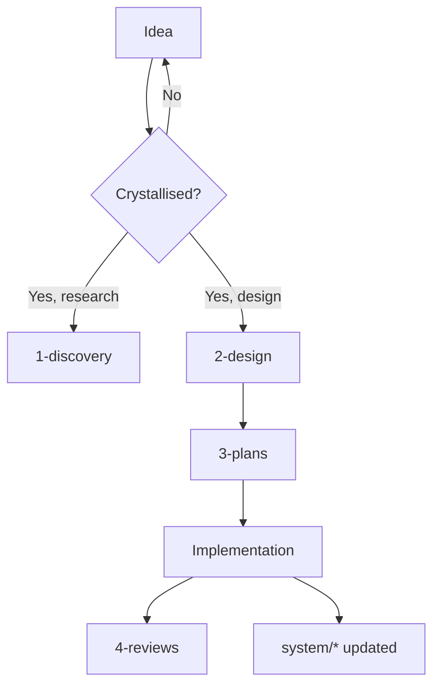
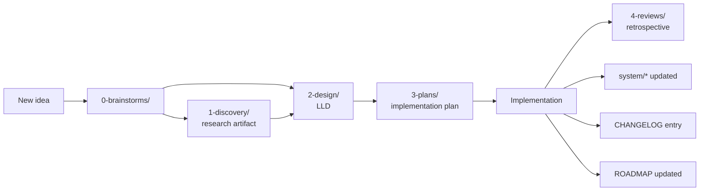

# Project Structure and Conventions — Portable Guide

A self-contained guide to a project documentation structure that supports long-running work — multiple initiatives shipping over months or years, with always-current state docs, per-initiative designs and plans, retrospectives, decision records, and clear conventions for how everything fits together.

This guide is **portable**: copy this file into a fresh project, follow the steps in §6, and you have the same structure operating in a new repo. Examples throughout are drawn from a real infrastructure project so the abstract conventions have a concrete shape.

---

## Table of contents

1. [Philosophy](#1-philosophy)
2. [Core principles](#2-core-principles)
3. [Repository structure](#3-repository-structure)
4. [What each folder is for](#4-what-each-folder-is-for)
5. [Conventions](#5-conventions)
6. [Workflow](#6-workflow)
7. [Recommended tools and plugins](#7-recommended-tools-and-plugins)
8. [Adopting this in a new project](#8-adopting-this-in-a-new-project)
9. [Concrete examples](#9-concrete-examples)
10. [Notes for adoption](#10-notes-for-adoption)
11. [Credits](#11-credits)

---

## 1. Philosophy

Most project docs fall into one of two failure modes:

- **Chaos** — a sprawling `docs/` with whatever happens to land there, no convention for what goes where, no way to answer "what's the current state?" or "what should I do next?".
- **Bureaucracy** — heavyweight templates, mandatory ceremonies, a system that's nice in theory but in practice no one uses because it's too much overhead.

This structure aims for the middle: **enough convention that orientation is instant; little enough overhead that solo work doesn't feel ceremonial.** It works equally well for human collaborators and AI agents (Claude Code, Cursor, etc.) — both benefit from deterministic answers to "where does X go?" and "what's the current state of Y?".

The structure is opinionated about *placement* (where things live) and *naming* (filenames carry semantic information), but lightweight about *content* (no rigid templates — write what's useful).

---

## 2. Core principles

### 2.1 Single source of truth

There's exactly one place to look for any given question:

- "What's the current state of the system?" → `docs/system/*.md`
- "What's queued / in flight / shipped?" → `docs/ROADMAP.md`
- "What did we decide and why?" → `docs/6-adrs/D-NN-*.md`
- "What was the design for X?" → `docs/2-design/YYYY-MM-DD-X-design.md`
- "How do I do Y?" → `docs/5-guides/Y-guide.md`

**No `TODO.md`** — its overlap with ROADMAP creates drift. The ROADMAP itself has a "Next actions" section.

### 2.2 Self-describing filenames

A filename should tell you what kind of doc it is, when it was written, and what it's about — without any folder context. This matters when files travel: tab titles, search results, attachments, chat shares.

```
2026-05-12-install-plex-design.md
└─date────┘ └─topic──────┘ └─type─┘
```

The folder reinforces the type; the filename suffix is the durable marker.

### 2.3 Always-current vs frozen-in-time

Two distinct doc shapes:

- **Always-current** docs (in `docs/system/` and `docs/5-guides/`) describe how things ARE right now. They get updated, not appended. No status field — they're always "current" by definition.
- **Lifecycle** docs (in `docs/0-brainstorms/` through `docs/6-adrs/`) describe a moment in time. They get a status field (`draft`, `approved`, `shipped`, `superseded`, `abandoned`) and rarely get edited after they ship. New work generates new lifecycle docs.

Confusing the two leads to "the design says X but the system does Y" drift.

### 2.4 Mandatory frontmatter for machine-readability

Every doc inside `docs/` carries YAML frontmatter with at least `type`, `status` (lifecycle docs only), and `scope`. This lets AI agents and shell scripts query the corpus cheaply: "show me approved designs touching networking" becomes `grep -l "scope:.*network" docs/2-design/ | xargs grep -l "status: approved"`.

### 2.5 Stage-first lifecycle, numbered for clarity

Folders represent stages of work, not initiatives or topics:

```
0-brainstorms → 1-discovery → 2-design → 3-plans → (implementation) → 4-reviews
                                                                      ↑
                                                            5-guides (stable how-tos)
                                                            6-adrs (single decisions)
                                                            system/ (current state)
```

The numeric prefixes (0–6) sort the folders in workflow order — `ls docs/` mirrors the lifecycle. New work flows up the chain; not every initiative touches every stage.

### 2.6 ADRs as first-class single-decision records

Architecture decisions live as individual files (`D-NN-short-title.md`), not as a section inside a larger document. Each captures considered options, the choice, and reasoning. They're append-only in spirit — superseded ones stay around with `status: superseded` and `superseded_by:` linking to the replacement.

### 2.7 Brainstorm-then-graduate

Exploratory thinking isn't scratch — it's a first-class artifact in `docs/0-brainstorms/`. As ideas crystallise, they graduate up the chain (brainstorm → discovery → design). Parked decisions stay as brainstorms with `status: parked` so they're not lost.

---

## 3. Repository structure

```
<project-root>/
├── README.md                       # short project overview + entry points
├── CLAUDE.md                       # auto-loaded brief for Claude Code sessions
├── .gitignore
├── .claude/
│   └── settings.local.json         # Claude Code workspace settings (gitignored)
│
├── docs/
│   ├── ROADMAP.md                  # forward view: queued / in-flight / shipped
│   ├── CHANGELOG.md                # backward view: what shipped, when
│   │
│   ├── system/                     # ALWAYS-CURRENT state of the system
│   │   ├── architecture.md         # HLD: living architecture doc
│   │   ├── hardware.md             # (or relevant aspect docs for your domain)
│   │   ├── ...                     # one file per aspect of the system
│   │
│   ├── 0-brainstorms/              # pre-design exploration; graduates upward
│   ├── 1-discovery/                # authoritative research artifacts
│   ├── 2-design/                   # LLDs (one per initiative)
│   ├── 3-plans/                    # phased implementation plans
│   ├── 4-reviews/                  # retrospectives
│   ├── 5-guides/                   # stable how-tos (BIOS update, drive replace, etc.)
│   └── 6-adrs/                     # architecture decision records (D-NN-*.md)
│
├── archive/                        # frozen imported material; date-prefixed
│   └── YYYY-MM-DD-<source>/        # e.g., chat exports, retired docs
│
├── configs/                        # versioned configuration files
├── scripts/                        # tested ops scripts
└── skills/                         # Claude Code skills (or similar agent definitions)
```

Adapt the inner structure of `configs/`, `scripts/`, `skills/` to your project. The `docs/` structure stays consistent.

---

## 4. What each folder is for

### 4.1 Root-level files

#### `README.md`

Short (~30 lines). Orients a new reader: what is this project, where does the current-state HLD live, where do queued/shipped views live. It does NOT duplicate content — it points at the canonical sources.

```markdown
# Project Name

One-line description.

**Current state:** see [docs/system/architecture.md](docs/system/architecture.md).
**What's in flight:** see [docs/ROADMAP.md](docs/ROADMAP.md).
**What's shipped:** see [docs/CHANGELOG.md](docs/CHANGELOG.md).

For Claude Code sessions: [CLAUDE.md](CLAUDE.md) is the auto-loaded brief.

## Repo layout
[brief table]

## Conventions
[brief summary, link to full guide]
```

#### `CLAUDE.md`

Auto-loaded by Claude Code at the start of every session. Contains: project at-a-glance (what, current state pointer), operator preferences (how to work with you), verification policy (when to search vs answer), repo structure summary, working conventions (filenames, status flow, change discipline, ROADMAP discipline, brainstorm graduation, commit format, diagram default), and "what NOT to do" guardrails.

Should be ~150–250 lines. Token cost is per-session, so brevity matters. Keep it scannable, not exhaustive — link to detailed docs (the doc-structure spec, etc.) for the full version.

If you're not using Claude Code, this file is still a useful "agents and contributors brief." Other AI tools and human collaborators benefit from the same content.

#### `docs/ROADMAP.md`

The single source of truth for "what's next." Six sections, each with a clear semantic — see §6.3 for full detail.

#### `docs/CHANGELOG.md`

Date-grouped record of what shipped, when. Most recent first. Each entry references the LLD/plan/retro that drove the change. Mirrors what's in ROADMAP's "Recently shipped" section but with more depth per entry.

```markdown
# Changelog

## 2026-04-28

### foundation — Phase 0 complete

- BIOS updated F11 → F39
- DOCP enabled, RAM at 3200 MT/s, memtest 3 passes clean
- SVM enabled
- IPv6 audit: TCP/UDP firewalled (D-23)
- See [docs/4-reviews/2026-04-28-foundation-retro.md], [docs/3-plans/2026-04-25-foundation-plan.md].
```

### 4.2 `docs/system/` — always-current state

Evergreen docs that describe how things ARE right now. Get UPDATED when state changes; don't accumulate timestamped versions.

For a software project: `architecture.md` (HLD), `services.md` (running services + endpoints), `data-model.md`, `dependencies.md`, etc.

For an infrastructure project (the example here): `architecture.md`, `hardware.md`, `storage.md`, `network.md`, `backups.md`, `containers.md`.

For a product project: `architecture.md`, `roadmap-snapshot.md`, `team.md`, `customers.md`.

The set of `system/*` files depends on what aspects of your system change independently and need separate "current state" answers.

**No frontmatter `status` field** — these docs are always current. Optionally include `last_reviewed: YYYY-MM-DD` as a *deliberate* claim that you've personally verified the doc is up-to-date as of that date (NOT auto-bumped on every commit).

### 4.3 `docs/0-brainstorms/` — pre-design exploration

Where exploratory thinking lands. Lower quality bar than the other lifecycle folders.

Frontmatter `status:`
- `open` — actively being explored
- `parked` — deferred for later (with notes on what would unpark it)
- `superseded` — graduated to discovery/design (link in `superseded_by:`)
- `abandoned` — explicitly not pursuing

When a brainstorm crystallises, it graduates up the chain — typically to `2-design/` directly, or via `1-discovery/` if substantial research came out of it first.

### 4.4 `docs/1-discovery/` — authoritative research artifacts

Where research reports, comparative analyses, and option-space writeups live. Content with a thesis (not just exploratory thoughts).

Examples: "Comparison of self-hosted photo platforms" (informs the photo-platform design), "Analysis of restic vs borg vs duplicacy" (informs the backup-strategy design), "Survey of vector databases" (informs the memory-rag design).

Frontmatter `status:` follows the standard lifecycle (`draft → approved → superseded`).

### 4.5 `docs/2-design/` — Low-level designs (LLDs)

One design doc per initiative. The "why" behind a piece of work — architecture, decisions, tradeoffs.

Each design typically has: summary, goals, non-goals, architecture (with Mermaid diagrams where helpful), decisions (linked to relevant ADRs), open questions, future considerations.

Frontmatter `status:`: `draft → approved → shipped → superseded`.

### 4.6 `docs/3-plans/` — Implementation plans

One plan per initiative, matching a design by topic stem. The "how" — phased implementation steps with verification and rollback per phase.

Frontmatter `status:` matches the design's lifecycle.

### 4.7 `docs/4-reviews/` — Retrospectives

Post-execution learnings. Written after work ships. Each retro typically has: summary, outcomes, what worked, what surprised, what to do differently next time, follow-ups.

Frontmatter `status:` is `shipped` (retros aren't planned; they reflect on what already happened).

### 4.8 `docs/5-guides/` — Stable how-tos

Operational reference docs that survive any single initiative. How to upgrade firmware, how to restore from backup, how to deploy a new service, performance primers, this guide itself.

Evergreen — no `status:` field. Optional `last_reviewed:`.

### 4.9 `docs/6-adrs/` — Architecture Decision Records

Single-decision files. One file per architecture decision, named `D-NN-short-title.md` (where NN is sequential).

Each ADR captures: considered options, picked option, reasoning, and cross-references to related ADRs and design docs.

```markdown
# D-NN: <Full Title>

## Considered
- Option A: ...
- Option B: ...

## Picked
<the choice>

## Why
<reasoning>

## Related
- [D-MM](D-MM-other-decision.md) — relationship
```

ADRs are decisions, not deliverables — they don't "ship." Their lifecycle is `draft → approved → superseded`.

### 4.10 `archive/`

Frozen imported material — chat exports, retired handover docs, third-party reports you want preserved alongside the project. Date-prefixed sub-folders for provenance:

```
archive/
├── 2026-04-25-design-chat/
│   ├── conversation-dump.md
│   └── original-handover.md
└── 2026-04-30-implementation-chat/
    └── conversation-transcript.md
```

Distinct from `docs/` — archive content is read-only historical, never updated. Distinct from a hypothetical `notes/` — archive is *imported* material; notes (if you have them) would be project-generated scratch.

### 4.11 `configs/`, `scripts/`, `skills/`, `.claude/`

Project-specific. Adapt to your needs:

- `configs/` — versioned config files (Docker Compose, Kubernetes manifests, IaC templates, app configs).
- `scripts/` — tested ops scripts. Half-finished work doesn't go here; use a `wip/` subfolder or keep it locally.
- `skills/` — Claude Code skills (or similar agent definitions). May or may not apply to your project.
- `.claude/` — Claude Code workspace settings (typically `settings.local.json` is gitignored).

---

## 5. Conventions

### 5.1 Filename conventions

| Folder | Pattern | Example |
|---|---|---|
| `0-brainstorms/` | `YYYY-MM-DD-<topic>.md` | `2026-05-01-quarterly-ipv6-rescan-routine.md` |
| `1-discovery/` | `YYYY-MM-DD-<topic>-research.md` | `2026-05-10-photo-platform-research.md` |
| `2-design/` | `YYYY-MM-DD-<topic>-design.md` | `2026-04-25-storage-architecture-design.md` |
| `3-plans/` | `YYYY-MM-DD-<topic>-plan.md` | `2026-04-25-storage-architecture-plan.md` |
| `4-reviews/` | `YYYY-MM-DD-<topic>-retro.md` | `2026-04-28-foundation-retro.md` |
| `5-guides/` | `<topic>-guide.md` (no date) | `bios-update-guide.md` |
| `6-adrs/` | `D-NN-<title>.md` | `D-23-ipv6-enabled-eero-firewall.md` |
| `system/` | `<aspect>.md` (no date, no suffix) | `architecture.md`, `containers.md` |

**Why date prefixes on lifecycle docs:** sorts chronologically (`ls 2-design/` shows the design history in order); answers "when was this written?" without opening the file; future versions of the same topic don't collide on filenames.

**Why no date prefix on evergreen:** these get UPDATED, not appended. The git log shows when content changed; the filename should reflect what the doc IS, not when it was created.

**Why suffixes (`-design`, `-plan`, etc.):** filenames travel out of folder context (tab titles, attachments, search results). The folder tells you the stage when the doc is in the repo; the suffix tells you the stage when the file is anywhere else.

### 5.2 Frontmatter

All `docs/*.md` files carry YAML frontmatter. Two schemas.

**Schema A — lifecycle docs** (`0-brainstorms/`, `1-discovery/`, `2-design/`, `3-plans/`, `4-reviews/`, `6-adrs/`):

```yaml
---
date: 2026-05-12
title: "Install Plex"
type: design                       # design | plan | retro | research | adr | brainstorm
status: draft                      # draft | approved | shipped | superseded | abandoned (or open/parked for brainstorms)
scope: [containers, network]       # optional, multi-valued tags
supersedes:                        # optional, path of doc this replaces
superseded_by:                     # optional, path of doc replacing this
related: []                        # optional, paths to related docs
---
```

**Schema B — evergreen docs** (`system/`, `5-guides/`):

```yaml
---
title: "Container Roster"
type: system                       # system | guide
scope: [containers]                # what aspect(s) this doc covers
last_reviewed: 2026-05-12          # optional — deliberate "I confirmed this is current"
---
```

Project-level docs (`README.md`, `CLAUDE.md`, `CHANGELOG.md`, `ROADMAP.md`) get **no frontmatter** — they're well-known by name.

### 5.3 Status semantics

For lifecycle docs:

- `draft` — being written or pending review
- `approved` — accepted; ready to plan/implement
- `shipped` — implementation done; relevant `system/*` docs updated; CHANGELOG entry exists
- `superseded` — replaced by a newer doc (must set `superseded_by:` path)
- `abandoned` — explicitly not pursuing; kept as historical record

**ADR exception:** ADRs don't ship. Their lifecycle is `draft → approved → superseded`.

**Brainstorm exception:** brainstorms use `open`, `parked`, `superseded`, `abandoned` — they don't get "approved" because crystallised brainstorms graduate to a different folder.

### 5.4 Conventional Commits

```
<type>(<scope>): <description>
```

Types: `feat`, `fix`, `docs`, `style`, `refactor`, `test`, `chore`, `perf`, `ci`. Imperative mood. Reference LLD and ADR paths in the body:

```
feat(plex): install Plex container with Tailscale exit

Closes LLD: docs/2-design/2026-05-12-install-plex-design.md
Updates system/containers.md, system/network.md.
```

### 5.5 Diagrams (Mermaid as default)



Why Mermaid:
- Renders natively in GitHub, VS Code, Obsidian — no external image asset to keep in sync.
- Source is plain text — diffable in git, editable in any editor, AI-authorable.
- The diagram travels with the doc when files move.

Fall back to other tools (draw.io, Excalidraw) only when Mermaid genuinely can't represent what you need. Commit both source and rendered output if you do.

---

## 6. Workflow

### 6.1 Lifecycle of a piece of work



Not every piece of work touches every stage. A small fix might skip brainstorm and discovery, going directly to design (or skipping design too if it's a one-line change). A multi-month initiative might cycle through multiple plans and reviews.

### 6.2 Change discipline

When a design or plan flips to `status: shipped`, the same commit (or commit series) must also:

1. Update relevant `docs/system/*.md` files to reflect the new state.
2. Add a `CHANGELOG.md` entry referencing the design/plan.
3. Update `ROADMAP.md` — move the item from "In flight" to "Recently shipped"; unblock dependents.
4. Set the design's frontmatter to `status: shipped`.

This keeps the always-current docs honest and the ROADMAP synchronised.

### 6.3 ROADMAP discipline

`docs/ROADMAP.md` is the single source of truth for "what's next." Six sections:

| Section | Meaning |
|---|---|
| **In flight** | Active work right now |
| **Next actions** | Concrete, ready-to-do items; just not started yet |
| **Drafts (pending review)** | Designs/plans with `status: draft` needing review before they unlock execution |
| **Future considerations** | On the radar but not designed yet — not actionable until designed |
| **Open questions** | True unknowns — things to find out or decide *before* they could become actions |
| **Recently shipped** | Backward view; mirrors CHANGELOG |

**Lifecycle of an item in ROADMAP:**

1. New idea → **Future considerations** (or skip if it lands ready-to-design).
2. Designed → **Drafts** (a design + plan exist with `status: draft`).
3. Draft reviewed and approved → **Next actions** (or **In flight** if starting immediately).
4. Started → **In flight**.
5. Shipped → **Recently shipped** + CHANGELOG entry + `system/*` updates + frontmatter `status: shipped`.

**Triage question for any new item:**

- Do we know what to do? → **Next actions**
- Do we have a design but not approval yet? → **Drafts**
- Do we have an idea but no design? → **Future considerations**
- Do we need to figure something out first? → **Open questions**

**Substantial Next-actions get a brainstorm note.** When a Next action is more than a one-liner — e.g., setting up a recurring routine, planning a maintenance procedure, scoping out a comparative purchase — capture the *details* in `docs/0-brainstorms/YYYY-MM-DD-<topic>.md` with `status: open`. ROADMAP holds the one-line pointer and link; the brainstorm holds the full proposal.

### 6.4 Brainstorm graduation

- A brainstorm becomes a research artifact (in `1-discovery/`) when it produces a referenceable thesis with a recommendation.
- A brainstorm becomes a design (in `2-design/`) when it crystallises into a concrete proposal for a piece of work.
- A brainstorm becomes a parked decision (status `parked` in `0-brainstorms/`) when it's deferred — with notes on what would unpark it.
- A brainstorm becomes abandoned (status `abandoned`) when explicitly not pursuing — kept as historical record so the question doesn't get re-asked.

Link via `superseded_by:` frontmatter when a brainstorm graduates.

---

## 7. Recommended tools and plugins

This structure is tool-agnostic — git, markdown, and a text editor are enough. But it's *designed* to work well with AI coding harnesses (Claude Code, Cursor, Codex CLI), and there are specific plugins/skills that operationalise the conventions described above. The list below is Claude Code-flavoured (since this project was built with it); equivalents for other harnesses likely exist.

You don't need all of these — pick what fits your workflow.

### 7.1 Workflow plugins (the chain itself)

These directly implement the brainstorm → design → plan → implement → finish chain from §6.

| Plugin | Provides | Used for |
|---|---|---|
| `superpowers` | `brainstorming`, `writing-plans`, `executing-plans`, `subagent-driven-development`, `finishing-a-development-branch`, `using-git-worktrees`, `verification-before-completion`, `systematic-debugging`, `requesting-code-review`, `receiving-code-review`, `test-driven-development`, `dispatching-parallel-agents` | The full SDLC workflow — `/brainstorm` opens a design session that produces a spec; `/writing-plans` turns it into an executable plan; `/executing-plans` walks through it; `/finishing-a-development-branch` wraps up. |
| `claude-md-management` | `claude-md-improver`, `revise-claude-md` | `/claude-md-improver` audits CLAUDE.md against quality criteria. `/revise-claude-md` updates it with end-of-session learnings. |
| `commit-commands` | `/commit`, `/commit-push-pr`, `/clean_gone` | Conventional-commit-formatted commits, push + PR creation in one step, clean-up of stale branches. |

### 7.2 Verification plugins (back the verification policy)

These support the "search before answering when unsure" policy from §5.

| Plugin | Provides | Used for |
|---|---|---|
| `context7` | `resolve-library-id`, `query-docs` | Fetches current library / framework / SDK docs on demand — preferred over web search for library-specific queries (covers React, Next.js, Prisma, Express, Tailwind, Django, etc.). |
| `security-guidance` | `/security-review` | Reviews pending changes on the current branch for security issues before merge. |
| `code-review` | `/review` | Single-shot PR code review against project conventions (CLAUDE.md). |
| `pr-review-toolkit` | `/review-pr` (multi-agent) | Comprehensive PR review using 6 specialised subagents: code-reviewer, code-simplifier, comment-analyzer, pr-test-analyzer, silent-failure-hunter, type-design-analyzer. |

### 7.3 Discovery and adoption plugins

| Plugin | Provides | Used for |
|---|---|---|
| `claude-code-setup` | `claude-automation-recommender` | Analyses a repo and recommends Claude Code automations (hooks, subagents, skills, plugins, MCP servers). Run this first when adopting Claude Code in a new project. |
| `skill-creator` | Skill scaffolding + evals | Create new skills, modify existing ones, run evals to measure skill triggering accuracy and performance. |
| `superpowers-developing-for-claude-code` | `working-with-claude-code`, `developing-claude-code-plugins` | Reference + workflows for building Claude Code plugins, hooks, MCP servers, and skills. Useful when extending the toolset itself. |

### 7.4 Output style

| Plugin | Provides | Used for |
|---|---|---|
| `explanatory-output-style` | `explanatory` output style | Adds inline `★ Insight` blocks that teach what's happening as work proceeds. Useful when learning a new domain or onboarding to a codebase. Toggle via `/output-style explanatory`. |

### 7.5 Project-type-specific plugins (optional)

Pick based on what your project does.

| Plugin | When useful |
|---|---|
| `feature-dev` | Software projects with discrete feature work — provides code-explorer, code-architect, code-reviewer subagents. Less critical for infra/docs projects. |
| `code-simplifier` | After writing code, refines for clarity and maintainability. |
| `frontend-design` | Projects with web frontends — generates production-grade React/Next.js components. |
| `ui-ux-pro-max` | Web/mobile UI/UX design — 50+ styles, 161 colour palettes, 57 font pairings, integration with shadcn/ui. |
| `playwright` | Browser-automation MCP — useful for testing web apps or scraping. |
| `typescript-lsp` | TypeScript projects — Language Server Protocol integration for diagnostics and refactoring. |
| `agent-sdk-dev` | Building Claude Agent SDK applications (Python or TypeScript). |
| `playground` | Building self-contained interactive HTML explorers/playgrounds. |

### 7.6 Built-in skills (no plugin needed)

These come with the harness itself and complement the structure:

- `/schedule` — create recurring or one-time remote agents. The natural home for proposals captured in `docs/0-brainstorms/` (e.g., quarterly maintenance routines, monthly health checks).
- `/loop` — run a prompt or slash command on a recurring interval within a session. Useful for "keep checking until X" workflows.
- `find-skills` — discover and install skills when you express a need ("how do I do X?").
- `update-config` — configure the harness via `settings.json`, including hooks for automated behaviours.
- `keybindings-help` — customise keyboard shortcuts.

### 7.7 MCP connectors (claude.ai)

MCP (Model Context Protocol) connectors give Claude access to external services. These run in claude.ai (web/desktop) by default; some may also be available via CCR remote agents. Configure at https://claude.ai/customize/connectors.

| Category | Connectors | Useful for |
|---|---|---|
| Communication | Slack, Gmail | Sending notifications from routines, reading project communication |
| Knowledge | Notion, Google Drive | Cross-project notes, attachments, shared docs |
| Calendar | Google Calendar | Scheduling, reminders, time-blocking |
| Deployment | Vercel | Web app deployment + log access |
| Design | Canva | Asset generation |
| Library docs | context7 (also a plugin) | Up-to-date framework documentation |
| Browser | Playwright | Web automation |

For routine agents (created via `/schedule`), MCP connectors expand what the agent can do beyond reading the repo. E.g., a quarterly audit agent can post results to Slack instead of just printing to the routine page.

### 7.8 Marketplaces

Plugins come from marketplaces. Three to know:

- **`claude-plugins-official`** — Anthropic's official marketplace; most plugins above live here.
- **`superpowers-marketplace`** — community-curated discipline skills (the canonical home of `superpowers`).
- **Project-specific marketplaces** (e.g., `ui-ux-pro-max-skill`) — single-plugin marketplaces from individual authors.

Manage via `/plugin` (TUI) or by editing `~/.claude/plugins/installed_plugins.json` directly. Snapshot your installed set occasionally — versions and SHAs drift over time.

### 7.9 Minimum viable setup for this structure

If you only install three things:

1. **`superpowers`** — for the workflow chain.
2. **`claude-md-management`** — to keep `CLAUDE.md` healthy.
3. **`commit-commands`** — for clean commits.

That covers the core moves: brainstorm → plan → execute → ship → maintain CLAUDE.md → commit per convention. Everything else is incremental value depending on what your project does.

---

## 8. Adopting this in a new project

### Step 1: Scaffold the structure

```bash
mkdir -p docs/{system,0-brainstorms,1-discovery,2-design,3-plans,4-reviews,5-guides,6-adrs}
mkdir -p archive configs scripts skills .claude
touch docs/{system,0-brainstorms,1-discovery,2-design,3-plans,4-reviews,5-guides,6-adrs}/.gitkeep
touch archive/.gitkeep configs/.gitkeep scripts/.gitkeep skills/.gitkeep
```

### Step 2: Create root files

- `README.md` — one paragraph project overview, layout table, link to current state and ROADMAP.
- `CLAUDE.md` — operator preferences, verification policy, repo structure, working conventions.
- `docs/ROADMAP.md` — the six sections, initially mostly empty except for what you know.
- `docs/CHANGELOG.md` — empty stub or seeded with the bootstrap commit.
- `.gitignore` — at minimum `.DS_Store`, `*.zip`, `dist/`, `.env`, `*.local`, `.claude/settings.local.json`.

### Step 3: Seed `docs/system/`

For your first iteration, write `docs/system/architecture.md` as a one-page HLD with whatever you currently know. Add other `system/*.md` files as you identify aspects of the system that need separate "current state" answers (containers, services, hardware, data, etc.).

### Step 4: Set commit conventions

Use Conventional Commits from day one. Reference LLD/ADR paths in commit bodies once those docs exist.

### Step 5: Commit and push

Initial commit: `chore: bootstrap repo with project structure conventions`. Push to remote.

### Step 6: Use `0-brainstorms/` for the first piece of exploratory work

Resist the urge to skip straight to a design doc. Even if you have a clear plan, capturing the brainstorm gives you the artifact to look back at, and dogfoods the convention so it sticks.

### Step 7: Build the muscle

The convention only works if you actually follow it. Specifically:

- When you make a decision worth remembering, write an ADR.
- When you ship something, update `system/*` and `CHANGELOG` and `ROADMAP` in the same commit.
- When you have an exploratory thought, capture it in `0-brainstorms/`, even briefly.

Six months in, the structure pays off — you can answer "what did we decide and why?" by reading the ADRs, "what's the current state?" by reading `system/*`, "what's next?" by reading ROADMAP. Without the convention, all three answers require archaeology.

---

## 9. Concrete examples

The conventions earn their value in how artifacts cross-reference each other. The patterns below describe what each artifact looks like in practice — adapt them to your own project.

### A complete initiative

The full lifecycle of a single piece of work — a hardware upgrade, a service migration, a feature rollout — looks like:

- **Design** in `2-design/` lays out the architecture, options considered, and chosen approach. `status: draft` while in flight, `status: shipped` once done.
- **Plan** in `3-plans/` references the design and breaks it into phased steps with verification criteria, effort estimates (S/M/L), risks, and the smallest viable first step.
- **Retro** in `4-reviews/` (optional, written after) captures what worked, what surprised, and follow-ups that came out of the work.
- **ADRs** in `6-adrs/` capture decisions made during the work — usually 1–4 per initiative, sometimes zero. Each ADR is single-decision; supersedes/superseded-by relationships are explicit.
- **`system/` updates** land in the same commit that ships the work (architecture, services, hardware — whichever aspects changed).
- **CHANGELOG entry** dated, referencing the design and (if applicable) retro.

The whole bundle is browseable from `ROADMAP.md → Recently shipped`, which links into the design, which links forward to the retro, which links back into ADRs.

### A parked brainstorm

A `0-brainstorms/<topic>.md` doc with `status: parked`, concrete deferral rationale, links to affected drafts, and triggers for when to revisit. Captures pre-design exploration without forcing a commitment.

### A Next-action with full proposal

ROADMAP "Next actions" holds a one-line pointer. The detailed proposal lives in `0-brainstorms/<topic>.md` with `status: open` — the full reasoning, options, and approach. Keeps ROADMAP scannable while preserving the thinking that informs each action.

### An ADR with cross-references

A `D-NN-<title>.md` file with: considered options, picked option, reasoning, and a `Related:` section linking to upstream ADRs and to designs that informed the decision. Single-decision per file — if a decision genuinely contains two, write two ADRs.

### A `system/` doc with cross-references

`system/<aspect>.md` describes current state with links to the originating design (rationale) and relevant ADRs (per-decision history). Pattern: `system/*` answers "what is the state?", linking out to "why is it that way?" and "what was the design?".

### This guide itself

The doc you're reading is an example of a stable how-to in `5-guides/`. Evergreen, no `status` field, one `last_reviewed:` date that's bumped only when you've personally re-verified the content.

---

## 10. Notes for adoption

- **Don't try to backfill everything at once.** Adopt the structure for new work; let old docs sit until they're touched. Forced migration is a tax that often kills adoption.
- **The numbered prefixes aren't sacred.** If you prefer named folders (`brainstorms/`, `designs/`, etc.), do that — you lose the workflow ordering that `ls` gives you, but the rest of the convention works fine.
- **`system/agents.md`** isn't in the standard set above — add it (or omit it) based on whether your project will have ongoing agent / automation work worth tracking.
- **Cadence of `last_reviewed:` updates** is a judgment call. For docs that age slowly (BIOS update guide), every 6–12 months is fine. For high-churn docs (current container roster), you might bump it whenever you ship.
- **Single-person vs team:** the conventions are designed for solo work but scale to small teams. For larger teams, you'd add review processes, ownership, and probably a more formal status flow — but the file shapes stay useful.

---

## 11. Credits

This structure was developed by [@carlosboeing](https://github.com/carlosboeing) for a infrastructure project, evolved from the `reference-workflow` reference structure.

Free to adopt, adapt, ignore. If it works for you, use it. If parts don't fit your project, drop them. The principle that matters is "single source of truth for any given question, with conventions cheap enough to actually follow."
