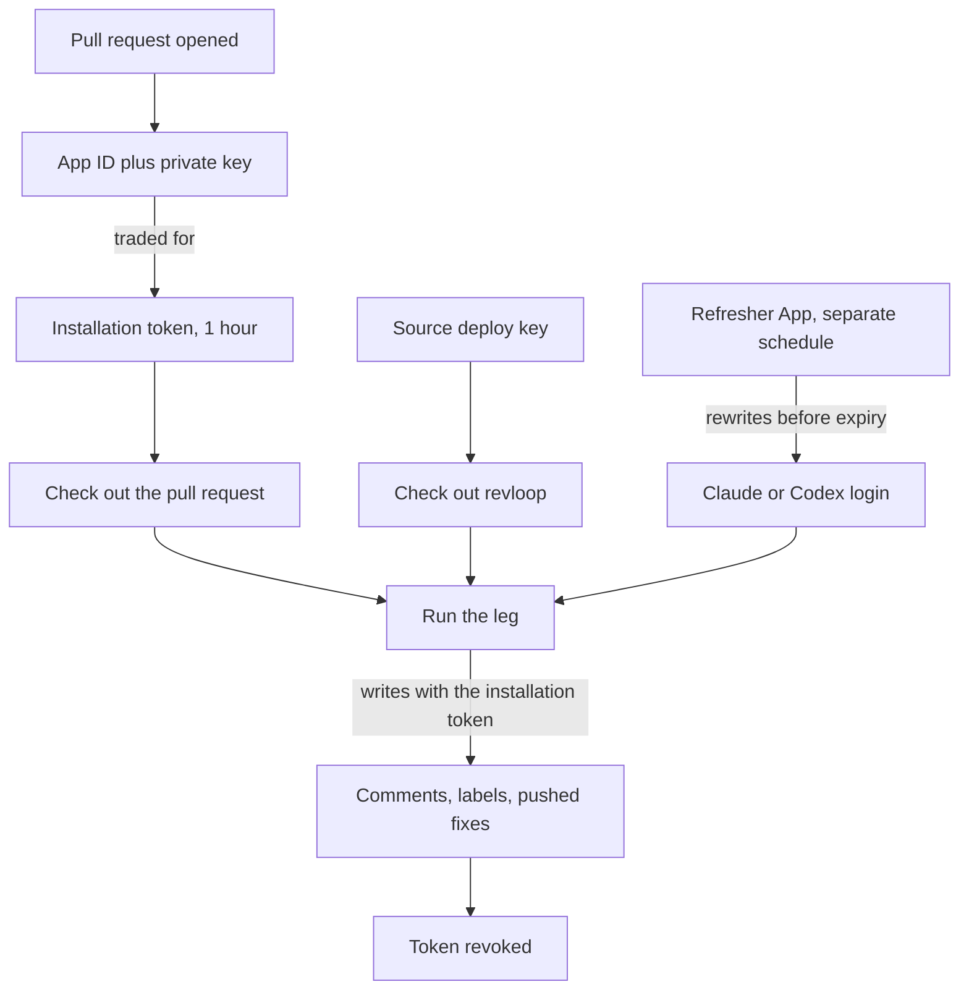

# revloop credentials

**This guide covers CI. Running revloop from your terminal needs none of it.**

| Mode | What it needs |
|---|---|
| **Local** — `revloop review --pr N` in your terminal | Your `gh` login and a logged-in harness. That is the whole list |
| **CI** — the loop running unattended on GitHub Actions | Up to six credentials, of four kinds, across two repositories |

The situation causes that difference, not a design choice. Your laptop is already logged in to everything. A CI runner is a fresh container that has never seen your code, your GitHub account or your Claude subscription. Every credential below fixes one part of that.

## Local mode

Two things, and you probably have both:

- **`gh auth login`** — revloop makes every GitHub call through `gh`, so it acts as you. Your comments, your labels, your pushes.
- **A logged-in harness** — `claude`, `codex` or `agy`, authenticated the ordinary way. revloop shells out to the CLI, and the CLI uses its own credential on disk.

`revloop doctor` checks both and names whichever is missing.

One exception. A leg pointed at an **endpoint** rather than a plain harness — Kimi through the claude adapter, say — needs that endpoint's token in your environment. The config's `token_env` gives the variable name. revloop passes the token inline on the invocation and never exports it.

**The skills hold no credentials, in either mode.** `pr-review` and `pr-address` make no GitHub call by design: they decide, and the orchestrator acts. So whatever a model reads in a diff, no GitHub token sits within its reach.

## CI

### First, the thing that confuses everyone

**"Secret" is a storage location, not a kind of credential.** A GitHub Actions secret is an encrypted box that hands a value to a workflow. What goes in the box varies.

So the secrets page holds four unrelated kinds of thing: an App's private key, an SSH deploy key, a vendor login, and a second App's private key. Tell them apart and the rest follows.

### The four jobs

A CI job is a stranger on a fresh machine. It needs four things:

| # | Job | Credential |
|---|---|---|
| 1 | Write on your pull request | `APP_ID` + `APP_PRIVATE_KEY` |
| 2 | Get a copy of revloop | `REVLOOP_SOURCE_KEY` |
| 3 | Log in to a paid AI | `CLAUDE_CODE_OAUTH_TOKEN`, `REVLOOP_CODEX_AUTH`, or an endpoint's own token |
| 4 | Keep job 3 from expiring | `REVLOOP_REFRESH_APP_ID` + `REVLOOP_REFRESH_APP_PRIVATE_KEY` |

### Which your setup needs

| Setup | Credentials |
|---|---|
| **Local, from your terminal** | **None of the above.** Your `gh` login and a logged-in harness |
| Claude on both legs, hosted runner | Jobs 1, 2, 3 — five secrets |
| Codex on either leg, hosted runner | Jobs 1, 2, 3, 4 — seven secrets |
| Self-hosted runner | Jobs 1 and 2 — the machine is already logged in |

A self-hosted runner skips job 3 for the reason your laptop does: the harnesses are installed, logged in, and refresh themselves the ordinary way. That is most of what makes self-hosted simpler to operate.

`revloop init` derives the list from your config and names what is missing. Add `--dry-run` and it prints the list without writing anything.

## Deep dive

### Job 1 — Identity: the loop App

`APP_ID` + `APP_PRIVATE_KEY`

revloop comments, resolves threads, applies labels and pushes fixes. Something has to be allowed to. It cannot be you, because you are asleep.

A **GitHub App** is a robot account you own. The App ID is its username, the private key its password. Both are long-lived and live in secrets.

Each run trades them for a **short-lived installation token** — one hour, and revoked when the job ends rather than left to expire. That token does the writing. The private key never leaves the secret.

Permissions are three and no more:

| Permission | For |
|---|---|
| `contents: write` | Pushing fixes |
| `pull_requests: write` | Comments, replies, resolving threads |
| `issues: write` | Labels — GitHub files PR labels under the Issues API |

**Why not `GITHUB_TOKEN`?** Every workflow gets one free. revloop never uses it, because GitHub refuses to fire workflows from anything `GITHUB_TOKEN` writes. That is the built-in infinite-loop guard, and it is correct in general. But revloop hands work between two jobs by pushing and labelling, so under `GITHUB_TOKEN` the loop stops dead after one leg. The App exists to get out from under a guard that is right everywhere else.

### Job 2 — The tool: the source deploy key

`REVLOOP_SOURCE_KEY`, plus a deploy key on the source repository

revloop's code lives in a different repository under a different account. The job must check it out to get the `revloop` command.

Nothing it already holds can do that. The App token works only where the App is installed. `GITHUB_TOKEN` works only on the repository under review.

A **deploy key** is an SSH key granting access to exactly one repository. It comes in halves:

| Half | Goes on | Is |
|---|---|---|
| Public | The repository being **read** (`claude-code-resources`), marked read-only | The lock |
| Private | The repository doing the **reading**, as `REVLOOP_SOURCE_KEY` | The key |

The workflow uses both at once:

```yaml
- uses: actions/checkout@v5
  with:
    repository: carlosboeing/claude-code-resources   # where the lock is
    ssh-key: ${{ secrets.REVLOOP_SOURCE_KEY }}       # the matching key
    path: .revloop-src
```

Worst case if the private half leaks: read access to one repository. No write, no user identity.

Create it with the recipe `revloop init` prints:

```bash
ssh-keygen -t ed25519 -C revloop-source -f /tmp/revloop-source -N ''
gh repo deploy-key add /tmp/revloop-source.pub --repo <source-repo> --title revloop-source
gh secret set REVLOOP_SOURCE_KEY --repo <consuming-repo> </tmp/revloop-source
rm /tmp/revloop-source /tmp/revloop-source.pub
```

Then test the read-only claim rather than trusting the label. Reading `HEAD` over SSH with that key alone should succeed, and `git push --dry-run` through it should be refused with *"the key you are authenticating with has been marked as read only"*.

### Job 3 — The brain: subscription credentials

Job 3 is revloop's economic premise. It drives the `claude` and `codex` CLIs the way you do at a terminal, on subscriptions rather than per-token API keys. So CI has to be logged in the way your laptop is.

| Secret | Holds | Lifetime |
|---|---|---|
| `CLAUDE_CODE_OAUTH_TOKEN` | A Claude subscription login, from `claude setup-token` | ~1 year, static |
| `REVLOOP_CODEX_AUTH` | Your Codex `auth.json` | Access token ~10 days, refresh token **rotates** |
| Whatever an endpoint names | e.g. `KIMI_API_KEY` | Vendor-dependent |

revloop derives this list from your config rather than fixing it. Two Claude legs need one secret. A self-hosted runner needs none.

Claude's is easy. A year is long and the token does not change, so a secret is a good home. `revloop init` runs `claude setup-token`, captures the output without printing it, and records the expiry so `revloop auth status` can warn as the year closes.

Codex's is the awkward one, and job 4 exists because of it.

### Job 4 — Staying logged in: the refresher App

`REVLOOP_REFRESH_APP_ID` + `REVLOOP_REFRESH_APP_PRIVATE_KEY`

Codex's credential renews itself, and **using the refresh token consumes it**. You get a replacement back and the old one dies. So whatever refreshes it must write the replacement into the secret, or the chain snaps and CI stays logged out until someone re-seeds it by hand.

Writing a secret needs the `Secrets: write` permission, and that permission is dangerous here for a specific reason. The review job reads a pull request diff and runs a model over it, so a stranger's text reaches it. A prompt injection that got to tool use in a job holding `Secrets: write` could mint a token and overwrite your secrets.

So the permission lives on a **second App**, with `Secrets: write` and nothing else, used by one scheduled workflow that never reads a diff. The review job cannot reach it.

Two rules follow, both load-bearing:

- **Never store the refresher's private key as an org secret with `--visibility all`.** That hands it to every workflow in the organisation, including the one reading diffs, which undoes the separation entirely.
- **One credential, one repository, one writer.** Concurrency groups are repository-scoped, so an org-level rotating credential would have several writers, and the first to refresh would invalidate the rest.

## Common confusions

**"The consuming repository's Deploy keys page is empty."** Correct. The deploy key is registered on the repository being *read*. The consuming repository holds only the private half, and private halves live on the secrets page.

**"Why two GitHub Apps?"** Privilege separation. The loop App touches pull requests and meets untrusted text. The refresher App can rewrite secrets and never sees a diff. Merging them would put `Secrets: write` in reach of a prompt injection.

**"Can I use org-level secrets?"** Only for a public repository, or on Team or Enterprise — GitHub serves org secrets to private repositories on paid plans alone. On a free organisation with private repositories, use repository secrets, which are narrower anyway. `revloop init` attempts org scope for an org owner and falls back to repository scope when that call fails.

## Runtime order


