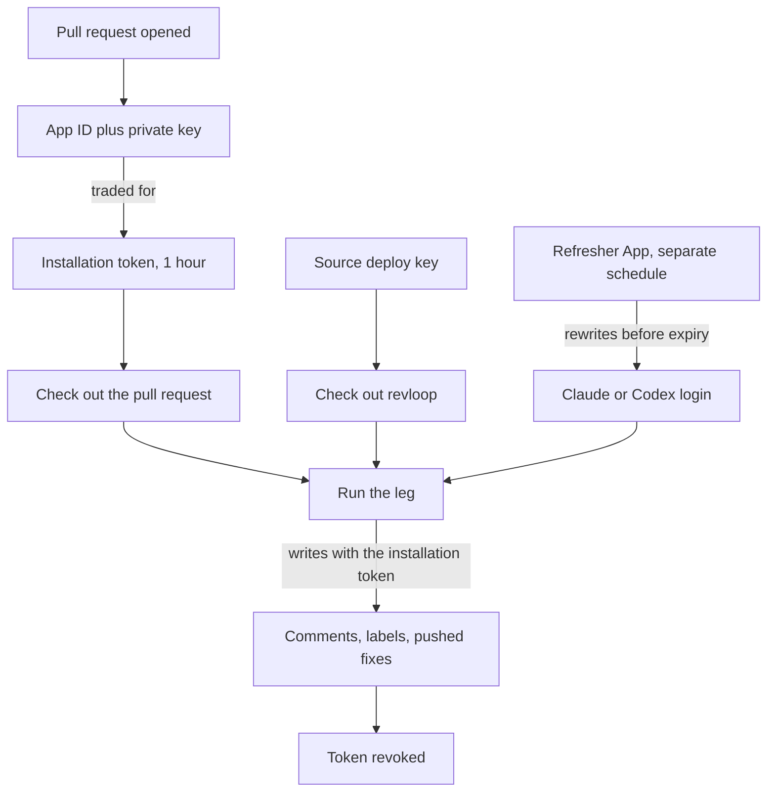

# revloop credentials

revloop runs an unattended review loop on your pull requests. To do that it needs up to six credentials, of four different kinds, spread across two repositories. This explains what each one is for.

## At a glance

A CI job is a stranger on a fresh machine. It needs four things:

| # | Job | Credential | Needed when |
|---|---|---|---|
| 1 | Write on your pull request | `APP_ID` + `APP_PRIVATE_KEY` | Always |
| 2 | Get a copy of revloop | `REVLOOP_SOURCE_KEY` | Always |
| 3 | Be logged in to a paid AI | `CLAUDE_CODE_OAUTH_TOKEN`, `REVLOOP_CODEX_AUTH`, or an endpoint's own token | Hosted runner only |
| 4 | Keep job 3 from expiring | `REVLOOP_REFRESH_APP_ID` + `REVLOOP_REFRESH_APP_PRIVATE_KEY` | Codex on a hosted runner only |

`revloop init` derives the list from your config and tells you which are missing.

### Read this first

**"Secret" is a storage location, not a kind of credential.** A GitHub Actions secret is an encrypted box that hands a value to a workflow. What goes in the box varies.

So the secrets page holds four unrelated kinds of thing: an App's private key, an SSH deploy key, a vendor login, and a second App's private key. Knowing which is which is most of understanding this.

## Which ones you need

| Your setup | Credentials |
|---|---|
| Claude reviews and addresses, hosted runner | Jobs 1, 2, 3 — five secrets |
| Codex on either leg, hosted runner | Jobs 1, 2, 3, 4 — seven secrets |
| Self-hosted runner | Jobs 1 and 2 only — the machine is already logged in |

## Deep dive

### Job 1 — Identity: the loop App

`APP_ID` + `APP_PRIVATE_KEY`

revloop comments, resolves threads, applies labels and pushes fixes. Something must be allowed to. It can't be you — you're asleep.

A **GitHub App** is a robot account you own. The App ID is its username, the private key its password. Both are long-lived and live in secrets.

Each run trades them for a **short-lived installation token** — one hour, revoked when the job ends rather than left to expire. That token does the writing. The private key never leaves the secret.

Permissions are three and no more:

| Permission | For |
|---|---|
| `contents: write` | Pushing fixes |
| `pull_requests: write` | Comments, replies, resolving threads |
| `issues: write` | Labels — GitHub files PR labels under the Issues API |

**Why not `GITHUB_TOKEN`?** Every workflow gets one free. revloop never uses it, because GitHub refuses to fire workflows from anything `GITHUB_TOKEN` writes. That's the built-in infinite-loop guard, and it's correct in general. But revloop hands work between two jobs by pushing and labelling, so under `GITHUB_TOKEN` the loop stops dead after one leg. The App exists to get out from under a guard that's right everywhere else.

### Job 2 — The tool: the source deploy key

`REVLOOP_SOURCE_KEY`, plus a deploy key on the source repository

revloop's code lives in a different repository under a different account. The job must check it out to get the `revloop` command.

Nothing it already holds can. The App token only works where the App is installed. `GITHUB_TOKEN` only works on the repo under review.

A **deploy key** is an SSH key granting access to exactly one repository. It comes in halves:

| Half | Goes on | Is |
|---|---|---|
| Public | The repo being **read** (`claude-code-resources`), marked read-only | The lock |
| Private | The repo doing the **reading**, as `REVLOOP_SOURCE_KEY` | The key |

The workflow uses both at once:

```yaml
- uses: actions/checkout@v5
  with:
    repository: carlosboeing/claude-code-resources   # where the lock is
    ssh-key: ${{ secrets.REVLOOP_SOURCE_KEY }}       # the matching key
    path: .revloop-src
```

Worst case if the private half leaks: read access to one repository. No write, no user identity.

Create it with the recipe `revloop init` prints:

```bash
ssh-keygen -t ed25519 -C revloop-source -f /tmp/revloop-source -N ''
gh repo deploy-key add /tmp/revloop-source.pub --repo <source-repo> --title revloop-source
gh secret set REVLOOP_SOURCE_KEY --repo <consuming-repo> </tmp/revloop-source
rm /tmp/revloop-source /tmp/revloop-source.pub
```

Verify both halves of "read-only" rather than trusting the label. Reading `HEAD` over SSH with that key alone should succeed, and `git push --dry-run` through it should be refused with *"the key you are authenticating with has been marked as read only"*.

### Job 3 — The brain: subscription credentials

This is revloop's economic premise. It drives the `claude` and `codex` CLIs the way you do at a terminal, on subscriptions rather than per-token API keys. CI has to be logged in the way your laptop is.

| Secret | Holds | Lifetime |
|---|---|---|
| `CLAUDE_CODE_OAUTH_TOKEN` | A Claude subscription login, from `claude setup-token` | ~1 year, static |
| `REVLOOP_CODEX_AUTH` | Your Codex `auth.json` | Access token ~10 days, refresh token **rotates** |
| Whatever an endpoint names | e.g. `KIMI_API_KEY` | Vendor-dependent |

The list is derived from your config, not fixed. Two Claude legs need one secret. A self-hosted runner needs none of these.

Claude's is easy — a year is long and it doesn't change, so a secret is a good home. `revloop init` runs `claude setup-token`, captures the output without printing it, and records the expiry so `revloop auth status` can warn as the year closes.

Codex's is the awkward one, and job 4 exists because of it.

### Job 4 — Staying logged in: the refresher App

`REVLOOP_REFRESH_APP_ID` + `REVLOOP_REFRESH_APP_PRIVATE_KEY`

Codex's credential renews itself, and **using the refresh token consumes it**. You get a replacement back and the old one dies. So whatever refreshes it must write the replacement into the secret, or the chain snaps and CI is logged out until someone re-seeds by hand.

Writing a secret needs `Secrets: write`, which is dangerous here in a specific way. The review job reads a pull request diff and runs a model over it, so it's exposed to text a stranger wrote. A prompt injection reaching tool use in a job that holds `Secrets: write` could mint a token and overwrite your secrets.

So it's a **second App**, with `Secrets: write` and nothing else, used by one scheduled workflow that never reads a diff. The review job can't reach it.

Two rules follow, both load-bearing:

- **Never store the refresher's private key as an org secret with `--visibility all`.** That hands it to every workflow in the org, including the one reading diffs — undoing the separation entirely.
- **One credential, one repository, one writer.** Concurrency groups are repository-scoped, so an org-level rotating credential would have several writers and the first to refresh would invalidate the rest.

## Common confusions

**"The consuming repo's Deploy keys page is empty."** Correct. The deploy key is registered on the repository being *read*. The consuming repo only holds the private half, and private halves live on the secrets page.

**"Why two GitHub Apps?"** Privilege separation. The loop App touches pull requests and is exposed to untrusted text. The refresher App can rewrite secrets and is not. Merging them would put `Secrets: write` in reach of a prompt injection.

**"Can I use org-level secrets?"** Only if the repository is public, or the organisation is on Team or Enterprise. GitHub serves org secrets to private repositories on paid plans only. On a free org with private repos, use repository secrets — narrower anyway. `revloop init` attempts org scope for an org owner and falls back to repository scope when that call fails.

**"Which secrets do I actually need?"** Run `revloop init --dry-run`. It prints the derived list against what's already set, and writes nothing.

## Runtime order


