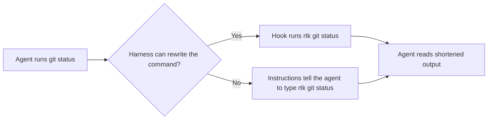

# RTK setup across harnesses

[RTK](https://github.com/rtk-ai/rtk) is a command-line proxy that shortens the output of common shell commands, such as `git status`, test runners and linters, before an AI agent reads it. Upstream describes it as cutting "up to 90% of the bash output your agent reads", and notes that this is not the same as cutting your bill by 90% (checked 2026-09-22).

This guide shows how to connect RTK to each supported harness.

## Two ways to connect it

| Mode | How it works | Harnesses |
|---|---|---|
| Automatic rewrite | A hook or plugin rewrites each shell command, for example `git status` to `rtk git status`, before it runs. The agent needs no instructions. | Claude Code, Cursor, OpenCode |
| Instruction prefix | The agent's instructions tell it to put `rtk` in front of shell commands itself | Codex, Antigravity, Kimi Code, Grok Build TUI |



Automatic rewriting covers shell commands only. Claude Code's built-in `Read`, `Grep` and `Glob` tools do not go through the shell, so their output is not shortened.

## Install RTK

Use one of the upstream install methods:

```bash
brew install rtk
```

```bash
curl -fsSL https://raw.githubusercontent.com/rtk-ai/rtk/refs/heads/master/install.sh | sh
```

```bash
cargo install --git https://github.com/rtk-ai/rtk
```

Check the install with `rtk gain`. A different crate named `rtk` exists on crates.io. If `rtk gain` fails, you probably installed that one, so use the `cargo install --git` command above.

## Connect each harness

### Claude Code

Run `rtk init -g`, or add the hook to `~/.claude/settings.json` yourself:

```json
"hooks": {
  "PreToolUse": [
    {
      "matcher": "Bash",
      "hooks": [
        {
          "type": "command",
          "command": "rtk hook claude"
        }
      ]
    }
  ]
}
```

### Cursor

Run `rtk init -g --agent cursor`, or add the hook to `~/.cursor/hooks.json`:

```json
"beforeShellExecution": [
  {
    "command": "rtk hook cursor"
  }
]
```

### OpenCode

Run `rtk init -g --opencode` to install RTK's plugin, which rewrites commands before they run. The toolkit's synchronizer does not install this plugin.

### Codex

This toolkit uses the instruction prefix for Codex. The shared instruction file, linked to `~/.codex/AGENTS.md`, tells the agent to prefix shell commands with `rtk`. Upstream also offers `rtk init -g --codex`, which installs a rewrite hook. Check that your Codex version supports it before switching.

### Antigravity

Antigravity uses the instruction prefix. The RTK section of the shared instruction file covers it. Upstream's `rtk init --agent antigravity` writes a project rule file at `.agents/rules/antigravity-rtk-rules.md` instead. This repository keeps an [equivalent rule](../rules/antigravity-rtk-rules.md) that is not installed by default. See the [rules README](../rules/README.md) to install it.

### Kimi Code

Kimi Code's hooks can allow or deny a tool call but cannot change it, so automatic rewriting is not possible. Run `rtk init --agent kimi` (RTK 0.44.0 or later) to add project instructions that tell the agent to prefix commands. The RTK section of the shared instruction file, which Kimi reads from `~/.agents/AGENTS.md`, says the same.

### Grok Build TUI

Grok's own `PreToolUse` hooks could rewrite commands, but Grok does not load Claude hooks, and RTK's Claude hook cannot read Grok's camelCase payload. There is no `rtk init` option for Grok, so do not run another agent's option in its place. Grok reads the shared instruction file through its Claude compatibility setting, and that file tells it to prefix commands with `rtk`.

## Check that it works

```bash
which rtk
rtk --version
rtk gain              # savings so far
rtk gain --history    # savings over time
rtk hook check "git status"   # shows how RTK would rewrite a command
```

After a session in any harness, `rtk gain` should show new activity.

## See also

- [RTK repository](https://github.com/rtk-ai/rtk)
- [Harness plugin parity guide](guide-harness-plugin-parity.md)
