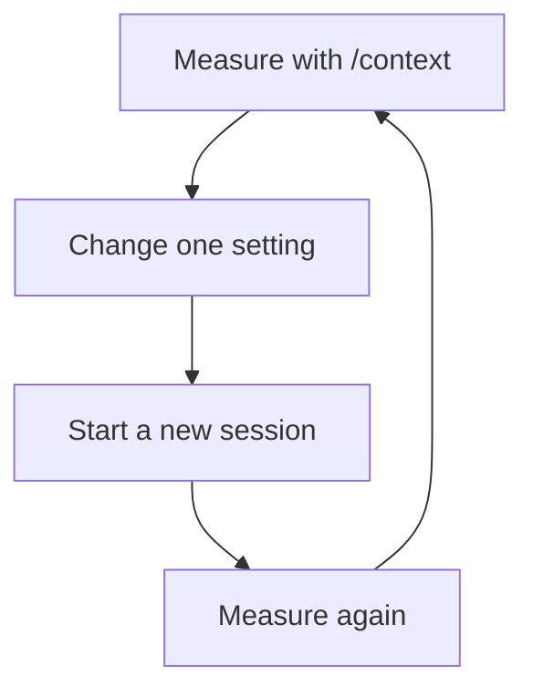

# Trimming Claude Code startup context

Claude Code loads tool definitions, skills, agents and instruction files before you type anything. With many integrations connected, this startup context can take a large share of the context window. This guide shows how to measure it and reduce it without losing the tools you use.

In one heavily connected environment measured on 2026-07-08, startup context was about 232,000 tokens of a 1M-token window. The steps below brought it to about 70,000.

## Where startup context goes

In that measurement, MCP tool definitions were 173,600 of the 232,000 tokens, about 75%. Almost all of that came from claude.ai connectors, not plugins. Instruction files were under 4%.

Your numbers will differ, and newer Claude Code versions can load tool definitions only when needed. Measure your own session before changing anything.

## Step 1: measure

Use two measurements:

- **`/context`** shows startup context by category and by tool. Run it before and after every change.
- **The first turn's `usage`** gives a scriptable total. On the first turn, almost all startup context is written to the prompt cache at once, so the first assistant message's `usage` is close to the full startup cost:

  ```bash
  python3 - "<transcript>.jsonl" <<'PY'
  import json, sys
  for ln in open(sys.argv[1], encoding="utf-8"):
      o = json.loads(ln)
      u = (o.get("message") or {}).get("usage") if o.get("type") == "assistant" else None
      if u:
          print("startup context:", u.get("input_tokens", 0) + u.get("cache_creation_input_tokens", 0) + u.get("cache_read_input_tokens", 0)); break
  PY
  ```

  Transcripts are stored at `~/.claude/projects/<encoded-cwd>/<session-id>.jsonl`, where the encoded directory is the working path with each `/` replaced by `-`.

A change takes effect in the next session. Always change the setting, start a new session, then run `/context` again.



## The settings that control it

| Setting | What it controls | Granularity | Stored in a file |
|---|---|---|---|
| `"disableClaudeAiConnectors": true` in `settings.json` | Every claude.ai connector | All or nothing | Yes |
| `"enabledPlugins": {"name@marketplace": false}` in `settings.json` | One plugin's MCP servers, skills and agents | One plugin | Yes |
| `claude mcp add ...`, stored in `~/.claude.json` | One MCP server you configure yourself | One server. Not affected by the connector switch. | Yes |
| `/chrome`, then "Enabled by default: No" | The Claude in Chrome extension | On or off | Menu setting |

Two facts make this work:

- **Turning connectors off in Claude Code does not affect the claude.ai web or desktop apps.** Those have their own settings.
- **You cannot keep a single connector.** To keep one integration and drop the rest, run that integration's MCP server yourself, as in step 2.

## Step 2: run the integrations you need yourself

Do this before turning connectors off, so nothing stops working. For example, to keep Fathom meeting recordings available to a meeting-capture skill:

```bash
claude mcp add --scope user fathom -- npx mcp-remote@latest https://api.fathom.ai/mcp
```

Complete the sign-in in your browser. Then check that `/mcp` lists `fathom`, and call one of its tools to confirm it is signed in. This uses the same backend as the claude.ai connector, with the same tools, but it is not affected by the connector switch. To freeze the bridge version, replace `@latest` with a specific version.

The same approach works for any connector you need while coding.

## Step 3: turn off connectors

Add this to `~/.claude/settings.json`:

```json
"disableClaudeAiConnectors": true
```

Start a new session and run `/context`. No tools starting with `mcp__claude_ai_` should remain, and the servers you added in step 2 should still be there.

## Step 4: turn off plugins you do not use

In `~/.claude/settings.json`, set unused plugins to `false`:

```json
"enabledPlugins": {
  "some-plugin@some-marketplace": false
}
```

Turning a plugin off removes all of its startup context: MCP servers, skills and agents. Turning it back on is a one-line change, so there is no reason to uninstall it.

## Step 5: remove overlapping integrations

If two integrations do the same job, keep the smaller one. For example, Claude in Chrome (about 10,000 tokens) overlaps with Playwright (about 6,000 tokens) for browser automation. Turn Claude in Chrome off with `/chrome`, then "Enabled by default: No", and start it for a single session with `claude --chrome` when you need your logged-in browser.

The `/chrome` menu is the setting that works. The `claudeInChromeDefaultEnabled` key in `settings.json` is ignored (Claude Code issues [#26204](https://github.com/anthropics/claude-code/issues/26204) and [#35825](https://github.com/anthropics/claude-code/issues/35825)), and `--no-chrome` applies to one session only.

## Result in the measured environment

| Stage | Startup context | Context free |
|---|---:|---:|
| Before | about 232,000 tokens | about 75% |
| Unused plugins off | about 226,000 tokens | |
| Connectors off, Fathom run separately | about 84,000 tokens | about 91% |
| Claude in Chrome off | about 70,000 tokens | about 93% |

## Undoing a change

| Change | How to undo it |
|---|---|
| `disableClaudeAiConnectors: true` | Remove the line or set it to `false` |
| A plugin set to `false` | Set it to `true` or remove the key |
| An MCP server you added | `claude mcp remove <name>` |
| Claude in Chrome off | `/chrome`, then "Enabled by default: Yes", or start with `claude --chrome` |

## Exceptions for one project

User-level settings make every project lean. If one project needs connectors, set `"disableClaudeAiConnectors": false` in that project's `.claude/settings.json`. That brings back every connector, so running the one you need yourself is usually better. See the [lean settings template](../templates/lean-claude-settings/README.md).
