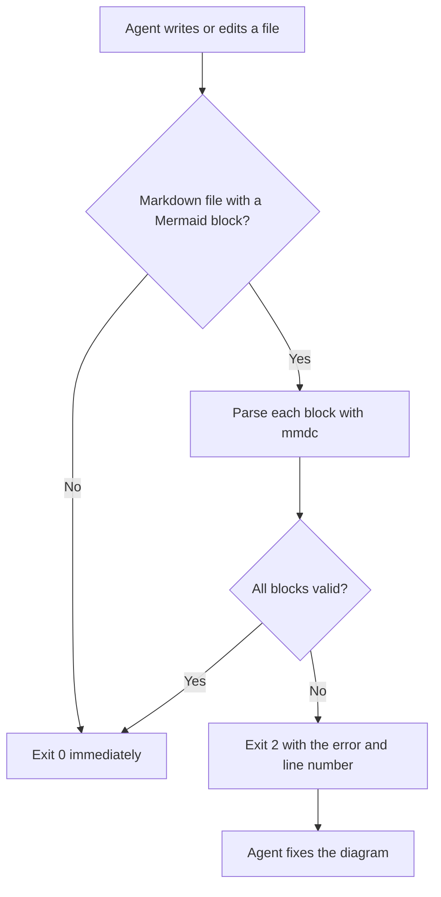

# validate-mermaid

A hook that checks Mermaid diagrams as an agent writes them. After the agent edits a Markdown file, it parses every Mermaid block with the real Mermaid parser. If a block fails, the hook sends the parser error back to the agent, which fixes the diagram in the same turn.

A successful parse means the diagram's syntax is valid. It does not guarantee a readable layout or identical rendering on GitHub, which may run a different Mermaid version.

## Why it exists

A single character can break a diagram without any visible warning while you write it. In one case, a sequence-diagram message containing `;` split into two statements, because Mermaid treats `;` as a statement separator. GitHub then failed to render the diagram. The hook catches this class of error before the file is committed.

## What it catches

Any block the Mermaid parser rejects, including these common mistakes:

- A `;` inside a label, message or note
- A sequence-diagram message that starts with `+` or `-`, which Mermaid reads as an activation marker
- Unquoted `(`, `)`, `[`, `]`, `{`, `}` or `|` inside a flowchart label

## How it works



## Requirements

- `jq`
- [`@mermaid-js/mermaid-cli`](https://github.com/mermaid-js/mermaid-cli), installed with `npm install -g @mermaid-js/mermaid-cli`. If `mmdc` is not installed, the script falls back to `npx`, which is slower on every call.

The first `mmdc` run downloads a headless browser. Run it once by hand after installing, so the hook does not pay that cost during a session:

```bash
printf 'graph TD\n a-->b\n' > /tmp/warm.mmd && mmdc -i /tmp/warm.mmd -o /tmp/warm.svg --quiet
```

## Set it up in Claude Code

1. Copy the script to `~/.claude/hooks/validate-mermaid.sh`. `scripts/sync-toolkit.sh --harness` does this for you.
2. Add this to `~/.claude/settings.json`, or to a project's `.claude/settings.json`:

   ```json
   {
     "hooks": {
       "PostToolUse": [
         {
           "matcher": "Write|Edit",
           "hooks": [
             {
               "type": "command",
               "command": "bash ~/.claude/hooks/validate-mermaid.sh",
               "timeout": 90,
               "statusMessage": "Validating Mermaid blocks"
             }
           ]
         }
       ]
     }
   }
   ```

## Run it manually

Harnesses without a suitable hook event can run the validator by hand after writing a diagram:

```bash
jq -n --arg path "$PWD/docs/example.md" '{tool_input: {file_path: $path}}' | bash ~/.claude/hooks/validate-mermaid.sh
```

An exit code of `0` means no block failed to parse. It can also mean the hook skipped the file, as described under [Behavior](#behavior).

## OpenCode version

`opencode-validate-mermaid.ts` does the same job in OpenCode, and it runs earlier. OpenCode has no shell hooks, so the check is a plugin that runs before each `write` or `edit` tool call. Throwing an error cancels the call, so a broken diagram never reaches the file.

| Tool | What the plugin validates |
|---|---|
| `write` | The full content about to be written |
| `edit` | The file as it will look after the edit: the current file on disk with `oldString` replaced by `newString` |

For an `edit`, the plugin skips validation if it cannot read the file or cannot find `oldString`, because it cannot reconstruct the result reliably.

`scripts/sync-toolkit.sh --harness` copies the plugin to `~/.config/opencode/plugins/validate-mermaid.ts`. OpenCode loads files in that directory without a config entry. The module exports only the plugin function, because OpenCode requires every export to be a function. Tested on 2026-08-19 with OpenCode 1.18.18.

## Behavior

- **Skips quickly.** Files that are not Markdown, files that do not exist and Markdown files without a Mermaid block exit `0` within milliseconds. The browser starts only when there is a diagram to check.
- **Fails open.** If the payload cannot be parsed or no validator is available, the hook exits `0` rather than blocking every write.
- **Handles indented blocks.** Diagrams inside list items are found. Each block is checked separately and reported with its starting line number.
- **Checks syntax only.** Style rules, such as not pinning a theme, are not enforced.
