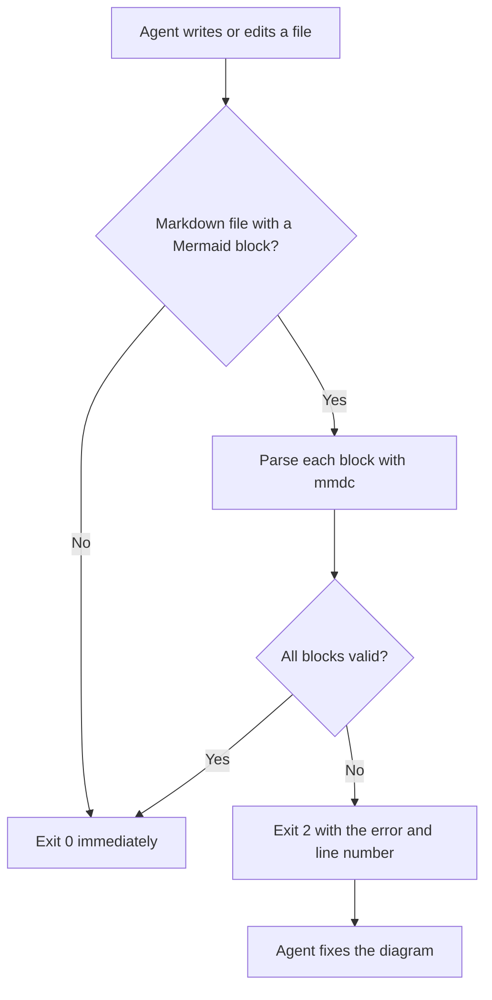
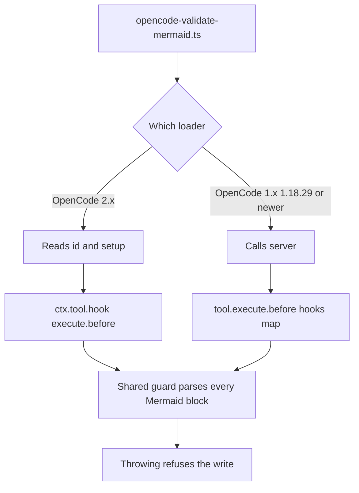

# validate-mermaid

A hook that checks Mermaid diagrams as an agent writes them. After the agent edits a Markdown file, it parses every Mermaid block with the real Mermaid parser. If a block fails, the hook sends the parser error back to the agent, which fixes the diagram in the same turn.

A successful parse means the diagram's syntax is valid. It does not guarantee a readable layout or identical rendering on GitHub, which may run a different Mermaid version.

## Why it exists

A single character can break a diagram without any visible warning while you write it. In one case, a sequence-diagram message containing `;` split into two statements, because Mermaid treats `;` as a statement separator. GitHub then failed to render the diagram. The hook catches this class of error before the file is committed.

## What it catches

Any block the Mermaid parser rejects, including these common mistakes:

- A `;` inside a label, message or note
- A sequence-diagram message that starts with `+` or `-`, which Mermaid reads as an activation marker
- Unquoted `(`, `)`, `[`, `]`, `{`, `}` or `|` inside a flowchart label

## How it works



## Requirements

- `jq`
- [`@mermaid-js/mermaid-cli`](https://github.com/mermaid-js/mermaid-cli), installed with `npm install -g @mermaid-js/mermaid-cli`. If `mmdc` is not installed, the script falls back to `npx`, which is slower on every call.

The first `mmdc` run downloads a headless browser. Run it once by hand after installing, so the hook does not pay that cost during a session:

```bash
printf 'graph TD\n a-->b\n' > /tmp/warm.mmd && mmdc -i /tmp/warm.mmd -o /tmp/warm.svg --quiet
```

## Set it up in Claude Code

1. Copy the script to `~/.claude/hooks/validate-mermaid.sh`. `scripts/sync-toolkit.sh --harness` does this for you.
2. Add this to `~/.claude/settings.json`, or to a project's `.claude/settings.json`:

   ```json
   {
     "hooks": {
       "PostToolUse": [
         {
           "matcher": "Write|Edit",
           "hooks": [
             {
               "type": "command",
               "command": "bash ~/.claude/hooks/validate-mermaid.sh",
               "timeout": 90,
               "statusMessage": "Validating Mermaid blocks"
             }
           ]
         }
       ]
     }
   }
   ```

## Run it manually

Harnesses without a suitable hook event can run the validator by hand after writing a diagram:

```bash
jq -n --arg path "$PWD/docs/example.md" '{tool_input: {file_path: $path}}' | bash ~/.claude/hooks/validate-mermaid.sh
```

An exit code of `0` means no block failed to parse. It can also mean the hook skipped the file, as described under [Behavior](#behavior).

## OpenCode version

`opencode-validate-mermaid.ts` does the same job in OpenCode, and it runs earlier. OpenCode has no shell hooks, so the check is a plugin that runs before each `write` or `edit` tool call. Throwing an error cancels the call, so a broken diagram never reaches the file.

| Tool | What the plugin validates |
|---|---|
| `write` | The full content about to be written |
| `edit` | The file as it will look after the edit: the current file on disk with `oldString` replaced by `newString` |

For an `edit`, the plugin skips validation if it cannot read the file or cannot find `oldString`, because it cannot reconstruct the result reliably.

### Version compatibility

One file serves both OpenCode plugin APIs through the dual entrypoint that OpenCode's own V1 migration guide documents. Each loader reads its own entrypoint and ignores the other, so nothing detects the version at load time. The module imports only Node built-ins and default-exports the definition, so it needs neither plugin types package.

| OpenCode | What the loader reads | Status |
|---|---|---|
| 2.x | The default export's `id` and `setup`. Hooks register with `ctx.tool.hook("execute.before", ...)` and throwing refuses the call | Verified 2026-09-23 with 2.0.14 |
| 1.18.29 and newer | The default export's `server()`, which returns the `tool.execute.before` hooks map | Verified 2026-09-23 with 1.18.32 |
| 1.x before 1.18.29 | A named function export | Not covered. Use the previous single-function version of this file |



On 2.x the hook receives one mutable event and reads `event.tool` and `event.input`. On 1.x it receives `input` and `output` and reads `input.tool` and `output.args`. The path argument is `filePath` on 1.x and `path` on 2.x (see the [2.x tools reference](https://opencode.ai/v2/docs/tools)), so the guard accepts both.

`scripts/sync-toolkit.sh --harness` copies the plugin to `~/.config/opencode/plugins/validate-mermaid.ts`. OpenCode loads files in that directory without a config entry.

Verified 2026-09-23 on both loaders with the same check, a Markdown file with a valid diagram and one with `;` in a message. On OpenCode 2.0.14 `opencode plugin list` shows the plugin's id, the good file writes normally, and the bad one is refused before the file is created; an edit that introduces a broken diagram is refused the same way. On 1.18.32 the good file writes and the bad one is refused the same way. Both refusals carry the parser error and the common causes above. Sources, all read 2026-09-23: the [OpenCode 2.x plugin API](https://opencode.ai/v2/docs/build/plugins), the [V1 plugin migration guide](https://opencode.ai/v2/docs/build/plugins/migrate-v1), and the [2.x tools reference](https://opencode.ai/v2/docs/tools).

### Limits

- The guard covers the `write` and `edit` tools only. Writes made through the shell are never validated. On 2.x some GPT models get the `patch` tool instead of `write` and `edit`, and 1.x has `apply_patch`; neither is covered.

## Behavior

- **Skips quickly.** Files that are not Markdown, files that do not exist and Markdown files without a Mermaid block exit `0` within milliseconds. The browser starts only when there is a diagram to check.
- **Fails open (shell hook).** If the payload cannot be parsed or no validator is available, the shell hook exits `0` rather than blocking every write. The OpenCode plugin refuses the write whenever the validator exits non-zero, which includes the case where neither `mmdc` nor `npx` can run.
- **Handles indented blocks.** Diagrams inside list items are found. Each block is checked separately and reported with its starting line number.
- **Checks syntax only.** Style rules, such as not pinning a theme, are not enforced.
