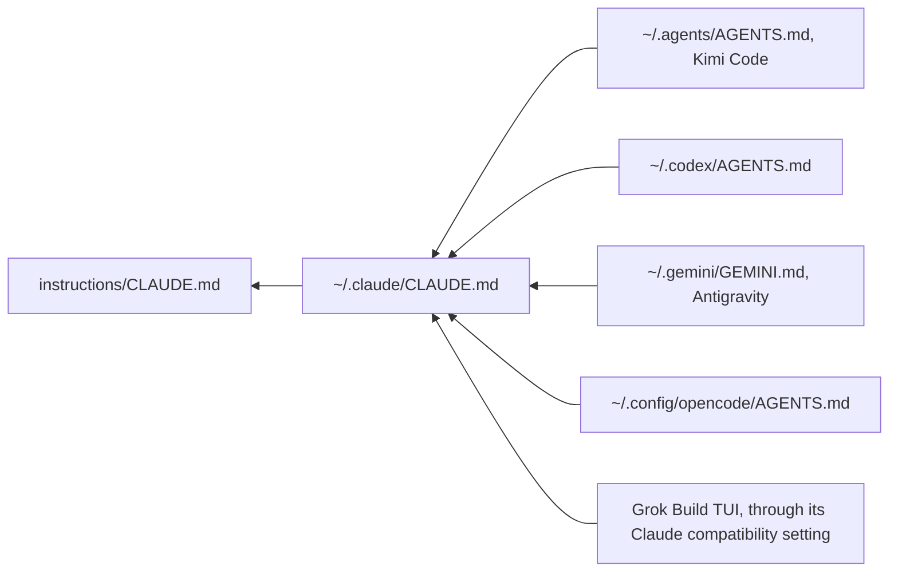

# Instructions

This directory holds [`CLAUDE.md`](CLAUDE.md), one global instruction file that every supported harness reads. Keeping a single file means a rule changed once takes effect in every harness.

## How each harness reads it

There is one real file. Every harness reaches it through a symbolic link, so there are no copies to fall out of date.



Links were chosen over generating one file per harness. Generated files could be trimmed for each harness, but they are one more thing that can drift. A link cannot.

Create the first link from a local clone:

```bash
mkdir -p "$HOME/.claude"
ln -s "$PWD/instructions/CLAUDE.md" "$HOME/.claude/CLAUDE.md"
```

The [new-machine setup guide](../guides/guide-new-machine-setup.md) covers the other harness links.

## Check the links

```bash
ls -l ~/.claude/CLAUDE.md ~/.agents/AGENTS.md ~/.codex/AGENTS.md \
      ~/.gemini/GEMINI.md ~/.config/opencode/AGENTS.md
```

Each path must resolve to `instructions/CLAUDE.md`. A broken link leaves a harness running with no instructions, and the harness does not warn you.

## Editing `CLAUDE.md`

- **A change applies to every harness.** Limit a rule to one harness only when it is specific to that harness, and label the section.
- **Use wording that is not specific to one harness.**
- **Leave out installer steps for individual harnesses.**
- **Watch the size.** Antigravity stops reading at 24,023 characters. Check with `wc -c instructions/CLAUDE.md` before committing a large addition.
- **Keep only lines that prevent mistakes.** For every line, ask whether removing it would cause the agent to make a mistake. If not, remove it.

## CopyDesk's block

If you use [CopyDesk](https://github.com/carlosboeing/copydesk), `copydesk setup` writes its rules between `<!-- copydesk:start -->` and `<!-- copydesk:end -->` in this file. It follows the link, so it writes here rather than into `~/.claude/`. Do not edit that block by hand. Run `copydesk setup --repair` instead.

On Claude Code, CopyDesk's rules then arrive twice, once from this file and once from its output style. `copydesk doctor` reports this.
