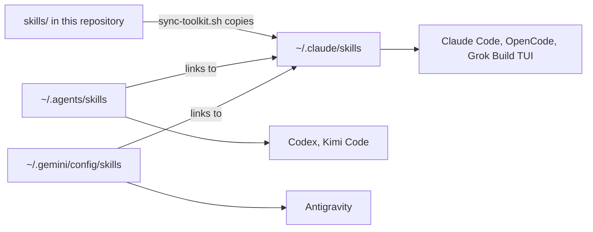

# Skills

Each directory holds one agent skill in the `SKILL.md` format that Claude Code and compatible harnesses load. Some skills also ship scripts, schemas, tests or reference files, so always install the complete directory unless the skill's README says otherwise.

## Catalog

| Skill | How to run it | What it does |
|---|---|---|
| [`briefing`](briefing/) | `/briefing` | Summarizes a project's current state from Git, GitHub, top-level files and its declared tracking records. Runs only when asked, not on follow-up questions. |
| [`learn`](learn/) | `/learn` | Explains a commit, pull request, file, folder, symbol, behavior or topic at the audience level and depth you choose |
| [`schedule-resume`](schedule-resume/) | `/schedule-resume` | Bundled skill with a shell helper that schedules an unattended session to resume later, using launchd on macOS or cron on Linux. Works with Claude Code, Antigravity, Codex and Kimi Code. |
| [`repo-standards`](repo-standards/) | `/repo-standards` | Checks, fixes or scaffolds a repository's governance files, workflows and branch protection from the house standard |
| [`oss-standards`](oss-standards/) | `/oss-standards` | Shortcut for `/repo-standards oss`. New automation should call `repo-standards` directly. |
| [`housekeeping`](housekeeping/) | `/housekeeping` | Compares local branches and worktrees with GitHub pull requests, and in `fix` mode removes only what a merge left behind |
| [`penmark-comments`](penmark-comments/) | Automatic, or on request | Reviews a local Markdown file and, once you choose where the output goes, can write validated Penmark inline comments |
| [`git-worktrees`](git-worktrees/) | Automatic | Sets the worktree location shared by all harnesses and the checks to run before changing branches |
| [`start-planning`](start-planning/) | `/start-planning` | Starts an implementation plan from an approved design, keeping design and planning as separate steps |
| [`start-implementation`](start-implementation/) | `/start-implementation` | Drives implementation from an approved plan (whole plan or one task) or direct small work from an execution-ready design or issue |
| [`capture-meeting`](capture-meeting/) | `/capture-meeting` | Turns a meeting recording, notes and related files into a checked project record |
| [`externalize-deliverable`](externalize-deliverable/) | `/externalize-deliverable` | Makes a client-safe copy of an internal document, which a person must review before it is sent |

Each skill's README covers its arguments, dependencies, install steps and design decisions.

## Install one skill

Clone the repository, then copy the whole skill directory into the Claude Code skill directory:

```bash
skill_name=learn
mkdir -p "$HOME/.claude/skills/$skill_name"
cp -R "skills/$skill_name/." "$HOME/.claude/skills/$skill_name/"
```

Start a new session afterwards. Skills with a slash command appear in the harness's command or skill list. Skills that load automatically may not appear there.

## Synchronize every authored skill

The synchronizer copies every skill in this directory into one hub at `~/.claude/skills`, then links the other harnesses' skill directories to it. It also writes OpenCode slash-command wrappers and the OpenCode Mermaid plugin.

Preview the changes, then apply them:

```bash
./scripts/sync-toolkit.sh --dry-run --harness
./scripts/sync-toolkit.sh --harness
```

`skills/sync-skills.sh` still works, and forwards to `scripts/sync-toolkit.sh --harness`.



| Path | Role | Read by |
|---|---|---|
| `~/.claude/skills` | The hub. Holds real skill directories. | Claude Code, OpenCode, and Grok Build TUI through its Claude compatibility setting |
| `~/.agents/skills` | A link to the hub | Codex and Kimi Code |
| `~/.gemini/config/skills` | A link to the hub | Antigravity |
| `~/.codex/skills` | Codex's own bundled skills. Not linked to the hub. | Codex |

Antigravity's command-line tool also documents a separate directory, `~/.gemini/antigravity-cli/skills`. The synchronizer does not link it. Check whether skills appear there, and link it yourself only after looking at what it already contains. See [Google's skill locations](https://antigravity.google/docs/skills), checked 2026-09-22.

The [harness plugin parity guide](../guides/guide-harness-plugin-parity.md) covers each harness's discovery rules in more detail.

## Install a skill for one project

To make a skill part of one repository, copy it into that harness's project-level skill directory. For Claude Code that is `.claude/skills`:

```bash
skill_name=learn
mkdir -p ".claude/skills/$skill_name"
cp -R "skills/$skill_name/." ".claude/skills/$skill_name/"
```

Check the harness's precedence rules before committing a duplicate. Claude Code prefers enterprise skills over personal skills, and personal skills over project skills, according to the [official discovery rules](https://code.claude.com/docs/en/skills), checked 2026-09-22.

## CrossRev review skills

The `pr-review` and `pr-resolve` skills now live in the [CrossRev repository](https://github.com/carlosboeing/crossrev), with the tool that runs them. Install them from there:

```bash
npx skills@latest add carlosboeing/crossrev
```

To sync them from a local CrossRev checkout instead, add its skills directory to `EXTRA_SKILL_SOURCES` in your local sync configuration. See [`sync-toolkit.conf.example`](../scripts/sync-toolkit.conf.example).

## Adding a skill to this repository

- Put each skill in its own directory, `skills/<name>/`.
- `SKILL.md` is the file the harness loads.
- Put usage and maintenance notes for people in a `README.md` next to it.
- Keep a skill to a single file until it needs scripts, schemas, tests or reference files.
- List every external command or service the skill needs.

Every skill needs Git, Bash and `rsync` to install. Individual skill READMEs list anything extra, such as `gh`, `jq` or `ripgrep`.
