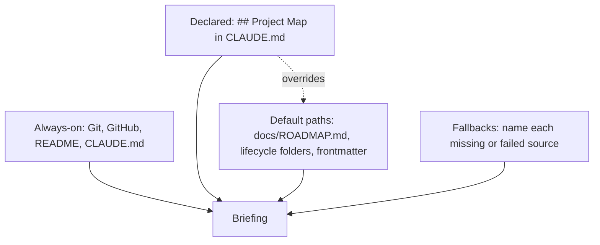

# briefing

An [agent skill](https://code.claude.com/docs/en/skills) that tells you where a project stands. Run it when you come back to a project after a break and want to know **where you are, what you were doing and what to pick up next**, without rereading every file.

It finds what is in progress from Git, GitHub, the `## Project Map` section of the project's `CLAUDE.md` if there is one, and any tracking files it can detect. The output adapts to what it finds: it leads with active work if there is any, and with what comes next if nothing is in progress.

It works in any repository, and gives richer results when a project follows the [project structure conventions](https://github.com/carlosboeing/agentic-toolkit/blob/main/guides/guide-project-structure-and-conventions.md). To see what the skill looked for and what it found, run `/briefing sources`.

It is meant as a fuller orientation than the one-line summary from Claude Code's built-in `/recap`.

## What it does

Run `/briefing` to get a briefing whose sections depend on the project's state:

| Section | When it appears |
|---|---|
| **Summary** | Always — 2–3 sentences: what you were doing, where it stands, what's needed from you (or "nothing waiting on you") |
| **Status** | When there's motion — in-flight threads on dense lines, plan progress as counts, the uncommitted-files table, last 3–5 shipped commits, the quiet line |
| **Findings** | When there's something worth knowing — risks and blockers as facts, stale statuses, structural gaps, and the draft inventory: actionable rows only, parked/stale groups collapsed to stated counts (`deep` renders every row) |
| **Recommendations and next steps** | Always — advisory, not a dump. A short paragraph on the recommended direction, then a numbered list of priority-ordered action items with steering and clickable paths (numbered so you can reply by number). Items can carry a bold signal tag — **Urgent**, **Quick win**, **Blocking** — and the order is derived from those signals. The only place the ask lives |
| **`★ About this briefing`** | Only if a source failure, depth conflict, detached HEAD, or thin-input case applies — otherwise omitted entirely |

Sections with nothing to say are omitted entirely, not padded.

Five rules bind every section, and they're what make a briefing scannable rather than merely complete:

1. **Tables for anything enumerable**, one-line bullets otherwise, no paragraph over three lines.
2. **Every code gets decoded on first use.** "S7 needs a ruling" is a lookup; "the homepage strip repeats itself one screen apart (S7)" is information.
3. **Every path is clickable** — written from the working directory, with `:line` when it points at one item in a long file. Never a bare basename.
4. **The funnel.** Actions live only in Summary's "what's needed" clause (as a pointer) and the closing section (as the ask). Status and Findings are read-only context.
5. **No silent drops.** Collapsing a group — parked drafts, stale branches — is allowed when it's counted, named, and carries an escape hatch. An unstated exclusion and an accidental omission look identical from the outside.

## Manual invocation only

Run `/briefing` yourself, or `$briefing` in Codex. Ordinary follow-ups such as "What's next?" do not request this workflow. Explicitly asking the agent to run the briefing skill also expresses that intent; command support depends on the harness.

`disable-model-invocation: true` makes the skill user-invocable-only in [Muse](https://meta-models.github.io/muse-code-sdk/next/guides/extend/skills/) and prevents automatic invocation in [Claude Code](https://code.claude.com/docs/en/skills#control-who-invokes-a-skill). Codex uses `agents/openai.yaml` with `policy.allow_implicit_invocation: false`. Other harnesses receive the same boundary in the description and opening instructions, but native enforcement depends on their support.

## Dials — how the briefing is shaped

Four knobs you can mix and match. Order doesn't matter.

| Dial | Keywords | Default | Effect |
|---|---|---|---|
| **Mode** | `sources`, `setup` | briefing | `sources` switches to the self-documentation view (what this skill probes, what it found). `setup` adds or updates the `## Project Map` section in CLAUDE.md (with backup, after you confirm). Can't be combined with depth tiers or with each other — see the dedicated subsections below. |
| **Depth** | `quick` (or `peek`), `standard`, `deep` (or `deep-dive`) | **adaptive (no override)** | Section count × source breadth × wall-clock. `quick` renders Summary + Recommendations and next steps only, < 5s; `standard` forces all four; `deep` renders the full draft inventory (no collapse) plus historical sources, stale-branch sweep, ADR scan, per-project memory. `quick` may drop whole sections but never rows from a section it renders. Does not apply when `sources` mode is active. |
| **Save** | `save` (or `--save`/`export`) | off | Write the output to `<repo>/.claude/briefing-log/` (or `~/.claude/briefing-log/` outside a git repo). Compatible with all modes. |
| **Help** | `help` (or `?`/`usage`/`--help`/`-h`) | off | Render synopsis and stop |

The depth default is genuinely adaptive — when no depth keyword is provided, the output's length is content-driven (sections appear or disappear based on what the project state contains). `quick`/`standard`/`deep` are explicit overrides for fixed-length tiers; "no dial" is its own behaviour, not a synonym for `standard`. (`/learn`'s depth dial defaults to `standard`; `/briefing`'s defaults to adaptive — same canonical keyword vocabulary, different defaults that fit each skill's job.)

## Where the information comes from

The skill reads from four layers. **Always-on** sources work in every project. **Declared** and **Default paths** depend on how the project is set up. **Fallbacks** cover anything that fails.



### Always-on — universal mechanics

Runs in every project, knows nothing about specific conventions. Reads git state (branch, ahead/behind, dirty status, recent commits), uncommitted edits (`git status` + `git diff`, capped at 200 lines per file), local-only state (unpushed commits on any branch, stashes, worktrees, no-upstream branches), GitHub state via `gh` (your open PRs, all open PRs, assigned issues, current-branch CI status), top-level docs (`README.md`, `CLAUDE.md` — well-known by name, not a convention), and the per-project memory index at `~/.claude/projects/<slug>/memory/MEMORY.md`.

The skill never runs `git pull` — only `git fetch` (read-only). If the fetch fails (network down, no remote, auth error), the briefing continues with stale refs and surfaces the failure in the footer.

### Declared — explicit declarations via CLAUDE.md

Add a `## Project Map` section to your project's CLAUDE.md to enrich the briefing with sources it can't auto-discover:

```markdown
## Project Map

- **Tracker**: GitHub Issues
- **Board**: https://github.com/me/repo/projects/3
- **Roadmap**: docs/ROADMAP.md
- **Changelog**: docs/CHANGELOG.md
- **Architecture**: docs/architecture.md
- **Working memory**: docs/ (numbered lifecycle convention)
- **Other**:
  - Story tracking lives in Linear, team SHARELOG
  - Telemetry comments on issues via scripts/item-telemetry.sh
```

Recognised trackers: `GitHub Issues`, `GitHub Project N`, `Linear …`, `Jira …`, `Notion <ID or URL>`, file paths, URLs, `none`. Each kind has its own integration recipe (the skill knows which CLI or MCP tool to invoke). Declarations are authoritative — they override anything the default-path sniffer would have caught.

For the canonical schema, see [`guide-project-structure-and-conventions.md` §5.8](https://github.com/carlosboeing/agentic-toolkit/blob/main/guides/guide-project-structure-and-conventions.md#58--project-map-section-in-claudemd).

### Default paths — convention sniffing

For any field you didn't declare in `## Project Map`, the skill probes for canonical-conventions signatures (the structure documented in [the canonical guide](https://github.com/carlosboeing/agentic-toolkit/blob/main/guides/guide-project-structure-and-conventions.md)). If they match — `docs/ROADMAP.md`, lifecycle dirs at `docs/[0-9]-*`, status frontmatter, ROADMAP sections like `## In flight` — the skill applies the canonical interpretation. If they don't match, it falls back to generic file discovery and names the gap.

This is the "lights up with conventions" tier. A project that follows the canonical layout gets richer briefings (in-flight detection wired to your ROADMAP sections, status frontmatter recognised, ADRs surfaced) for free. A project that uses different conventions just gets always-on + declared output, which still works — no broken behaviour.

Default-mode briefings don't lobby for convention adoption — orientation output stays focused on the project state. If you want to see what this skill probed and what it found (canonical paths matched, declarations honoured, gaps named), run `/briefing sources`. That view frames declared paths via `## Project Map` as first-class equivalents to canonical defaults, not deviations.

**Prose-inference last resort.** If `## Project Map` is absent AND the canonical-path probes find nothing for a given field, the skill scans `CLAUDE.md` and `README.md` prose for high-confidence hints — markdown links matching `*roadmap*.md`, `*changelog*.md`, `*architecture*.md`, and explicit tracker mentions like `GitHub Issues` or `Linear team <name>`. Inferred values render with an `(inferred from CLAUDE.md)` suffix in briefings and appear in their own row in `/briefing sources` so you can see where the information came from. Inference never writes — to make values authoritative, run `/briefing setup`.

### Fallbacks — graceful degradation

Standing instructions for every failure mode (no git repo, no remote, `gh` missing, network down, fetch auth failure, no `## Project Map`, declared tracker unreachable, detached HEAD, secret-pattern files, working memory not found at any default path, …). Failures that affect orientation surface as bullets in the conditional `★ About this briefing` block; failures that don't surface in `/briefing sources` if you ask for them. Never papered over, never silently fabricated.

## Install

See [Install one skill](../README.md#install-one-skill) in the skills catalog, or run `scripts/sync-toolkit.sh --harness` to sync every skill. Copy the whole `briefing/` directory, including `agents/openai.yaml`, which holds the Codex invocation policy.

## Usage examples

```
# ─── Standard cases ────────────────────────────────
/briefing                            # adaptive default
/briefing quick                      # Summary + next steps only, ~5–7 reads, < 5s
/briefing deep save                  # extended-window briefing, written to disk
/briefing standard                   # forces all four sections

# ─── Sources mode (self-documentation) ─────────────
/briefing sources                    # what this skill probes + what it found here
/briefing sources save               # save the sources view to <TS>-sources.md

# ─── Setup mode (add or update ## Project Map) ─
/briefing setup                      # propose + apply a ## Project Map block

# ─── Help ──────────────────────────────────────────
/briefing help
/briefing ?
```

## `/briefing sources` — self-documentation mode

A separate output that documents what this skill probes and what it found in the project. Mutex with depth tiers (`quick`/`standard`/`deep`); compatible with `save`. Run it when you want to know:

- What sources this skill *can* read in any project (always-on git/gh, declared `## Project Map` fields, default canonical paths, fallbacks).
- What it *did* read in this specific project (which paths matched, which were declared, which weren't found).
- How to enrich future briefings — either by declaring additional locations in `## Project Map`, or by adopting canonical conventions for zero-config behaviour.

The view is descriptive, not prescriptive. A project that uses `decisions/` instead of `docs/adrs/` and declares the path is a first-class hit, not a deviation. Both paths — declared and canonical — are equally valid. The view exists to make the skill's mechanics legible, not to lobby for any particular layout.

Output is organised by four user-facing layers (the same source model the skill uses internally, with friendlier labels): **Always-on**, **Declared (highest priority)**, **Default paths (when not declared)**, and **Fallbacks**. Empty layers render as `(none)` rather than disappearing — transparency is the point.

## `/briefing setup` — add or update `## Project Map`

The `setup` mode adds (or updates) the [`## Project Map` block](https://github.com/carlosboeing/agentic-toolkit/blob/main/guides/guide-project-structure-and-conventions.md#58--project-map-section-in-claudemd) in your CLAUDE.md. Useful when you want richer briefings on a project that hasn't declared its tracker / roadmap / working-memory locations yet.

What it does:

1. Probes the project state (git remote, GitHub PRs/issues, canonical paths, working-memory dirs).
2. Reads CLAUDE.md (if present) and looks for an existing `## Project Map` section.
3. Proposes a populated `## Project Map` block — pre-filling detected fields, marking unknowable fields as `<placeholder>`, suggesting `Other` bullets based on what was found.
4. Shows the proposal, then asks structured questions via Claude Code's native question UI: one question per low-confidence field (defaulted to `none`, prose-inferred, fell back to a non-canonical signal, or contradicts probed reality). Each question lists 2–3 concrete options with descriptions plus an `Other` slot for free-form values. When one alternative is materially better, it's marked `(Recommended)`. High-confidence fields render silently — the only question in that case is a single yes/no on whether to write.
5. **On the recommended/affirmative answer**, writes to CLAUDE.md (creating `CLAUDE.md.before-briefing-setup.bak` first as a one-time backup) with any user overrides applied. **On the no-op / "Don't write"** answer, prints the block for manual paste.

This is the **only** mode that writes to a project file other than `briefing-log/`. Writes happen only after explicit user confirmation, with a backup created first. No silent edits.

If `## Project Map` already exists, setup mode runs in **diff mode**: it parses the existing fields, computes per-field changes against the proposal, and asks one structured question per changed field (`Update` / `Keep current` / `Other`) before applying anything. Doesn't blanket-overwrite. Fields whose answer was `Keep current` retain their existing value.

`setup` is mutex with depth tiers (`quick`/`standard`/`deep`), with `sources`, and with `save`. Run it on its own, then optionally re-run `/briefing` to see how the new declarations enrich your briefings.

## Saved briefings (`briefing-log`)

When you append `save`, the briefing is written to disk so you can re-read it later or pin a known-good orientation point (useful before a long break).

- **Location**: `<repo>/.claude/briefing-log/` if you're in a git repo, else `~/.claude/briefing-log/`.
- **Filename**: `YYYY-MM-DDTHHMM.md` (UTC, ISO8601 to the minute, no colons in the filename for filesystem portability).
- **Frontmatter**: `type`, `date`, `project`, `branch`, then either `depth` + `in-flight` (default-mode saves) or `mode: sources` (sources-mode saves) — mutex, every record has exactly one of those two.
- **Overwrite policy**: never silent. If the filename already exists, a `-2`, `-3`, … suffix is appended.
- **Gitignore**: not auto-ignored. Whether to commit your `briefing-log/` is up to you and your team.

Normal briefing mode writes only when `save` is requested. The separate `setup` mode can update the project brief after confirmation.

## Design philosophy

A few load-bearing rules — read these if you want to understand why the skill behaves as it does, or if you want to extend it:

- **Four layers, never more.** Always-on universal mechanics, declared sources, default-path sniffing, and fallbacks for graceful degradation. Each new source kind earns its place in one of the four. The split between declared (explicit) and default-path (sniffed) keeps convention-specific knowledge out of the universal baseline.
- **Convention-aware, not convention-coupled.** The skill is shareable to projects using any conventions. Adopting the canonical conventions in this repo lights it up with richer behaviour; not adopting them produces simpler but still-useful output. Never imposes; always suggests.
- **Adaptive over fixed.** The default has no depth keyword precisely because the right shape changes with project state. `quick`/`standard`/`deep` are escape hatches when you know what you want.
- **Read-only on the project.** Normal briefing mode leaves project files unchanged except for a requested saved log. The separate `setup` mode can update the project brief after confirmation.
- **`git fetch`, never `git pull`.** Fetching updates refs without modifying the working tree, so the briefing can compute accurate ahead/behind without risking a merge mid-task. Fetch failures are tolerated — the briefing falls back to stale refs and surfaces the gap in the footer.
- **Anti-fabrication.** Every data point comes from a source read this invocation. No invented PR numbers, file paths, SHAs, or URLs. Stale data labelled stale beats stale data presented as fresh.
- **Honest about gaps.** Source unreachable, declared tracker missing, no `## Project Map` section, network down — orientation-affecting gaps name themselves in the conditional `★ About this briefing` block. Setup-affecting gaps surface in `/briefing sources` if you ask for them. Never papered over.
- **No transcripts.** The skill never reads raw conversation transcripts on disk, even at `deep`. That would undermine the working-memory discipline (`docs/` artifacts become optional if briefings can recover from transcripts), and the on-disk format is undocumented Anthropic internals.
- **Packaging.** The workflow lives in `SKILL.md`; `agents/openai.yaml` carries the Codex invocation policy.

## Limitations

- **Single project only.** No cross-project briefings. If you have a portfolio question ("what's in flight across all five repos I'm working on?"), open each one in turn or build a wrapper.
- **No computed metrics.** The skill cites raw counts from existing tooling — number of PRs, number of unpushed commits, ROADMAP item counts. It does not aggregate token costs, estimate effort, predict ship dates, or otherwise produce numbers that aren't already in a tool somewhere.
- **No transcript reading.** As above — by design, not by oversight. A future version may add a `Stop` hook that saves an explicit end-of-session snapshot instead.
- **Tracker integrations are best-effort.** The skill knows the CLI/MCP path for `GitHub Issues`, `GitHub Project N`, `Linear`, `Jira`, `Notion`, file paths, and URLs. If a declared tracker has no CLI installed and no MCP configured, the briefing names the gap and continues — it doesn't try to scrape.
- **No `quick`/`standard`/`deep` learning.** The dial doesn't remember what you've asked for; every invocation is from-scratch.

## Requirements

- **Claude Code** installed (any recent version).
- **`git`** (almost certainly already installed).
- **`gh` CLI** authenticated, optional but strongly recommended — without it the skill skips GitHub PR/issue/CI lookups and notes the gap in the footer.
- A project-tracker CLI or MCP server, only if you've declared one in `## Project Map` (e.g. `linear-cli`, Notion MCP).

## Sharing

Share the `briefing/` directory so the Codex invocation policy travels with the skill:

1. Send them the GitHub link, or send the skill directory.
2. They put the directory at `~/.claude/skills/briefing/`, or their harness's skills location.
3. Restart Claude Code.

For the briefing to be richer than Always-on in a colleague's repo, they also add a `## Project Map` section to that repo's CLAUDE.md. The `templates/default-project/CLAUDE.md` in this repo includes the section as scaffolding.

No package, marketplace or sign-in is needed, apart from the optional `gh` CLI.

## See also

- **[`SKILL.md`](SKILL.md)** — the skill itself, drop-in to `~/.claude/skills/briefing/`.
- **[`guide-project-structure-and-conventions.md` §5.8](../../guides/guide-project-structure-and-conventions.md#58--project-map-section-in-claudemd)** — the canonical `## Project Map` schema this skill consumes.
- **[`templates/default-project/CLAUDE.md`](../../templates/default-project/CLAUDE.md)** — generic CLAUDE.md scaffold that ships with the section pre-populated.
- **[`/learn`](../learn/)** — sibling skill in this repo. Same single-file shape, same closed-keyword parser pattern, same canonical depth vocabulary (`quick`/`standard`/`deep`) — different default behaviour and different problem domain (lessons, not orientation).

## License

MIT, like the rest of the repository.
