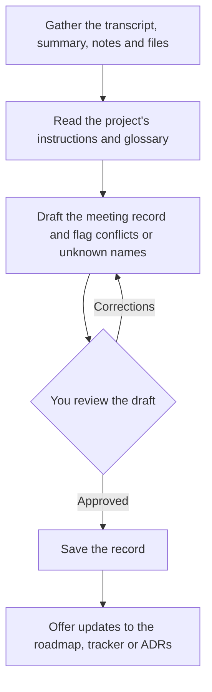

# capture-meeting

Turns a meeting into a project record. The skill combines an AI meeting recording (from Fathom or another tool) with your own notes and files, drafts a meeting document that follows the project's conventions, and asks you to check it before saving. It then offers to update the roadmap, issue tracker or decision records with what the meeting decided.

## How it works



1. **Gather.** Finds the meeting transcript and summary through the Fathom MCP server, another MCP source or pasted text, together with your notes.
2. **Match the project.** Reads the project's instruction file, such as `CLAUDE.md` or `AGENTS.md`, and its glossary, for example `comms/glossary.md`.
3. **Draft and check.** Combines the inputs and flags conflicts, unrecognized names and unclear action items.
4. **Review.** Shows you the draft and the flags. Nothing is saved until you approve it, and any name corrections are written back to the glossary.
5. **Propagate.** Offers to update the roadmap, the issue tracker or an ADR based on the decisions and action items.

## Usage

```
/capture-meeting today's sync
/capture-meeting "weekly project meeting"
/capture-meeting https://fathom.video/share/123456
```

## Install

See [Install one skill](../README.md#install-one-skill) in the skills catalog, or run `scripts/sync-toolkit.sh --harness` to sync every skill.

## Design decisions

- **You are the final check.** Transcription tools mishear names and mix up people and companies, so the skill never saves without your review.
- **Your notes win.** When your notes and the transcript disagree, the skill treats your notes as correct.
- **It follows the project's layout.** It uses the directory structure, glossary location and instruction file the project already has.
