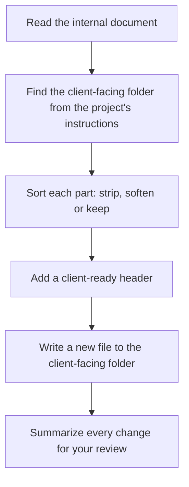

# externalize-deliverable

Makes a client-safe copy of an internal document. The skill removes company-side details such as negotiating positions, pricing, margins, competitor notes and internal flags, and writes the result to the project's client-facing folder. The original document is never changed.

## How it works



Each part of the document gets one of three treatments:

| Treatment | Applies to | Examples |
|---|---|---|
| Strip | Internal-only content | Equity or pricing strategy, margins, transcript links, off-the-record remarks, internal questions |
| Soften | Wording that promises more than was agreed | "Agreed to proceed" becomes "agreed to pursue, subject to the proposal", when that is the real state |
| Keep | The shared record | Decisions, actions and context both sides already know |

For meeting notes and reports, the skill adds a header with the title, date, and attendees grouped by organization.

## Usage

```
/externalize-deliverable path/to/internal-notes.md
/externalize-deliverable "meeting notes from today"
```

## Install

See [Install one skill](../README.md#install-one-skill) in the skills catalog, or run `scripts/sync-toolkit.sh --harness` to sync every skill.

## Design decisions

- **The source stays untouched.** The skill always writes a new file, so no internal context is lost.
- **A person checks every copy.** The skill helps with redaction but cannot guarantee it. It always stops for your review before anything is shared.
- **Keep the record useful.** It removes sensitive details but keeps the document readable and complete for the client.
