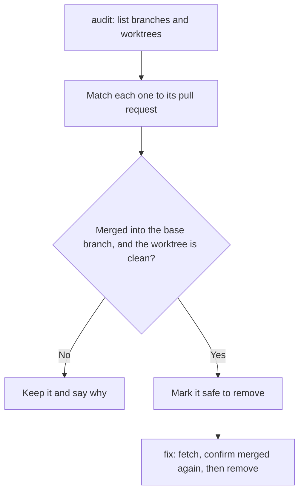

# housekeeping

Finds the local branches and worktrees that merged pull requests left behind, and removes them on request. The skill runs the drift guard's `housekeep` script, which the repository keeps at `scripts/githooks/housekeep`.

## Modes

| Command | What it does |
|---|---|
| `/housekeeping` or `/housekeeping audit` | Checks every local branch and worktree against its GitHub pull request, and reports what is safe to remove. Changes nothing. |
| `/housekeeping check` | Reports what the last pull (`ORIG_HEAD..HEAD`) left behind, plus stale remote references |
| `/housekeeping fix` | Fetches from origin, checks each candidate again, then removes the worktree and local branch and prunes stale remote references |

The [drift guard README](../../git-hooks/drift-guard/README.md#reading-the-audit-output) explains each line of the audit output.

## What it never does

- Delete a remote branch.
- Force-remove a worktree.
- Remove a branch whose worktree has uncommitted changes or ignored files.
- Remove the branch checked out in the main worktree, or in the worktree running `fix`.
- Remove a branch unless its merge commit is in the base branch's history.
- Remove anything without first confirming through `gh` that the pull request is merged, both when listing and again just before deleting.
- Remove anything if fetching from origin fails.
- Run on a schedule or from a hook. The `post-merge` hook runs `check`, never `fix`.

## Why it uses a Git script

Three of the six supported harnesses cannot run a blocking hook, so the logic lives in a Git script that works for every harness and for people too. The skill is a convenient way to run it from an agent session.

Each repository keeps its own copy of the script, because Git's hook path is a per-clone setting that is never set automatically. `/repo-standards check` reports a repository without it, and `/repo-standards fix` installs it.

## Design notes

- **Squash merges.** `git branch -d` refuses to delete a squash-merged branch, because Git cannot tell it was merged. `fix` uses `git branch -D`, which is why it confirms the merge through `gh` and the base branch history first.
- **Ignored files.** `git worktree remove` deletes ignored files, such as build output or local configuration, without warning. `housekeep` checks for them with `git status --porcelain --ignored` and refuses to remove a worktree that has any.
- **Nested repositories.** A nested private repository is a separate Git repository. Run the skill there separately.

## Install

See [Install one skill](../README.md#install-one-skill) in the skills catalog, or run `scripts/sync-toolkit.sh --harness` to sync every skill. The repository also needs the drift guard script at `scripts/githooks/housekeep`.
