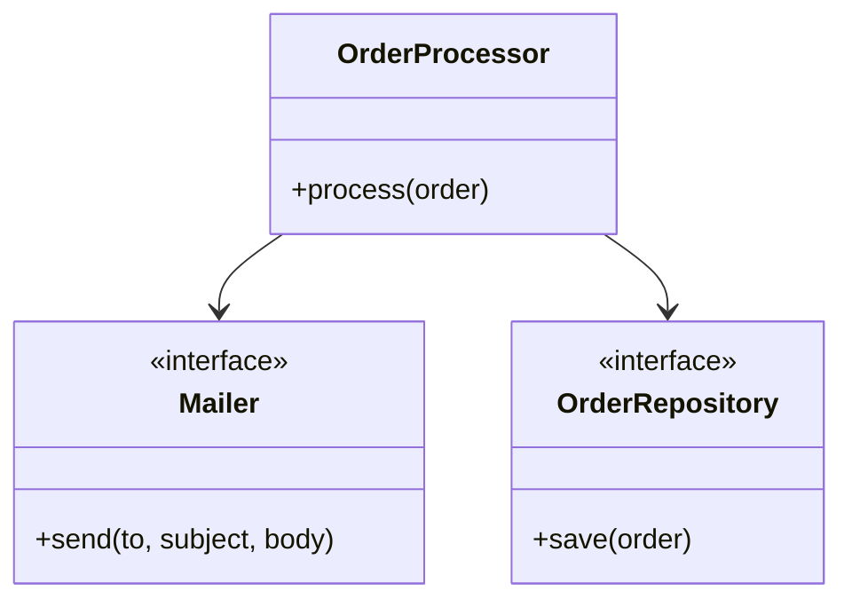

# `/learn` — Educational explainer for the last commit or PR

This skill turns a recent change into a software-engineering lesson. The reader has just had Claude Code (or someone else) make a change, and they want to actually understand it: what was done, why it was done that way, and which fundamentals are at play.

The audience is someone learning software engineering. They are not a beginner programmer — they can read code — but they have not yet internalised the named patterns and principles that experienced engineers use to reason about design. The job of this skill is to bridge that gap, on a real diff, every time they ask.

## Synopsis

```
/learn [target] [level] [depth] [save] [help]

  target   <ref> | pr [<N>] | <path> | <symbol>             default: HEAD
           | "<question>" | topic <name>
  level    expert | intermediate | beginner | eli5        default: intermediate
           (synonyms — expert:    technical, staff
                       beginner:  simple, plain
                       eli5:      grandma, grandmother)
  depth    quick | standard | deep                          default: standard
           (synonyms — quick:    peek
                       standard: overview
                       deep:     deep-dive, deepdive, audit)
           Only meaningful in topic and static (folder) modes.
  save     write the lesson to .claude/learn-log/          default: off
           (synonyms: --save, export)
  help     show this synopsis instead of running           (synonyms: ?, usage,
                                                                      --help, -h)
```

Order of args does not matter. `/learn topic auth simple deep-dive save` and `/learn save deep-dive simple topic auth` are equivalent. If `help` (or `?`, `usage`) appears anywhere in the args, the skill renders this Synopsis as the response and stops — no lesson, no save, no execution.

## Target shapes

`/learn` accepts six kinds of target. The dispatcher classifies the non-keyword tokens syntactically and runs the matching gathering recipe. If more than one classification is plausible, state the inference in the first line of the response so the user can override.

| Shape | Looks like | What gets gathered | Example |
|---|---|---|---|
| **Diff** | empty, `pr`, `pr <N>`, SHA, `HEAD~N`, `HEAD^`, branch name, tag, range (`A..B`) — anything `git show`/`git diff` accepts | The diff, commit message, PR description and review comments | `/learn`, `/learn pr 42`, `/learn HEAD~3`, `/learn cfc4afb` |
| **Static** | A path that exists in the working tree | The file (single file → top-to-bottom walkthrough) or folder (directory listing + key files → structural tour) | `/learn src/auth/`, `/learn package.json`, `/learn ./foo.ts` |
| **Symbol** | A bare identifier that ripgrep finds as an exported function/class/type | The symbol's definition + the call sites that use it | `/learn OrderProcessor`, `/learn handleLogin` |
| **Trace** | Quoted natural language describing a behaviour | Entry-point search + path through the code, end to end | `/learn "how does login work"` |
| **Topic** | The literal keyword `topic` followed by a name | Topic vocabulary lookup → codebase grep using the search terms → bounded file reads (depth-controlled) | `/learn topic auth`, `/learn topic dependency-injection` |
| **Help** | `help`, `?`, `usage`, `--help`, `-h` | Nothing — render the Synopsis and stop | `/learn help`, `/learn ?` |

### Ambiguity resolution

A token like `auth` could be a branch, a folder, or a topic. When more than one match is plausible, prefer in this order:

1. Explicit `topic` keyword present → topic mode (always wins).
2. Path that exists on disk → static mode.
3. Git ref that resolves (`git rev-parse <token>` succeeds) → diff mode.
4. Bare identifier that ripgrep finds as an exported symbol → symbol mode.
5. Otherwise → trace mode if the token is a multi-word phrase, else fall back to topic mode with the token as the topic name (and state the assumption).

Always say which mode was chosen in the first line, so the user can correct with `/learn topic auth` if they meant the topic and the dispatcher picked the folder.

## When this skill runs

The user invokes it explicitly, usually with a slash:

- `/learn` → explain the last commit on the current branch (`HEAD`).
- `/learn pr` → explain the open PR for the current branch, or the most recently merged PR if there is no open one.
- `/learn pr 123` → explain a specific PR by number.
- `/learn HEAD~2`, `/learn <sha>`, `/learn main..feature` → explain a specific commit or range.

If the invocation is ambiguous, default to the last commit (`HEAD`) and state the assumption in the first line of the response.

It also runs without a slash when the user clearly asks for a teaching pass on recent work — phrases like "teach me what just changed", "explain the last commit", "walk me through this PR like a tutorial".

## Audience level

The reader can dial how technical the lesson is by adding a level keyword to the invocation. The keyword can appear anywhere in the args — order does not matter — and the skill treats any token from the closed set below as the level, with everything else as the target spec.

- **expert** (synonyms: `technical`, `staff`) — peer-to-peer. Assume the reader knows SOLID, the common GoF patterns, and standard vocabulary. Don't define everyday terms; lean on precise jargon. Skip analogies unless the diff contains a genuinely unusual idea.
- **intermediate** (default — no keyword needed) — for someone who can read code but is still building their library of named patterns. Define each named concept the first time it appears. Connect every abstraction to a concrete consequence the reader will eventually feel (testability, blast radius, swap-ability). This is the audience the skill was originally written for.
- **beginner** (synonyms: `simple`, `plain`) — minimise jargon. When you must use a term, explain it in everyday language *before* naming it. Prefer "the function asks for what it needs as arguments instead of grabbing it from somewhere global, which is called **dependency injection**" over "the constructor injects its dependencies." One concept per sentence.
- **eli5** (synonyms: `grandma`, `grandmother`) — analogy-first. Lead every named concept with a non-code metaphor — kitchens, libraries, post offices, plumbing, restaurant orders. Code references are still allowed; the reader is not literally five. But every principle must be motivated by a real-world picture before any jargon enters the sentence. Use this level when the reader is very new, or when the change is conceptually far from their comfort zone.

Examples:

- `/learn simple` → last commit, plain language.
- `/learn pr 42 expert` → PR 42, full technical depth.
- `/learn HEAD~2 eli5` → that commit, analogy-driven explanation.
- `/learn grandma` → last commit, maximum accessibility.

If the user's invocation contains both a level keyword *and* a natural-language hint ("can you make this really simple?"), respect the natural-language signal even if the keyword disagrees or is missing. If two level signals genuinely conflict, pick the gentler one and state the assumption in the first line.

The level affects **writing only** — it does not change which concepts get surfaced. A correct `eli5` lesson still names the right principles; it just leads with the metaphor and keeps the jargon density low.

## Depth

For target shapes where section 4 is *"where this lives in your codebase"* (topic mode, and static mode for folders), the depth keyword controls how far the skill walks through the codebase. Order-independent in the args; default `standard` if no keyword is present.

| Keyword | Coverage | Use when |
|---|---|---|
| `quick` (synonym: `peek`) | 2–3 representative `path:line` hits, locations + a one-liner each | "Just point me at the relevant files" |
| `standard` (synonym: `overview`) *(default)* | 4–6 places walked through with explanation; flag what's NOT covered | The default learning lesson |
| `deep` (synonyms: `deep-dive`, `deepdive`, `audit`) | Comprehensive coverage, capped at **20 files**; flag missing sub-concepts | "Audit this topic across the codebase" |

The 20-file cap on `deep` is hard. Past that it's a search engine, not a lesson — say so and stop adding. Reaching the cap is itself a finding: the topic is *bigger than this codebase* in some meaningful sense, and naming that is more useful than truncating silently.

Depth has no effect on diff/symbol/trace/help modes — section 4 in those is the critical-review pass, which sizes itself naturally to the input.

## How to gather the change

The gathering recipe depends on which target shape was selected (see **Target shapes** above). The first three steps are common to every mode; from step 4 onward, branch by mode.

1. **Parse the args.** Walk the tokens once and bucket each one:
   - **Level keywords** (closed set): `expert`, `technical`, `staff`, `intermediate`, `beginner`, `simple`, `plain`, `eli5`, `grandma`, `grandmother`. Default `intermediate` if none.
   - **Depth keywords** (closed set): `quick`, `peek`, `standard`, `overview`, `deep`, `deep-dive`, `deepdive`, `audit`. Default `standard` if none.
   - **Save keywords** (closed set): `save`, `--save`, `export`. Default off if none.
   - **Help keywords** (closed set): `help`, `--help`, `-h`, `?`, `usage`. If any appear, **short-circuit**: render the Synopsis block above as the response and stop.
   - **Topic marker**: the literal token `topic` followed by its argument (the next non-keyword token) → topic mode, with the next token as the topic name.
   - **Quoted phrase**: a multi-word string in quotes → trace mode.
   - **Everything else** is the target spec, classified per the **Target shapes** rules.
2. **Classify the target.** Apply the ambiguity-resolution order from **Target shapes** to pick a mode. State the inferred mode in the first line of the response.
3. **If the target is invalid**, say so plainly. Empty repo, no commits, nonexistent path, no matching symbol, no topic vocabulary entry *and* no fallback search terms reasonable for the topic name → ask the user how they want to proceed.

### Diff mode

4. Resolve the target:
   - No args → `git log -1 --stat HEAD` and `git show HEAD`.
   - `pr` with no number → `gh pr view --json number,title,body,headRefName,baseRefName,files,state,url 2>/dev/null`. Fall back to the most recently merged PR for the branch if no open one.
   - `pr <N>` → `gh pr view <N> --json number,title,body,files,state,url` and `gh pr diff <N>`.
   - A ref/sha/range → `git show <ref>` or `git diff <range>`.
5. Read the diff in full. Read the commit message and PR description. For PRs, pull review comments via `gh api repos/<owner>/<repo>/pulls/<N>/comments` — reviewer pushback is often the most teachable moment in the change.
6. Read enough surrounding code to understand the context. Don't bluff a decision you don't understand — say "I'd need to check X" instead.

### Static mode

4. Resolve the path (`ls` for folders, file existence check for single files). If it's a folder, also peek at any `README.md`, `index.*`, or `package.json` / similar manifest at that level — those usually carry intent.
5. For a single file → read it top-to-bottom.
   For a folder → list the contents, identify the 3–5 most-representative files (usually entry points, the largest by lines of real code, and any obvious "core" file by name), and read those.
6. Trace key imports out of the read files. Don't recurse forever — one hop is usually enough to ground the lesson.

### Symbol mode

4. Resolve the symbol. Use ripgrep to find the definition: `rg --type-add 'src:*.{ts,tsx,js,py,go,rb,rs,java,kt,swift,cs}' -t src '<symbol>' --files-with-matches | head -5`, then narrow to the actual definition file (look for `class <symbol>`, `function <symbol>`, `def <symbol>`, etc.).
5. Read the definition file. Also find call sites: `rg '<symbol>(' -l | head -10`. Read 2–3 representative call sites to understand how the symbol is used in practice.

### Trace mode

4. Identify candidate entry points from the question. Common heuristics: HTTP handlers (`router`, `app.get`, `@app.route`, etc.), event subscribers, CLI command registrations, file names containing the verb in the question.
5. Use ripgrep to find the entry, then walk forward through the call graph by reading each function and noting where it dispatches next. Cap the trace at 6–8 hops; if it gets longer, name where the trace becomes too deep to teach and stop.
6. Spawning the **Explore** subagent is the right move when the trace is non-obvious or the codebase is large — it can do bounded discovery and return only the path, keeping the main context lean.

### Topic mode

4. Look up the topic in the **Built-in topic vocabulary** table below. If found, use its search terms and named subconcepts. If not, **state the assumption in the first line** ("`<topic>` isn't in my canonical list — I'm improvising with these search terms: […]"), then derive plausible search terms from the topic name and continue.
5. Run ripgrep on the codebase using the search terms (case-insensitive, word-boundary): `rg -iw '(term1|term2|...)' -l` to find candidate files, then `rg -iw '(term1|...)' --json | head -100` to get specific `path:line` hits.
6. Apply the depth keyword to bound how many files to read in detail (`quick` → top 2–3, `standard` → top 4–6, `deep` → up to 20). Sort by relevance: prefer files where multiple search terms hit, files with the topic name in the path, and entry points (`index.*`, `main.*`, `app.*`).
7. Read the selected files. Group hits by sub-concept where possible. **Be honest about gaps** — if the topic vocabulary names a sub-concept (e.g. for `auth`: MFA) and the codebase has no hits, say so. The map of *what isn't there* is often as instructive as what is.

### Help mode

4. Render the Synopsis block above and stop. Don't fetch anything. Don't write anything to disk.

### Common closing rules (all modes)

- **If the working tree is not a git repository** in diff mode, say so and ask what the user wants to do.
- **If your inferred mode was wrong**, the first line lets the user say "no, I meant `topic auth`" — make sure that first line states the inference clearly enough to be corrected.

## The lesson structure

Use this structure. Skip sections that don't apply rather than padding them. The same five sections (six in topic mode) work across all target shapes — only what each section *means* changes per mode.

### How the frame adapts per mode

| Section | Diff | Static (file/folder) | Symbol | Trace | Topic |
|---|---|---|---|---|---|
| **1. What** | What changed | What this code is and does | What this symbol does | What path the behaviour follows | What this topic is (concept-level definition) |
| **2. Why structured this way** | Decisions in the diff | Decisions in the existing design | Why the symbol's signature/shape is what it is | Decisions at the key hops | Why this concept exists; what problem it solves |
| **3. Concepts at play** | Concepts the change brings in | Concepts the structure embodies | Concepts the symbol embodies | Concepts along the path | The named sub-concepts within the topic |
| **4.** *(see below)* | Critical review | Critical review | Critical review | Critical review | **Where this lives in your codebase** *(new in topic mode)* |
| **5.** *(topic mode shifts)* | Further reading | Further reading | Further reading | Further reading | Critical review of the codebase's take on this topic |
| **6.** *(topic mode only)* | — | — | — | — | Further reading |

In topic mode, section 4 is the *grounding* section: the concept-level material in sections 1–3 gets mapped onto concrete `path:line` references in the user's actual codebase. This is what makes the topic-mode lesson genuinely useful for learning — abstract knowledge tied to specific files the reader is touching every day.

### 1. What changed

A 2–4 sentence summary in plain language. "This commit adds X so that Y works." Mention the files touched in aggregate ("three files in `src/auth/`"), but do not list every line. If the commit message states intent clearly, lean on it.

### 2. Why it's structured this way

The interesting bit. Pick out the *deliberate decisions* in the diff — the choices that could have gone another way. Lay them out in a table so the reader can scan the contrast quickly:

| Decision | The alternative | Why this version is preferable |
|---|---|---|
| Concrete code choice with `path:line` reference. | What the obvious other approach would have looked like — short pseudo-code is fine. | The principle/pattern (named, only if it really applies) and the concrete consequence the reader will feel: testability, blast radius, swap-ability, etc. |

A change usually has 1–4 such rows worth highlighting. More than that and you're padding; fewer and the change is probably small enough that section 2 collapses into one paragraph and the table becomes overhead — drop it for very small changes.

If a decision is structural enough to deserve a *visual*, consider a Mermaid diagram (see the **Diagrams** section below) instead of, or in addition to, the table row. A before/after class diagram for a refactor, or a sequence diagram for an async change, often teaches the move faster than prose can.

For refactors that change a single function or class shape, also include a side-by-side before/after code block — old code on the left, new code on the right, both short. Only include the lines that materially changed; trim aggressively. The comparison is the lesson.

### 3. The concepts at play

A short labelled list of the named concepts that genuinely show up. For each one, give:

- A **one-sentence definition** in plain English.
- The **line(s) in this diff where it shows up**, using `path:line` references.
- A **"why it matters"** hook — what bug, refactor, or scaling problem this prevents in the wild.

Things to look for, organised so you can scan a diff against them:

- **SOLID**:
  - **SRP** (Single Responsibility) — was a god-class or god-function split up? Does each new unit have one reason to change?
  - **OCP** (Open/Closed) — was the change made by *adding* a new case (new subclass, new strategy) rather than *modifying* existing code?
  - **LSP** (Liskov Substitution) — does a new subclass actually behave like its parent everywhere the parent is used? (Violations are subtle: same signature, different invariants.)
  - **ISP** (Interface Segregation) — was a fat interface split so callers depend only on the methods they use?
  - **DIP** (Dependency Inversion) — does high-level code now depend on an abstraction that's injected by the caller, instead of reaching out to a concrete implementation?
- **Common design patterns** (call out only when they really fit): Strategy, Factory, Adapter, Decorator, Observer, Repository, Builder, Facade, Template Method, Command. If you see a pattern that's almost-but-not-quite one of these, say so — "this is Strategy-ish, but with only one implementation today, so it's really preparation for Strategy later."
- **Other fundamentals**:
  - Pure functions vs. side effects; referential transparency.
  - Immutability and value semantics.
  - Error-handling style: errors-as-values vs. exceptions, sentinel values vs. typed errors, `Result`/`Either`-style returns, fail-fast vs. recover-and-log.
  - Defensive programming vs. trusting boundaries — validate at the edge, trust the inside.
  - Encapsulation and leaky abstractions.
  - Cohesion (things that change together live together) and coupling (how much one module needs to know about another).
  - DRY, YAGNI, KISS — and **when they're being deliberately violated**. ("The duplication here is intentional because the two callers are diverging.")
  - Idempotency, atomicity, transactional boundaries.
  - Layering — presentation / application / domain / infrastructure.
  - Testing strategy — unit vs. integration vs. end-to-end, the test pyramid, AAA (Arrange–Act–Assert), test doubles (stub/mock/fake/spy), property-based tests.
  - Concurrency and async: race conditions, locks, channels, promises, structured concurrency, cancellation.
  - Performance: time and space complexity (Big-O), allocations, I/O patterns, caching layers, N+1 queries, batching.
  - Security: input validation, output encoding, authn vs. authz, principle of least privilege, secret handling, CSRF/XSS/SQLi categories.
  - API and type design: parse-don't-validate, making illegal states unrepresentable, total vs. partial functions.

This list is not a checklist — it is a memory aid. Only call out concepts that *are actually present* in the diff.

### 4. What an experienced engineer would still call out

A short critical-review pass. What's good, what's debatable, what would get a comment in code review. Be honest: if you would push back on something in the diff, say so and explain why. The reader needs to learn that "shipped" doesn't mean "perfect" — most real-world code is a tradeoff between quality and momentum, and a learning engineer benefits more from seeing that tradeoff named than from a sanitised "looks great!" review.

If reviewer comments exist on the PR, this is the place to surface the most instructive ones.

### 5. Further reading

If a major named concept showed up, drop one or two pointers — the canonical book chapter, a well-known blog post, or the language's own docs. Examples: "Working Effectively With Legacy Code" for seam-introduction, "Refactoring" by Fowler for any extract/inline move, the language's official concurrency docs for async changes. Don't pad. If nothing canonical applies, skip this section entirely.

This section complements the inline links from the **Citations and links** policy below — section 5 is for the *one or two* most-worth-reading sources for the lesson as a whole, while inline links cover every named concept on first mention.

## Built-in topic vocabulary

Topic mode looks each topic up in this table. Each row gives the search terms used to grep the codebase, and the named sub-concepts the lesson is expected to walk through (use these as section-3 anchors). If a user asks for a topic *not* in this table, **state the assumption in the first line** ("`<topic>` isn't in my canonical list — improvising with these search terms: …") and continue with derived search terms.

| Topic | Aliases | Search terms (case-insensitive, word-boundary) | Named sub-concepts to cover in section 3 |
|---|---|---|---|
| `auth` | authentication, authn, authz, login | auth, authenticate, login, logout, session, token, jwt, oauth, password, credential, permission, role, middleware, guard | authn vs authz · sessions vs tokens · password hashing (salt, KDFs) · OAuth/OIDC flows · RBAC vs ABAC · middleware/route guards · MFA |
| `dependency-injection` | di, ioc, dependency-inversion | inject, constructor, factory, container, provider, ctor | constructor injection · setter injection · DIP (the principle) vs DI (the technique) · IoC · composition root · service-locator anti-pattern |
| `error-handling` | errors, exceptions | throw, catch, error, exception, panic, recover, raise, except, Result, Either | errors-as-values vs exceptions · sentinel vs typed errors · fail-fast vs recover · retry/backoff · error boundaries · structured error context |
| `logging` | logger, logs | log, logger, info, warn, error, debug, trace, structured | log levels · structured vs unstructured · context propagation · log volume/cost · PII redaction · correlation IDs |
| `observability` | telemetry, monitoring, o11y | metric, trace, span, otel, prometheus, opentelemetry, instrument | three pillars (logs/metrics/traces) · cardinality · sampling · SLI/SLO/SLA · alerting · distributed tracing |
| `validation` | validate, schema | validate, schema, parse, zod, joi, yup, pydantic, ajv | parse-don't-validate · schemas as types · runtime vs compile-time · boundary validation vs internal trust · error shape |
| `state-management` | state, store | state, store, reducer, action, atom, signal, zustand, redux, mobx, pinia | local vs global state · derived state · normalisation · server vs client state · optimistic updates · cache invalidation |
| `routing` | router, routes | route, router, navigate, link, redirect, history | declarative vs imperative routing · route matching · nested routes · guards · code-splitting per route · deep linking |
| `caching` | cache | cache, memo, memoize, redis, lru, ttl, invalidate, stale | read-through vs write-through · TTL · cache invalidation · stampede protection · LRU/LFU · two-level (memory + disk) |
| `concurrency` | async, parallelism | mutex, lock, channel, atomic, race, deadlock, goroutine, thread, await, async, promise | race conditions · happens-before · structured concurrency · cancellation · deadlock vs livelock · message passing vs shared memory |
| `security` | sec | sanitize, escape, csrf, xss, sqli, injection, hash, crypto, sign, verify | input validation/output encoding · authn vs authz · least privilege · defence in depth · secret management · OWASP top 10 |
| `performance` | perf | optimi, bench, profile, cache, allocate, n+1, latency, throughput | Big-O · allocations · I/O patterns · N+1 queries · batching · profiling vs guessing · latency vs throughput |
| `i18n` | internationalization, l10n, localization | i18n, l10n, locale, translate, gettext, intl, formatMessage | message extraction · pluralisation · ICU MessageFormat · RTL · locale-aware formatting (date, currency) · fallback chains |
| `accessibility` | a11y | aria, role, alt, tabindex, focus, screenreader, a11y | semantic HTML · ARIA roles · keyboard navigation · focus management · colour contrast · screen reader support |
| `layering` | layers, architecture | layer, presentation, domain, application, infrastructure, repository, controller, handler, service | presentation vs domain vs data · dependency direction · ports & adapters / hexagonal · clean architecture · why mixing layers hurts |
| `domain-modeling` | ddd, domain-driven-design | entity, aggregate, value-object, domain, bounded-context, repository | entities vs value objects · aggregates · bounded contexts · ubiquitous language · making illegal states unrepresentable |
| `api-design` | api, rest, graphql | endpoint, route, handler, schema, openapi, graphql, resolver | resource modelling · idempotency · status codes · pagination · versioning · error envelopes · REST vs RPC vs GraphQL |
| `data-access` | db, database, orm | query, sql, orm, prisma, sequelize, sqlalchemy, knex, drizzle, repository, transaction | raw SQL vs ORM · transactions · N+1 · migrations · connection pools · read/write splits |
| `testing` | test, tests | test, spec, expect, assert, describe, it, mock, stub, fixture | test pyramid · unit vs integration vs e2e · AAA (Arrange-Act-Assert) · test doubles (stub/mock/fake/spy) · property-based · coverage as a proxy |

The table is the *baseline* — feel free to add codebase-specific terms when the canonical search terms miss obvious project names (e.g. if a codebase calls its auth layer `gatekeeper`, search for that too once it's been spotted in the file tree).

## Citations and links

Every named software-engineering concept the lesson surfaces should be linked to a canonical reference **the first time it appears in the response**, so the reader can follow up at the moment of curiosity. The link goes inline on the concept name itself, not in a footnote and not in a separate `(read more)` tail.

### Source preference

Use sources roughly in this order of reliability:

1. **Wikipedia** — `https://en.wikipedia.org/wiki/<Page_Title>`. Default for most foundational named concepts (SOLID and each of the five principles, the GoF design patterns, Big-O notation, idempotency, ACID, race conditions, etc.). URL pattern is stable and predictable; pages are usually high-quality for foundational topics.
2. **Martin Fowler's bliki** — `https://martinfowler.com/bliki/<Term>.html`. The canonical source for refactoring vocabulary, the **Strangler Fig** pattern, "anaemic domain model", "two hard things in computer science", and similar Fowler-coined or Fowler-canonised terms.
3. **MDN Web Docs** — `https://developer.mozilla.org/en-US/docs/...` for web platform topics: JavaScript language semantics, HTTP, CSS, browser APIs, web performance.
4. **The language's official docs** — `docs.python.org`, `pkg.go.dev`, `doc.rust-lang.org`, `kotlinlang.org/docs`, `learn.microsoft.com/dotnet`, etc. — for language-specific concepts (async/await semantics, generics, error idioms, lifetimes).
5. **Original blog posts**, when a concept was coined there and has no Wikipedia page. Examples: "parse, don't validate" (Alexis King), "boring technology" (Dan McKinley), "fallacies of distributed computing" (originally L. Peter Deutsch). Link to the original article, not to a re-explanation.
6. **Refactoring.guru** — `https://refactoring.guru/...` is a useful secondary source for design patterns when Wikipedia's page is too thin or too academic. Good at `beginner` and `eli5` levels.

### Anti-fabrication rule (this is the critical one)

**Never invent a URL.** A confidently-wrong link is worse than no link — it wastes the reader's click and erodes trust in every other link in the response.

If you are not certain a URL is correct and live, do one of:

1. **Use the WebFetch tool to verify** the URL before including it. The skill is read-only on the codebase, but verifying a link with WebFetch is fine and encouraged. One WebFetch is seconds; one fabricated URL costs the reader real time and trust.
2. **Omit the link and write a search hint instead** — *"search Wikipedia for `Strangler fig pattern`"* or *"see Martin Fowler's bliki entry on `StranglerFigApplication`"*. A search hint is honest; a wrong URL is not.

Wikipedia URLs for foundational SWE concepts are usually predictable enough to write directly (`https://en.wikipedia.org/wiki/SOLID`, `https://en.wikipedia.org/wiki/Liskov_substitution_principle`, `https://en.wikipedia.org/wiki/Conventional_Commits` — though that last one isn't certain to exist; verify if uncertain). For Fowler bliki entries, blog posts, and anything where the URL slug isn't obvious — verify first.

### Density rules by level

The number of links scales with the level:

- **expert** — link a concept *only on first mention*, and only for terms that aren't part of a senior engineer's everyday vocabulary. Don't link "encapsulation" to a peer; do link more specialised terms (e.g. "outbox pattern", "saga", "structured concurrency", "happens-before").
- **intermediate** (default) — link every named concept on first mention. Section 3 ("The concepts at play") is a particularly good place since each bullet introduces a concept formally; the section-3 bullet is the natural anchor for the link.
- **beginner** / **eli5** — link every named concept on first mention, *and* prefer links that lead to accessible explanations (Wikipedia intros, refactoring.guru, Fowler bliki entries) over deep specifications. Avoid linking to RFCs, formal grammars, or paper PDFs at these levels — the link should help, not intimidate.

### Format

Use standard Markdown link syntax: `[term](url)`. Link the concept's name as it appears in the sentence; don't add a separate "(read more)" tail.

- Good: "...this is the **[Strangler Fig pattern](https://martinfowler.com/bliki/StranglerFigApplication.html)**, where the new system grows around the old before the old is removed."
- Avoid: "...this is the Strangler Fig pattern [(more info)](...) where the new system..." — the link breaks the prose flow and reads as filler.

If the same concept is mentioned again later in the lesson, don't relink — the reader has the link already.

### Repo-relative paths are NOT links

This subsection's rules are for *external* URLs only — Wikipedia, Fowler bliki, MDN, etc. **Repo-relative file references must always be written as bare `path:line` (or `path`)** — never wrap them in markdown link syntax.

- Good: `` `docs/foo.md:42` `` or `docs/foo.md:42` (Claude Code's CLI auto-detects this pattern and makes it cmd+clickable).
- Bad: `` [`docs/foo.md`](docs/foo.md):42 `` — the renderer treats this as a hyperlink to a relative URL it has no resolver for, so the link goes dead, *and* the trailing `:42` is pushed outside the link, defeating the path-detector. The reader can't navigate to it at all.

Backticks around the bare path are fine and recommended for visual distinction. The rule is specifically about the `[text](url)` markdown syntax — apply it to every repo-relative path reference in every section of the lesson, including section 4 in topic mode where path:line refs are densest.

## Diagrams

A diagram is worth including when the change is *fundamentally visual* and prose would have to work hard to describe what a picture shows in two lines. Use [Mermaid](https://mermaid.js.org/) — it's text, lives in the markdown, and renders in GitHub, Obsidian, VS Code preview, claude.ai, and most other modern markdown viewers.

### When to reach for one

- **Structural refactor** (a class extracted, a function split, a module's shape changed) → before/after class diagram with `classDiagram`.
- **Async / timing change** (a callback became a promise, a synchronous call became a queue, retries or backoff added) → `sequenceDiagram` showing actors and messages.
- **Control-flow rewrite** (a nested-if collapsed to early-returns, a state machine introduced, a pipeline changed) → `flowchart` or `stateDiagram-v2`.
- **Data-shape change** (a new schema, a join introduced, a denormalisation) → `erDiagram` for tables; `flowchart` with labelled edges for object shapes.

### When NOT to reach for one

- The change is small or isolated (a typo, a single-line fix, a renamed variable).
- The change is fundamentally textual (config values, copy edits, doc rewrites — like the `cfc4afb` test case earlier).
- The diagram would just restate what the code obviously shows. If you're typing `A --> B --> C` and that's the same as reading the code top-to-bottom, skip it.
- You can't make the picture clearer than two short paragraphs of prose. Don't manufacture diagrams the same way you don't manufacture lessons.

### A note on the CLI

The Claude Code CLI does **not** render Mermaid — it shows the raw fenced code block as text. The IDE extension panels usually don't render it inline either. Mermaid renders in: claude.ai/code, GitHub, Obsidian, VS Code's *preview* pane, and most external markdown viewers.

This means a diagram in a live `/learn` response is partly a *save-for-later* benefit — its full value lands when the lesson is exported (see **Saving the lesson** below) and read in a renderer. Don't let that put you off including one when it earns its keep — even raw Mermaid source is readable enough that a motivated learner can parse it. But it does mean: if a change is borderline, prose is usually the right call.

### Format

Always fence with a `mermaid` language tag and keep the diagram tight (≤ 15 nodes / ≤ 10 sequence messages). Bigger diagrams overwhelm rather than teach. Example:

````

````

One diagram per change is the usual cap. Two only if they show genuinely different angles (e.g. structure *and* timing of the same refactor). Never three.

## Saving the lesson

If `save` (or `--save`, `export`) appears in the args, write the lesson to disk after rendering it in the response.

### Where

- If the current working directory is inside a git repository → `<repo-root>/.claude/learn-log/`.
- Otherwise → `~/.claude/learn-log/`.

Create the directory if it doesn't exist (`mkdir -p`). Don't add it to `.gitignore` automatically — leave that to the user. Some teams will want learn-logs committed (a teaching trail for PR reviewers); others won't (personal scratch). Mention this in the file footer.

### Filename

- Commits: `YYYY-MM-DD-<short-sha>-<level>.md` — for example `2026-05-01-cfc4afb-eli5.md`.
- PRs: `YYYY-MM-DD-pr<N>-<level>.md` — for example `2026-05-01-pr42-intermediate.md`.
- Ranges or special targets: `YYYY-MM-DD-<safe-target>-<level>.md` — sanitise non-filename characters (`/`, `~`, `..`) to `-`.

If a file with that name already exists, **don't overwrite silently**. Append a numeric suffix (`-2`, `-3`, …) and tell the reader the path you used.

### File frontmatter

Every saved file gets YAML frontmatter so it's searchable and tool-readable:

```yaml
---
type: learn-log
target: <ref or PR number>
level: <expert | intermediate | beginner | eli5>
date: YYYY-MM-DD
target-title: <commit subject or PR title>
---
```

### File body

The exact lesson rendered in the response, verbatim — including all inline links, tables, and Mermaid blocks. The renderer view of the saved file is the *better* view (Mermaid renders, links are clickable), so don't strip anything for the saved copy. Append a short footer:

```
---

*Generated by `/learn` on YYYY-MM-DD against <ref>. Whether to commit this file is up to you — `learn-log/` is unignored by default.*
```

### After saving

Tell the reader the absolute path you wrote to. One line is enough — don't restate the lesson. Example:

> Saved to `/Users/.../example-app/.claude/learn-log/2026-05-01-cfc4afb-eli5.md`. Open it in any markdown viewer with Mermaid support to see the diagram render properly.

If the save failed (permission denied, disk full, weird path), say so plainly, show the error, and continue — don't suppress the error and pretend the save worked. The lesson itself was already rendered, so the reader hasn't lost anything; they just won't have a saved copy.

## Tone and depth rules

Two dials are at play: **change size** drives length (one-liner vs. 500-line refactor), and **level keyword** drives jargon density and analogy use. They're independent — a one-line bug fix at `eli5` is still a short answer, just framed with a metaphor.

- **Match jargon density to the level.** At `expert`, lean on precise terms; at `intermediate`, define each on first use; at `beginner`, prefer everyday phrasing and only name the term after the plain-English version; at `eli5`, lead with a non-code analogy before any term enters the sentence. (See the **Audience level** section above for the full contract.)
- **Connect concrete to abstract, every time.** Pattern: "Here's the line. Here's the principle. Here's why the principle matters in practice." Never name a principle without pointing at the line that embodies it. This rule holds at every level — the principle still gets named even at `eli5`, just *after* the metaphor.
- **Don't manufacture lessons.** If a commit is a typo fix, say so: "This is a maintenance commit — a corrected string in `README.md:42`. There's nothing big at play; not every change has a lesson, and recognising that is itself a lesson." Resist the urge to drag SOLID into every diff.
- **Be honest about tradeoffs.** Most "principles" are heuristics, not laws. If the code violates DRY, YAGNI, or "no globals" for a good reason, say *why* it's the right call here. Teaching the exception teaches the rule.
- **Match depth to change size.** A one-line bug fix gets a short answer — a paragraph, maybe two. A 500-line refactor gets the full treatment. Don't pad small changes; don't skim large ones. The level keyword does *not* change this — `expert` doesn't mean longer, `eli5` doesn't mean shorter.
- **Don't rewrite the diff.** The point is to explain, not edit. If you would genuinely change something, mention it in section 4 — do not actually modify any files. This skill is read-only on the codebase. (Verifying a citation URL with WebFetch is fine — that's read-only too.)
- **Quote sparingly.** Pull short snippets (1–5 lines) when the snippet itself is the lesson. Otherwise reference by `path:line` and trust the reader to open the file.
- **Prefer "we" or "the code" over "you".** "Here the code chooses to inject the dependency" reads better than "you injected the dependency" when the reader didn't write it themselves.

## What NOT to do

- Don't lecture on principles that aren't actually in the diff. ("This commit doesn't use the Strategy pattern, but here's an explanation of the Strategy pattern…" → no.) If the reader wants the abstract topic, they'll ask.
- Don't grade the commit on a rubric or assign a score. This is a learning aid, not a performance review.
- Don't repeat the diff line-by-line. The reader can read the diff. Pick the *interesting* parts.
- Don't use emojis or breathless tone. Educational, not enthusiastic.
- Don't conflate "what the code does" with "why it's structured this way." The first is mechanics; the second is the lesson. The first is usually the smaller part of the answer.
- Don't claim certainty you don't have. "I think this is intended to be a Strategy-pattern setup, but with only one implementation today I can't be sure" is more useful than a confident wrong reading.
- **Don't fabricate citation URLs.** If you don't know the URL is correct, verify it with WebFetch or write a search hint instead (`search Wikipedia for "Liskov substitution principle"`). A wrong link is worse than no link — see the **Citations and links** section.
- **Don't wrap repo-relative paths in markdown link syntax.** `` [`docs/foo.md`](docs/foo.md):42 `` is broken in two ways — the link target is a relative URL the renderer can't resolve, and the `:42` falls outside the link so cmd+click navigation fails. Always write the bare `path:line` form: `` `docs/foo.md:42` ``. The Citations and links rules in this skill are for *external* URLs only.
- Don't pile up links at `expert` level. Senior readers don't need a Wikipedia link on "encapsulation"; it reads as condescending. Link only the genuinely specialised terms.
- Don't drop into condescension at `beginner` or `eli5`. Plain language ≠ baby talk. The reader is learning, not stupid.
- **Don't manufacture diagrams.** Mirror of "don't manufacture lessons" — a Mermaid block on a typo fix or a config value change is noise. Diagrams earn their place by showing something prose can't show in two lines (see the **Diagrams** section).
- **Don't overwrite an existing learn-log file silently.** If `save` is set and the target filename already exists, append a numeric suffix and tell the reader the new path.
- **Don't run the lesson when `help` was requested.** If `help` / `?` / `usage` appears in the args, render the Synopsis and stop — even if other args are present. Help is an explicit request to *not* execute.
- **Don't fabricate codebase hits in topic mode.** If the topic vocabulary's search terms find nothing in this codebase, *say so* — that's a finding, not a failure. "You asked about caching; this codebase has no caching layer" is more useful than inventing examples.
- **Don't pretend a topic is canonical when it's not.** If the requested topic isn't in the **Built-in topic vocabulary** table, the first line of the lesson must say it's improvising and list the search terms it derived, so the user can correct them if they're off.
- **Don't blow past the 20-file `deep` cap.** When the cap is hit, stop reading and say so — "I've covered 20 files; auth touches more than that in this codebase, which is itself a finding." Truncating silently is worse than naming the limit.
- **Don't run the wrong mode silently.** If the dispatcher inferred a mode from an ambiguous token (e.g. `/learn auth` → topic mode because the path doesn't exist), state the inference in the first line so the user can correct with the explicit `topic` keyword.

## Worked example (illustrative, not a template)

Suppose the last commit replaces:

```python
def process_order(order):
    sendgrid.send(order.user.email, "Your receipt", render(order))
    db.save(order)
```

with:

```python
class OrderProcessor:
    def __init__(self, mailer: Mailer, repo: OrderRepository):
        self._mailer = mailer
        self._repo = repo

    def process(self, order: Order) -> None:
        self._mailer.send(order.user.email, "Your receipt", render(order))
        self._repo.save(order)
```

A good `/learn` response at the **intermediate** (default) level would:

- **Section 1**: note that `process_order` was extracted into an `OrderProcessor` class with two injected dependencies.
- **Section 2**: identify two deliberate decisions — (a) wrapping the function in a class so dependencies can be passed in, (b) typing those dependencies as `Mailer` and `OrderRepository` interfaces rather than concrete `sendgrid` and `db`. Show the contrast (the old version reached out to module-level globals) and explain the consequence (the new version is testable without mocking imports, and the mailer can be swapped without touching `OrderProcessor`).
- **Section 3**: name **[Dependency Inversion](https://en.wikipedia.org/wiki/Dependency_inversion_principle)** (high-level `OrderProcessor` depends on abstractions, not on `sendgrid` directly) and the **Repository pattern** (`OrderRepository` hides persistence behind a domain-shaped interface — the canonical write-up is Martin Fowler's `Repository` entry in the PoEAA catalog; verify the URL with WebFetch before linking, or write a search hint instead). Note that **[Dependency Injection](https://en.wikipedia.org/wiki/Dependency_injection)** is the *technique* (passing dependencies in via the constructor), while Dependency Inversion is the *principle* it serves — a small distinction worth surfacing.
- **Section 4**: note that the class has no behaviour beyond `process` yet, so an experienced reviewer might ask whether this needs to be a class at all, or whether a function taking `mailer` and `repo` as arguments would be simpler — the class shape is justified only if more behaviour is coming. Flag that as a real tradeoff, not a flaw.
- **Section 5**: maybe one pointer — the relevant chapter of *Clean Architecture* or a short blog post on DI in Python.

That's the shape. Not a template to fill in mechanically — a model for what "good" looks like.

### Same change at different levels (sentence-level taste)

Here is one sentence about the same decision at each level, so you can hear the difference:

- **expert**: "Constructor-injected `Mailer`/`OrderRepository` invert the dependency, making the call site the composition root."
- **intermediate**: "Instead of grabbing `sendgrid` and `db` from the module scope, `OrderProcessor` asks for them as constructor arguments — this is **[dependency injection](https://en.wikipedia.org/wiki/Dependency_injection)**, and it's what makes the class testable without monkey-patching imports."
- **beginner**: "The new version makes the function ask for the things it needs (an emailer, a database) instead of grabbing them from somewhere global. That's called **[dependency injection](https://en.wikipedia.org/wiki/Dependency_injection)** — and it's mostly useful because it makes the code easy to test with fake versions of those things."
- **eli5**: "Imagine a chef who used to walk over to a specific oven and a specific fridge in the kitchen. The new chef says 'hand me an oven and a fridge when you ask me to cook' — they don't care which ones, as long as they work like an oven and a fridge. That makes it easy to test the chef in a pretend kitchen with fake appliances. In code-talk this is called **[dependency injection](https://en.wikipedia.org/wiki/Dependency_injection)**."

Same line, same principle, four different doors into it. The link only appears once across the four — link on first mention.
