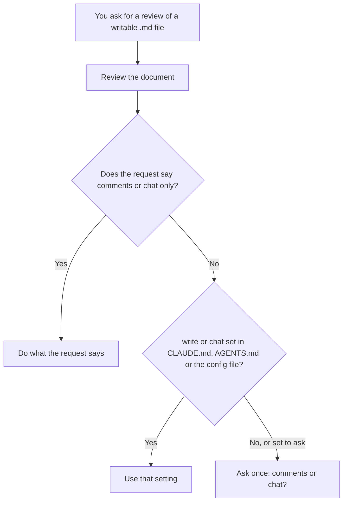

# penmark-comments

Reviews a local Markdown file when you ask for a review. After reviewing, it asks once whether the findings should also be written into the file as validated [Penmark](https://github.com/carlosboeing/penmark) v1 comments or stay in chat, and remembers your answer. It only adds comments. It never rewrites the document's existing text, and never commits unless you ask separately.



## When it applies

The global default activates the skill for an explicit request to review, audit, critique, or comment on a writable local `.md` file. It does not apply to summaries, explanations, extraction tasks, pasted text without a writable target, or non-Markdown artifacts. Pull-request reviews and general code reviews do not activate this skill, even when their diff contains Markdown.

Direct and project instructions control where findings go, never whether the skill runs. The skill reviews first, then resolves the surface. These requests write comments without asking, because they say so:

- `Review design.md and add Penmark comments.`

These return findings in chat without asking, because they refuse the comments themselves:

- `Review design.md, but don't add any comments.`
- `Critique notes.md and return findings in chat only.`

These reach the consent gate, because they refuse changes to the work rather than to the review:

- `Audit proposal.md read-only.`
- `Review design.md, but do not modify files.`
- `Review a design document. Do not implement or edit anything — findings only.`

Answering "Yes, and stop asking" saves `{ "mode": "write" }` to `~/.config/penmark-comments/config.json`, after which the gate stops appearing. A `penmark-comments: write` line in `CLAUDE.md` or `AGENTS.md` takes precedence over that file.

When a request uses several files, comments belong only in the primary reviewed document. Comparison and source documents remain unchanged.

## Bundle contents

```text
penmark-comments/
├── SKILL.md                                  # Harness instructions
├── agents/openai.yaml                        # Codex UI metadata
├── references/penmark-agent-contract-v1.md   # Pinned writer subset
├── scripts/validate-penmark-comments.mjs     # Structural validator
├── scripts/validate-penmark-comments.test.mjs
└── tests/fixtures/
```

Install the whole directory. Copying only `SKILL.md` omits the pinned writer contract and required validator.

## Install

From a clone of this repository, run:

```bash
./scripts/sync-toolkit.sh --harness
```

The script copies each skill directory into `~/.claude/skills/` and links `~/.agents/skills/` and `~/.gemini/config/skills/` to it. It updates the hub copies, including removing files that no longer exist in the source. A harness skill directory that is a real directory rather than a link is left alone unless you pass `--adopt`, so compare same-named skills before adopting. See [Synchronize every authored skill](../README.md#synchronize-every-authored-skill) for details.

For a standalone shared installation, copy the complete `penmark-comments/` directory into the target harness's skill directory rather than copying an individual file.

## Validate

Node.js is the only runtime dependency. Validate one or more reviewed documents after writing:

```bash
node scripts/validate-penmark-comments.mjs path/to/document.md
node --test scripts/validate-penmark-comments.test.mjs
```

The validator checks the structural writer contract. Penmark's upstream specification remains normative; where a local Penmark checkout is available, also use its production parser as an additional compatibility check.

## Troubleshooting and upgrades

- If existing Penmark data is corrupt or declares an unknown review version, leave the target unchanged and report the validator diagnostics.
- If an inline span would split Markdown syntax, use a block or range anchor instead.
- If the skill is unavailable, return findings in chat rather than rediscovering or inventing the format.

The bundled contract is pinned to a specific upstream Penmark commit. When Penmark changes the format, first update the contract from the normative spec, extend the validator and fixtures, run the cross-harness smoke tests, then change the skill. Do not silently upgrade comments already present in documents.

## See also

- [Penmark agent integration guide](../../guides/guide-penmark-agent-integration.md)
- [Penmark writer contract](references/penmark-agent-contract-v1.md)
- [Skill instructions](SKILL.md)
