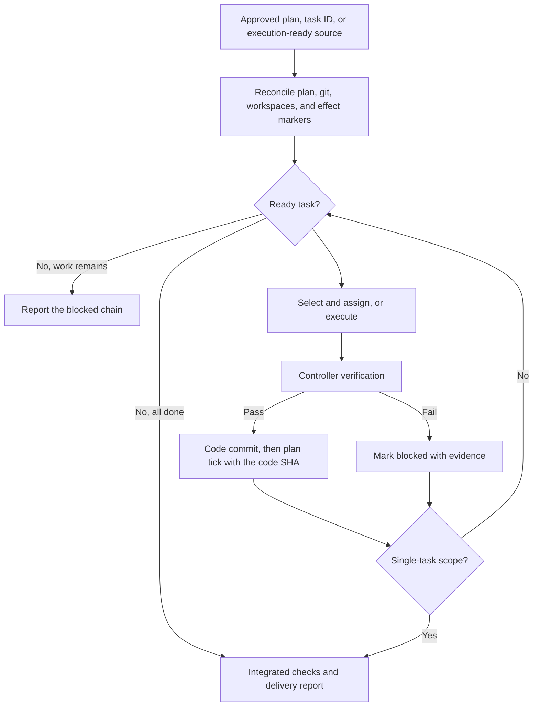

# start-implementation

Drives implementation from an approved plan, whole or by one task, or from an execution-ready design or issue for direct small work. One controller runs the phase: it selects ready work, delegates where the harness supports it, verifies results, integrates, and records progress. It stops at the authorized delivery milestone.

## What it does

```
/start-implementation [plan-path] [task-id]
```

It also runs when you ask in plain words to implement a plan, resume interrupted work, or just fix something small. Both paths are optional: without a plan path the skill finds the current approved plan in the project's own files; without a task ID it drives the whole plan.



## Entry scopes

| Scope | What you supply | What it does | Where it stops |
|---|---|---|---|
| Whole plan | An approved plan path | Drives every dependency-ready task to the plan's authorized delivery milestone | At that milestone, or a halt condition |
| Single task | Plan path plus a task ID | Checks predecessors, runs that task, records its checkpoint | After the named task, even when more work is ready |
| Direct small work | An execution-ready design or issue | Answers the five readiness questions, then implements with the same rules | At the project's ordinary delivery point |

## Delivery states

The report keeps verified local work, committed work, PR review, merge, and rollout apart. A branch SHA is never presented as a merge SHA, and no state implies permission for the next one.

## What it will not do

- Write or revise the design or the plan.
- Infer permission to push, open a PR, merge, or deploy.
- Repeat an external effect to repair a checkbox.
- Let a worker write shared state or self-merge.
- Claim a delegation it did not make.

## Install

See [Install one skill](../README.md#install-one-skill) in the skills catalog, or run `scripts/sync-toolkit.sh --harness` to sync every skill.

## Design notes

- The five readiness questions live in the skill so it stands alone: no separate implementation guide is needed to run direct small work.
- Progress follows the two-commit sequence: the code commit first, then a plan commit that ticks the task and records the code SHA. One controller owns plan writes.
- Delegation is checked against the live harness at run time. When no worker facility exists, the same tasks run serially instead of faking one.
