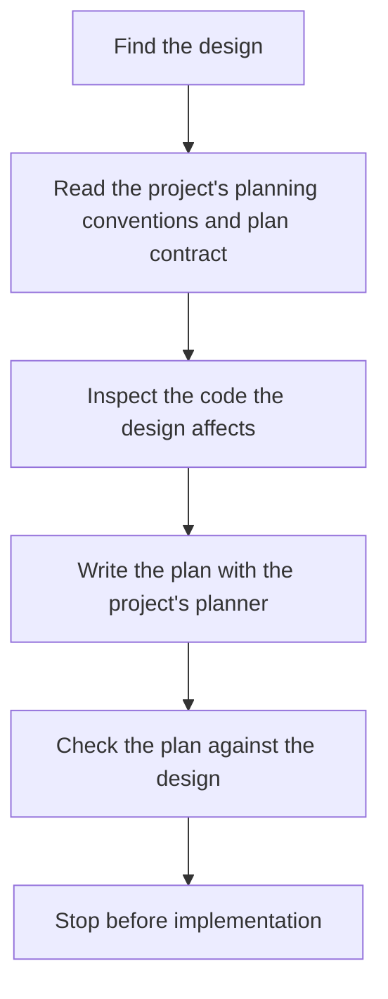

# start-planning

Starts an implementation plan from an approved design, in a fresh session. The skill keeps design and planning as separate steps. The project decides the details: where plans go, how they are named and reviewed, and which planning skill to use.

## What it does

```
/start-planning [design-path]
```

It also runs when you ask in plain words to start planning from a design. The path is optional. Without one, the skill finds the current design in the project's own files.

A new session can plan without the design conversation that came before it. The agent:

1. Resolves the design (explicit path, or project-native discovery).
2. Discovers this project's planning conventions from its instructions and existing files.
3. Resolves the plan contract: a project-named contract or template when the project has one, else the shared `references/plan-contract.md` that ships beside `SKILL.md`.
4. Inspects repository state materially implicated by the design.
5. Delegates structure to the project's planner (`writing-plans` when that is what the project uses).
6. Writes a plan that answers the contract, references the design, checks it against the design, and stops before implementation.



It does not rebuild requirements from the earlier design chat, reopen settled decisions unless you ask in the current session, or offer to start implementing.

## Example

In this repository:

```
/start-planning path/to/design.md
```

Or, with one clearly current design:

```
/start-planning
```

A fresh session reads that design, inspects this repo, writes the plan where **this** project keeps plans, and stops. Other projects keep plans elsewhere; the skill discovers that layout instead of assuming this one.

Plan content follows the contract in force. When the project's instructions name a plan contract or template, the plan uses that presentation; otherwise the shared `references/plan-contract.md` sets the minimum answers and the project's own conventions fill in the rest.

## What it will not do

- Write or revise the design.
- Encode a universal frontmatter schema, plan folder, test command, or git policy.
- Duplicate `writing-plans` or any other planner the project already has.
- Start implementation, or treat planning as permission to implement.

## Install

See [Install one skill](../README.md#install-one-skill) in the skills catalog, or run `scripts/sync-toolkit.sh --harness` to sync every skill.

The skill is a directory. Sync copies `SKILL.md` and `references/` together, so each installed copy loads its own versioned plan contract.

## Design notes

- `references/plan-contract.md` is a deliberate exception to this catalog's single-file skill preference. The contract must load relative to the installed `SKILL.md`, and versioned content beside the skill beats a path guessed from another project's layout.
- The contract is a quality contract, not a template. It says what a plan must answer and leaves headings, task counts, and commit subjects to the project and its planner.

## Help

```
/start-planning help
```

Renders the synopsis and does nothing else.
